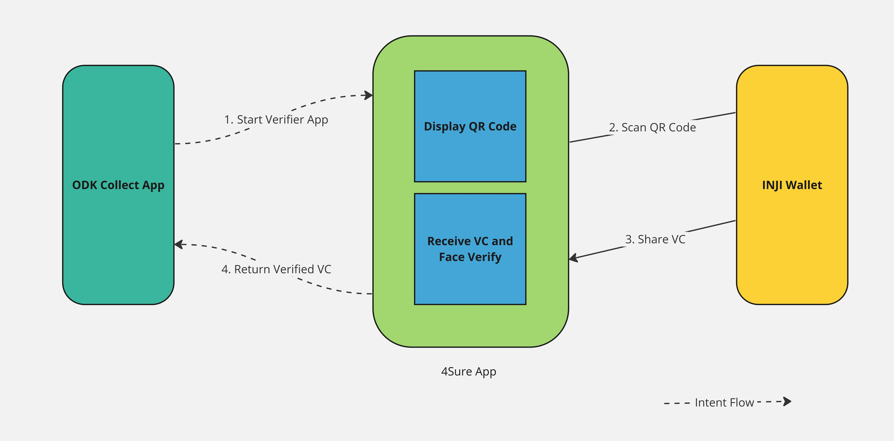

# \*️ 4Sure Verifier App

The 4Sure App is designed to streamline the process of verifying digital credentials in a secure and efficient manner. Leveraging the power of [Bluetooth Low Energy (BLE)](https://en.wikipedia.org/wiki/Bluetooth\_Low\_Energy) technology, this app integrates the [MOSIP](https://mosip.io/#1) (Modular Open Source Identity Platform)[ BLE Verifier SDK](https://docs.mosip.io/inji/integration-guide/ble-verifier), facilitating seamless and wireless transfer of verifiable credentials (VCs). Additionally, the app is reinforced with the [Biometric SDK ](https://github.com/biometric-technologies/biometric-sdk-react-native)module, which enables it to perform biometric authentication. This integration allows for accurate identity verification by using biometric data, such as facial recognition, providing an additional layer of security and trust in the verification process.

### Workflow

<figure><figcaption>
4Sure App Workflow
</figcaption></figure>

* **Start 4Sure App**: The workflow begins with the user opening the ODK Collect App, which then triggers the initiation of the 4Sure App.
* **Display QR Code**: Upon initiation, the 4Sure App displays a QR code. This code is meant to be scanned by another device to establish a connection for secure data transmission.
* **Scan QR Code**: The user uses the INJI Wallet to scan the displayed QR code from the 4Sure App. The INJI Wallet typically resides on a personal device like a smartphone, containing the user's digital credentials.
* **Share VC**: After scanning the QR code, the INJI Wallet shares the Verifiable Credential (VC) with the 4Sure App via Bluetooth.
* **Receive VC and Perform Face Verification**: The 4Sure App receives the VC and initiates a face verification step. This involves matching the user's live facial features with the facial data stored within the VC to ensure that the credential belongs to the person presenting it.
* **Return VC**: Once verification is complete, the 4Sure App sends the VC back to the ODK Collect App.

### Features & Components

<figure><figcaption>
4Sure App High Level Architecture
</figcaption></figure>

* **Secure transfer of credentials**: Utilizes BLE technology for the secure and encrypted transfer of digital credentials.
* **MOSIP integration**: Fully integrated with the MOSIP platform, ensuring compatibility and interoperability with a wide range of identity solutions.
* **User-friendly interface**: Designed with a focus on ease of use, ensuring accessibility for users of varying technical proficiencies.
* **Face Verification:** Incorporates a robust face verification SDK to enhance identity authentication, adding an extra layer of security and trustworthiness to the verification process.

### Open Source Integrations

<table><thead><tr><th width="444">Library</th><th>License</th></tr></thead><tbody><tr><td><a href="https://github.com/mosip/ble-verifier-sdk">mosip/ble-verifier-sdk</a></td><td>MIT License</td></tr><tr><td><a href="https://github.com/mrousavy/react-native-vision-camera">mrousavy/react-native-vision-camera</a></td><td>MIT License</td></tr><tr><td><a href="https://github.com/biometric-technologies/biometric-sdk-react-native">iriscan/biometric-sdk-react-native</a></td><td>MIT License</td></tr></tbody></table>

