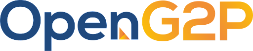

# 🏠 Home

<figure><figcaption></figcaption></figure>

OpenG2P is an open source platform upon which government-to-person (G2P) solutions could be built. The roots of the platform lie in the social benefit delivery systems originally developed in response to the Ebola outbreak in Sierra Leone.

The platform offers people facing processes such as onboarding into schemes, identity verification, and cash transfers to their bank accounts. It also incorporates government department facing features such as creation of registries and beneficiary lists, eligibility checks, scheme definition, payment disbursement and reconciliation.

OpenG2P is a DPG (Digital Public Good) recognized by the DPGA and has received contributions and support from multiple organisations and implementers. Its roadmap includes support for non-monetary benefits, proof of delivery, beneficiary management, secure registries, and decision making support.

The project, co-founded by the Government of Sierra Leone and UNDP and supported by Mifos ([https://mifos.org/](https://mifos.org/)) in the early stages, is now housed in IIIT Bengaluru, a university in India.
