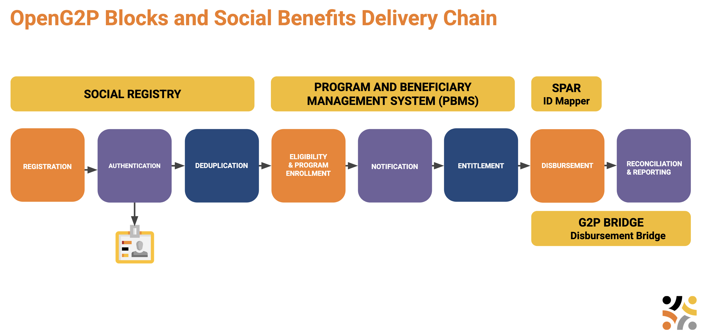
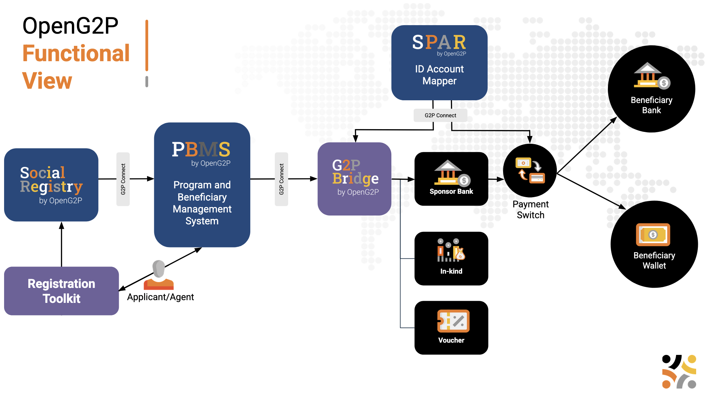
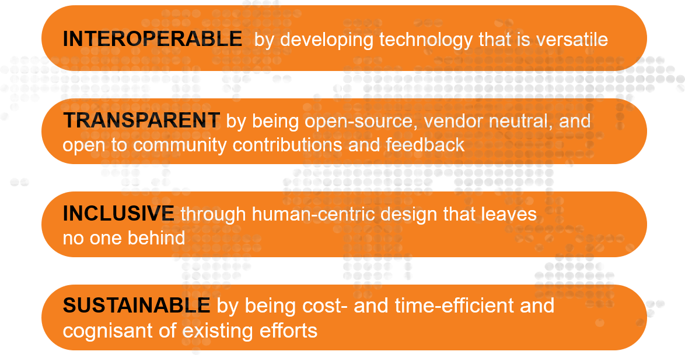

# Overview

[OpenG2P](https://openg2p.org) is an open-source platform that enables governments and humanitarian organisations to deliver critical social benefits directly to those who need them. It facilitates the building of secure, inclusive and efficient **registries, program management capabilities and digital cash transfer delivery systems**.

OpenG2P is a **Digital Public Good** (DPG) recognised by the[ DPGA](https://digitalpublicgoods.net/) and a significant building block of a country's Digital Public Infrastructure ([DPI](https://docs.cdpi.dev/dpi/readme)). OpenG2P contributes to the G2P transfers DPI layer in a digital economy, while leveraging DPGs in other categories. Its modular and interoperable technology augments existing systems in countries, without discarding what works or starting from scratch.

## Offerings

OpenG2P offers **open-source, rapidly deployable, building blocks (modules)** to digitise G2P service delivery, focussing on social benefit delivery. The modules are interoperable, scalable, and secure.&#x20;

<figure><figcaption>
The boxes in yellow depict the OpenG2P modules covering benefit delivery chain
</figcaption></figure>

### <mark style="color:purple;">Modules</mark>

<table data-view="cards"><thead><tr><th></th><th data-hidden data-card-cover data-type="files"></th><th data-hidden data-card-target data-type="content-ref"></th></tr></thead><tbody><tr><td><strong>Dynamic</strong> <strong>Registry</strong></td><td><a href=".gitbook/assets/social-registry-logo.jpg">social-registry-logo.jpg</a></td><td><a href="social-registry/">social-registry</a></td></tr><tr><td><strong>Program and Beneficiary Management System</strong></td><td><a href=".gitbook/assets/PBMS-on-light-background.png">PBMS-on-light-background.png</a></td><td><a href="pbms/">pbms</a></td></tr><tr><td><strong>Social Payments Account Registry</strong> (ID Mapper)</td><td><a href=".gitbook/assets/spar-logo.png">spar-logo.png</a></td><td><a href="spar/">spar</a></td></tr><tr><td><strong>G2P Disbursement Bridge</strong></td><td><a href=".gitbook/assets/g2p-bridge-logo.png">g2p-bridge-logo.png</a></td><td><a href="g2p-bridge/">g2p-bridge</a></td></tr></tbody></table>

### <mark style="color:purple;">Reference designs</mark>

Beyond the modules mentioned above, OpenG2P provides reference designs that are informed by our experience working with countries on real-world use cases.

### <mark style="color:purple;">Country support</mark>

Supporting countries is deeply ingrained in the core values of OpenG2P's offerings. We actively participate in **local capacity building, support during customisation, long-term L3 support on the platform, and commercial ecosystem development**.

## Functional architecture

OpenG2P has a flexible architecture that allows governments and social benefit delivery systems to choose modules per their needs. All the modules are designed to be installed and used standalone. However, the full power of OpenG2P can be harnessed if all the modules are used in conjunction with each other.

<figure><figcaption>
Typically connection of modules to deliver cash digitally
</figcaption></figure>

## Guiding principles

OpenG2P is built on a bedrock of good practices and principles that drive our work towards empowering populations around the world through technology.

<figure><figcaption>
Guiding principles
</figcaption></figure>

The platform is built for inclusion and has supporting features. For example, beneficiaries in remote areas without network connectivity can be registered offline.

The OpenG2P code is currently available on [GitHub](https://github.com/openg2p) under [open-source licenses](license.md). It is currently housed in the International Institute of Information Technology, Bangalore ([IIITB](https://www.iiitb.ac.in/)), a non-profit research university.
