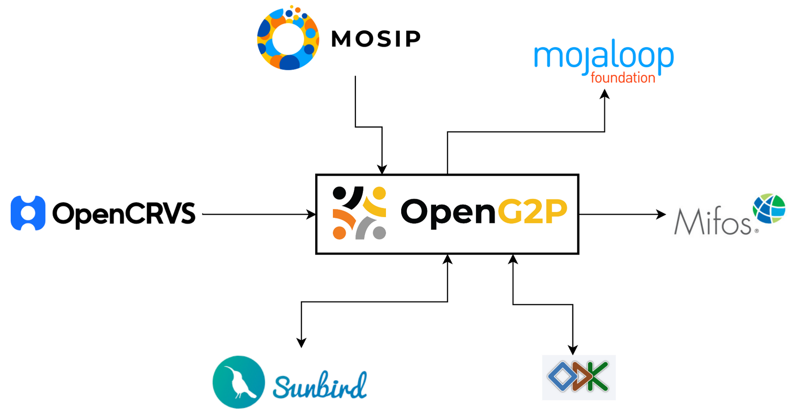
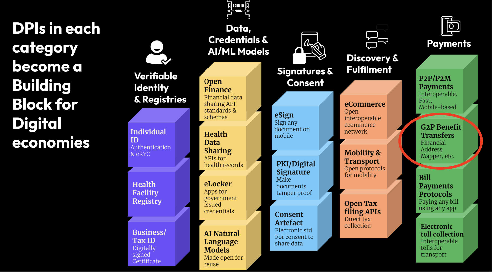
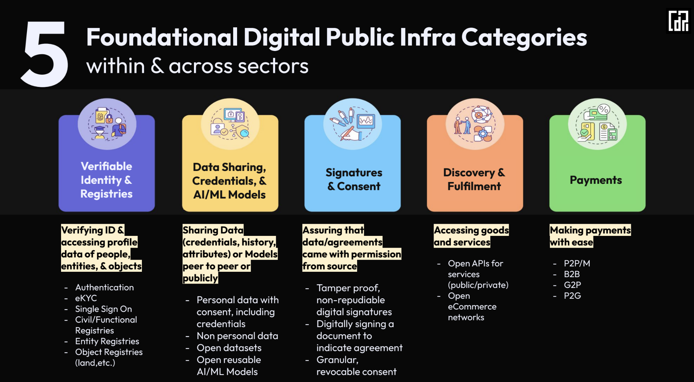
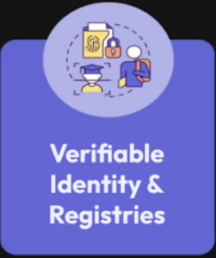
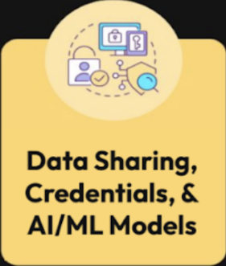
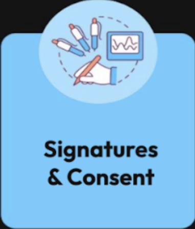
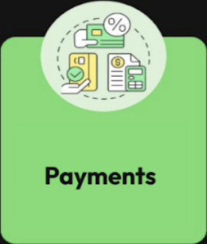
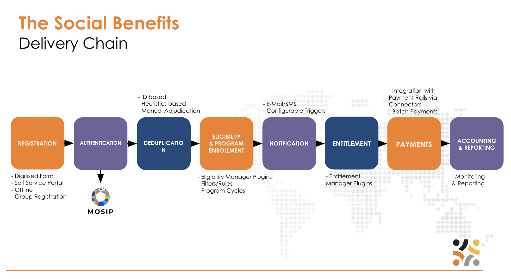
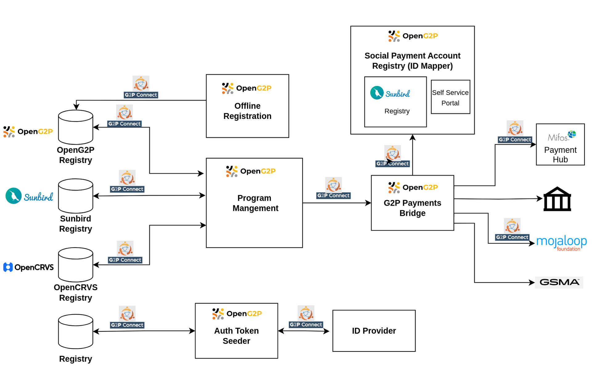
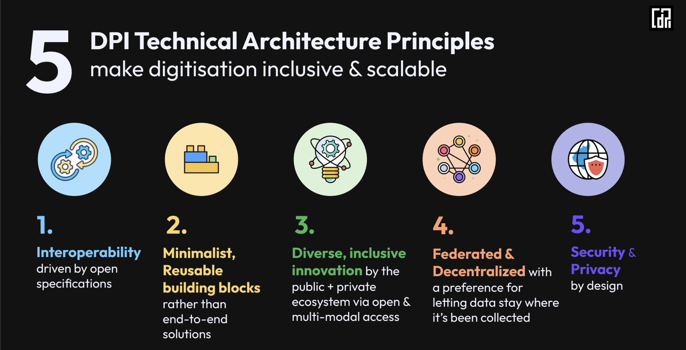

# OpenG2P - A Building Block for DPI

### Context 

As nations aim to transition into the digital realm, the concept of Digital Public Infrastructure (DPI), facilitated by Digital Public Goods (DPGs), is swiftly gaining prominence. Among these DPGs, OpenG2P addresses the crucial requirement for digitizing and automating essential processes related to the distribution of social benefits, encompassing both G2P payments and in-kind transfers. As a pivotal element in a nation's efforts towards social advancement, OpenG2P naturally assumes a key pillar in constructing the framework of DPI. To fully unlock the potential advantages of DPI for a country, it is essential that OpenG2P interfaces seamlessly with other DPGs in an interoperable manner. This collaborative approach ensures that the comprehensive benefits of DPI can be fully realized.

Among the existing DPGs, there is a compelling argument for OpenG2P to engage with the aforementioned DPGs. While successful integration with MOSIP, ODK, and Mojaloop has already been showcased, the ongoing roadmap includes initiatives to connect with Mifos Payment Hub, OpenCRVS, and Sunbird RC via G2P Connect/DCI interfaces.

### DPI Categories 

_Source: CDPI_

Within the DPI categories mentioned above, OpenG2P is primarily positioned in the Payments sector. Nonetheless, OpenG2P makes use of various components in different sectors, highlighting the importance of an approach that relies on interconnected building blocks for a nation's digital framework.

|                                                                                                                                                                                                                                                                                                                                                               | **Authentication & eKYC:** The OpenG2P system utilizes the Identity system for authenticating and verifying beneficiaries. This process leads to the creation of a user token, which is subsequently employed to facilitate deduplication and establish identity within the scope of OpenG2P programs.                                                                                                                                                                                               |
| ----------------------------------------------------------------------------------------------------------------------------------------------------------------------------------------------------------------------------------------------------------------------------------------------------------------------------------------------------------------------------------------------------------------------------- | ---------------------------------------------------------------------------------------------------------------------------------------------------------------------------------------------------------------------------------------------------------------------------------------------------------------------------------------------------------------------------------------------------------------------------------------------------------------------------------------------------- |
| **Single Sign On:** Utilizing the Identity platforms, OpenG2P beneficiaries can seamlessly access the self-service portal via Single Sign-On (SSO), ensuring a secure method to share information with the OpenG2P system. This process requires the user's effective consent, enhancing data security and privacy.                                                                                                           |                                                                                                                                                                                                                                                                                                                                                                                                                                                                                                      |
| **Functional Registries:** OpenG2P boasts a robust registry system that can fulfil diverse functional registry needs. Moreover, it offers compatibility to work with widely used registries such as OpenCRVS and Sunbird RC. Additionally, OpenG2P can seamlessly integrate with specific databases, presenting APIs based on the "G2P Connect" specifications, thereby ensuring flexibility and adaptability.                |                                                                                                                                                                                                                                                                                                                                                                                                                                                                                                      |
|                                                                                                                                                                                                                                                                                                                                                               | **Health data sharing:** By accessing beneficiaries' health data, government entities can tailor assistance, track medical needs, and respond effectively to health emergencies, thereby enhancing the overall well-being and healthcare outcomes of the population. This approach enables more personalised and responsive OpenG2P programs that address specific health challenges and contribute to improved public health.                                                                       |
| **eLocker :** OpenG2P can issue verifiable credentials (VCs) that signify beneficiaries' program identity. These VCs would be downloadable and securely stored in the eLocker, ensuring a dependable record of their beneficiary status. Beneficiaries will also be able securely share these credentials for authorised purposes, enhancing the versatility of their beneficiary identity.                                   |                                                                                                                                                                                                                                                                                                                                                                                                                                                                                                      |
| **Reusable AI/ML models:** AI/ML models can play a vital role in OpenG2P programs by detecting fraud and anomalies. These models analyze beneficiary data, transactions, and communications to identify unusual patterns, irregularities, or misleading information. By swiftly flagging potential issues, AI can help ensure the integrity of the program, prevent losses, and safeguard benefits for legitimate recipients. |                                                                                                                                                                                                                                                                                                                                                                                                                                                                                                      |
|                                                                                                                                                                                                                                                                                                                                                               | **eSign:** OpenG2P programs can effectively utilize the eSigning option for beneficiary authentication and consent in various activities, such as data sharing and program enrollment. Through eSigning, beneficiaries can securely validate their identity and provide consent electronically, ensuring a streamlined and efficient process. This digital approach enhances security, reduces paperwork, and promotes a user-friendly experience for beneficiaries engaging in OpenG2P initiatives. |
| **PKI/ Digital Signature:** In OpenG2P programs, digital signatures reinforce security and integrity, especially in QR code-based vouchers. These vouchers, digitally signed, validate essential documents like contracts and transactions. Beneficiaries securely sign and authenticate records, fostering confidence, enabling remote participation, and enhancing program credibility.                                     |                                                                                                                                                                                                                                                                                                                                                                                                                                                                                                      |
| **Consent Artefact:** Consent artefacts are vital for OpenG2P, providing tangible proof of beneficiaries' explicit agreement. These artefacts, often digital signatures or confirmations, validate consent for actions like data sharing or enrollment.                                                                                                                                                                       |                                                                                                                                                                                                                                                                                                                                                                                                                                                                                                      |
|                                                                                                                                                                                                                                                                                                                                                               | **G2P Benefit transfers:** This is one of the core functionality of OpenG2P. G2P payments (direct cash transfer) are enabled by connecting to the payment rails of a country.                                                                                                                                                                                                                                                                                                                        |

### Unbundling OpenG2P with interoperable interfaces 

The process of digitizing a nation's systems is likely to occur gradually, advancing through various stages of maturity in the digital transformation of existing social protection and payment systems. Consequently, it becomes crucial for OpenG2P to be adaptable for such progressive "Brownfield" implementations. OpenG2P envisions a modular approach, separating essential elements such as registry, authentication, tokenization, program management, and payments, through standardized open API interfaces like G2P Connect and DCI. This approach allows countries to selectively digitize and automate specific aspects of their processes without causing disruptions to established workflows.

A typical social benefit delivery chain is depicted below:

Following a modular approach, the deployment of reusable functional blocks should be achievable without necessitating the implementation of the entire delivery system. With this objective in mind, the upcoming architecture is presently in the design phase and is being integrated into the roadmap.

As illustrated, the OpenG2P modules establish connections to registries and other systems in an interoperable fashion, utilizing the G2P Connect/DCI interface. Each of these modules can be deployed independently.

The architecture is being envisaged keeping in mind the principles laid out by DPI:

_Source: CDPI_

### &#x20;
