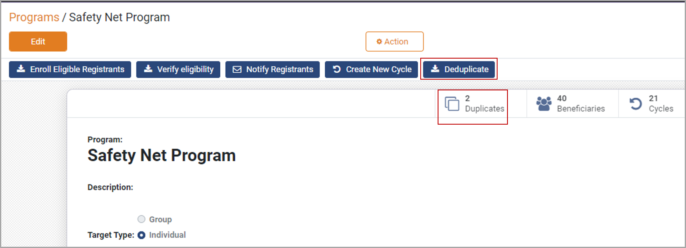

# Deduplication

## Introduction

Deduplication refers to the process of removing duplicate entries in the program, thus avoiding double-dipping, and merging all the demographic fields associated with an individual or a group into a single record.

Each program in the OpenG2P program should have at least one deduplication manager configured. A separate deduplication manager must be created and configured for a program.

## Deduplication manager types

OpenG2P platform supports three types of Deduplication Managers:

#### Default Deduplication Manager

This deduplication manager is assigned by default to each program. Since it is mandatory to configure at least one deduplication manager, program administrators can use this deduplication manager if they are sure of unique registration entries or do not want to run the deduplication.

#### ID Deduplication Manager

This deduplication manager will deduplicate the registrants based on the ID of the registrants. The program administrators should configure the ID type that will be used for deduplication. To learn more about ID type configuration, click [here](../guides/user-guides/configure-id-types.md).

#### Phone Number Deduplication Manager

The registrants can be deduplicated based on their phone numbers. This deduplication manager is often configured along with the ID Deduplication Manager.

## Deduplication manager configuration

Configuring a deduplication manager in a program is a two-step process.

#### Create a deduplication manager type

The program administrator must create at least one deduplication manager for each deduplication manager type required. To learn more about this step, click [here](../guides/user-guides/create-deduplication-manager-types/).

#### Add the deduplication manager to a program

The program administrator needs to add the deduplication manager created in the first step. To learn more about this step, click [here](../guides/user-guides/create-deduplication-manager.md).

## Deduplicating registrants

Deduplication of registrants is a one-click operation once deduplication managers are added to the program. The deduplication manager does not distinguish between original and duplicate records, and all beneficiaries with the same field value - as configured for duplicate detection - are listed as duplicates.

The figure below shows two duplicate entries.&#x20;

<figure><figcaption></figcaption></figure>

## How-To Guides

[Configure ID Types](../guides/user-guides/configure-id-types.md)

[Create Deduplication Manager Types](../guides/user-guides/create-deduplication-manager-types/)

[Create Deduplication Manager under Program](../guides/user-guides/create-deduplication-manager.md)

##
