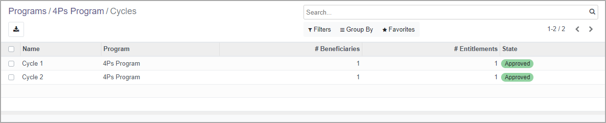
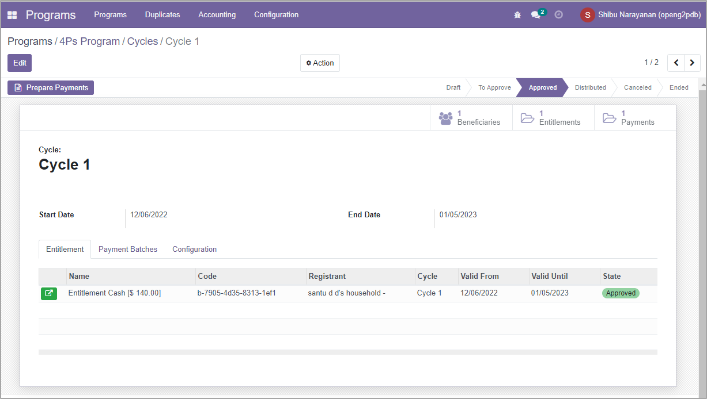

# Program Cycles

## Introduction

A program may have disbursements done in multiple cycles with different start and end dates for each cycle. Such cycles may be defined and triggered as per the schedule defined in each cycle. Each program should have at least one Cycle Manager associated with it.&#x20;

<figure><figcaption></figcaption></figure>

## Program Manager

The Program Manager is a software module in the OpenG2P platform. It manages the number of cycles in a program and each request to create a cycle is executed through the Program Manager. The program administrators can easily replicate cycles by selecting the option to copy from the previous cycle. The manager also has a configuration option to create a cycle-less program. To learn the steps to configure a Program Manager, click [here](../guides/user-guides/configure-program-manager-in-program.md).

## Cycle Manager

While the Program Manager manages all the cycles, each cycle is managed by a Cycle Manager. Cycle Manager provides many convenient single-click actions to enable program administrators to quickly create new cycles, copy beneficiaries from the program, and prepare and approve entitlements. To learn more about these steps, click [here](../guides/user-guides/create-and-approve-disbursement-cycle.md).

<figure><figcaption></figcaption></figure>

## How-To Guides

[Configure Program Manager in Program](../guides/user-guides/configure-program-manager-in-program.md)

[Create and Approve Program Cycle](../guides/user-guides/create-and-approve-disbursement-cycle.md)
