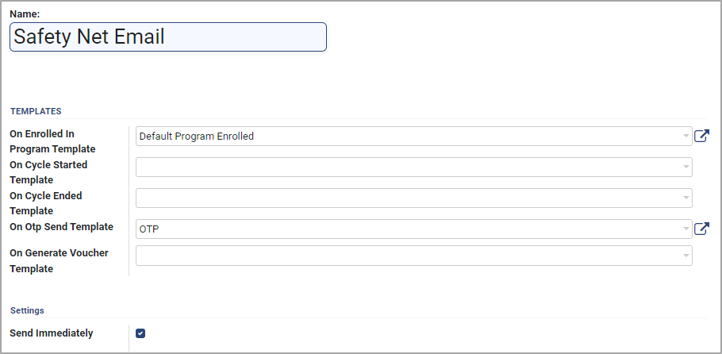

# Notifications

## Introduction

Notifications to beneficiaries and administrators are a must, especially when there are multiple stages of a delivery chain, usually with long time intervals between the different stages. Beneficiaries must be notified of their enrollment status, entitlements, payouts, exits, etc. Multiple channels such as SMS, email, and messaging apps can be used for notifications.

OpenG2P provides configuration of email, SMS, and Fast2SMS notifications in a few simple steps. Depending on the implementation needs of a program, notifications can be triggered for specific events in the delivery chain.

The figure below shows example notifications configured for two events - enrolling in the program and sending OTP.

<figure><figcaption></figcaption></figure>

## Notification manager

OpenG2P manages notifications via notification managers. Each program has at least one notification manager configured. The platform defines a different notification manager for each type of notification - SMS, email, Fast2SMS. These are the most commonly used notification managers:

* SMS notification manager
* Email notification manager
* Fast2SMS&#x20;

OpenG2P uses the in-built [Qweb Templates](https://www.odoo.com/documentation/16.0/developer/reference/frontend/qweb.html) and [Inline Templates](https://apps.odoo.com/apps/modules/10.0/mail\_inline\_css/) for configuring the HTML pages and fragments. Notifications are sent based on the event and application configurations.

<figure><figcaption></figcaption></figure>

## Configuring notifications

Configuring the notifications requires two steps:

#### Create a notification manager type

The program administrator must create at least one notification manager for each notification manager type required. To learn more about this step, click [here](../guides/user-guides/create-notification-manager-types/).

#### Add the notification manager to a program

The program administrator needs to add the notification manager(s) created in the first step to the program. To learn more about this step, click [here](../guides/user-guides/configure-notification-manager.md).&#x20;

## Send notifications

Sending the notifications is a one-click operation. Based on the state of the program - enrolment, entitlement, payment, etc. - the corresponding notification is sent by the notifications manager types configured for the program. To learn more about this step, click [here](../guides/user-guides/send-notifications-to-individual-registrants.md).

## How-To Guides

[Create Notification Manager Types](../guides/user-guides/create-notification-manager-types/)

[Create Notification Manager under Program](../guides/user-guides/configure-notification-manager.md)

[Send Notifications to Individual Registrants](../guides/user-guides/send-notifications-to-individual-registrants.md)

