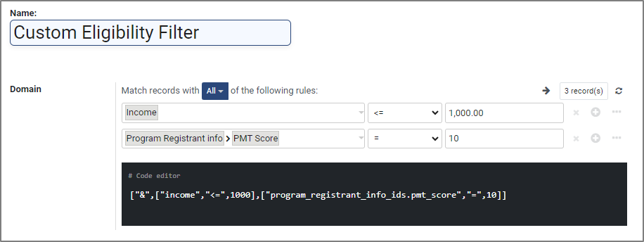

# Proxy Means Test

## Introduction

Proxy Means Test (PMT) is a method widely used by governments and international organizations to estimate the income or consumption levels of households, particularly those in low and middle-income countries. PMT serves as a valuable tool for targeting social programs and subsidies effectively, ensuring that limited resources are allocated to those who need them the most. PMT is based on the principle that certain household characteristics, known as proxies, correlate with income and standard of living. These proxies may include household composition, housing quality, asset ownership, access to basic services, and other observable characteristics.

## World Bank Formula

One of the prominent formulas utilized in PMT calculations is the World Bank Formula, a significant contribution to poverty assessment and social assistance allocation. The formula's precision lies in its capacity to accurately identify the most vulnerable households. By incorporating multiple characteristics, it mitigates the risks of misclassifications and ensures resources reach those in genuine need. The formula is calculated using these steps:

#### Regression model

A regression model is constructed using data from a representative household survey where both income and proxies are available. Household characteristics like education, household size, and location might contribute to a higher or lower income prediction. Household welfare (usually income or consumption) is the dependent variable and observable characteristics are the independent variables.

#### Formula creation

The regression analysis generates coefficients for each independent variable. Each coefficient is the corresponding characteristic's impact (also known as weightage) on household welfare, and the regression equation is the weighted sum. The regression equation is transformed into a simplified formula that can be used to predict household welfare based on observable characteristics.&#x20;

#### Proxy score and threshold determination

A proxy score is calculated for each household using the formula and indicates the household's relative income level. The proxy score is divided into different income brackets, and a corresponding threshold is established for each bracket. Households falling below a certain threshold are identified as eligible for social assistance or other targeted interventions.&#x20;

## WB PMT formula configuration

Proxy Means Test plug-in can be conveniently installed in the OpenG2P platform. The observable characteristics are referred to as computed fields in the OpenG2P platform. To learn the steps to configure computed fields, click [here](../guides/user-guides/configure-proxy-mean-test.md).

The platform supports extensive yet easy configurations for calculating proxy scores from these computed fields. The figure below shows the configuration of observable characteristics and corresponding coefficients (weightage).&#x20;

<figure><figcaption></figcaption></figure>

The WB PMT score is calculated from the weighted sum of these fields. The formula for this configuration is:

```
PMT Score = x_number_of_children * 10 +
              x_sqft_of_house * 25 +
              x_sqft_of_land_owned * 40 +
              x_access_to_electricity_connection * 10 +
              x_own_a_vehicle * 15               
```

The PMT score can be used either standalone or in conjunction with other eligibility criteria as shown in the figure below.

<figure><figcaption></figcaption></figure>

#### Advantages of using PMT with WB formula

The implementation of the Proxy Means Test with the World Bank Formula offers several significant advantages:

1. Equity and Efficiency: By precisely targeting assistance, the formula reduces the occurrence of leakage (benefits going to ineligible households) and exclusion (needy households being left out).
2. Resource Optimization: Scarce resources can be efficiently directed to where they are most needed, optimizing the impact of social assistance programs.
3. Data-driven Decision-making: The World Bank Formula's statistical foundation encourages evidence-based decision-making, enhancing accountability and transparency in poverty alleviation efforts.
4. Adaptability: PMT's reliance on observable characteristics makes it adaptable to diverse contexts, accommodating variations in economies and cultures.

## How-To Guides

[Configure Proxy Means Test](../guides/user-guides/configure-proxy-mean-test.md)


####
