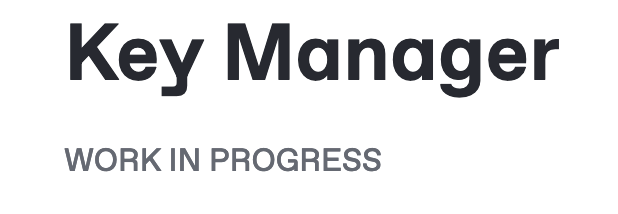

# Documentation Guidelines

## Introduction

This guide provides basic guidelines for you to write neat documentation.

## General conventions

* Page title: Capitalize the first letter of every word. Like this page title
* Start a topic with Introduction/Concept/Context
* Use Gitbook's "Heading 1, Heading 2" etc for headings
* Headings must use lowercase except for the first letter. E.g. "Code of conduct"
* Provide reference links to the text as applicable
* Provide a link at the first mention of a new/different topic. For example, if the guide is talking about installing the SmartScanner app, and the WireGuard app is mentioned, then provide the link for WireGuard.
* Avoid using ":" in a heading.  E.g. "Design choices:"&#x20;
* Use clear and crisp images - the images should not appear blurred when seen on full screen.
* If you are adding image files, make sure all file names are lowercase with hyphens. E.g `architecture-diagram.png`.
* The filename for images should follow the naming convention of every word in lower case, and words separated by hyphens i.e. view-all-programs.png.
* For work-in-progress features/functions, you may mention the same under the title as shown below:

<figure><figcaption></figcaption></figure>

* Check spelling and grammatical corrections using tools such as Grammarly.

## User guides

In addition to the above while writing user guides follow these conventions:

* Use second-person pronouns i.e. you, your, etc. in the instructions/steps.
* Use the bold and italicized font for UI elements i.e. dashboard names, button labels, information fields, etc.
* Use the exact name and case for the UI elements as shown in the user interface.
* Use quotes for a phrase/word if the phrase/word has to be represented as is.

## Specification for diagram

Follow the below specification while creating diagrams in Miro

<table><thead><tr><th width="116.5"></th><th></th></tr></thead><tbody><tr><td>Font </td><td>Opensans</td></tr><tr><td>Font Size</td><td>18px</td></tr><tr><td>Logos</td><td>Use the font available in the URL: <a href="https://drive.google.com/drive/folders/1LC9F1WXOKv9xPrC6dHLBFuUG5GOaiPvo?usp=drive_link">https://drive.google.com/drive/folders/1LC9F1WXOKv9xPrC6dHLBFuUG5GOaiPvo?usp=drive_link</a></td></tr><tr><td>Export image</td><td><ul><li>Size: Medium </li><li>Format: JPG</li></ul></td></tr></tbody></table>


Diagram specification

