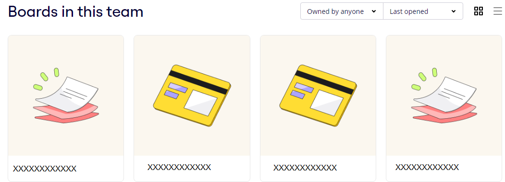
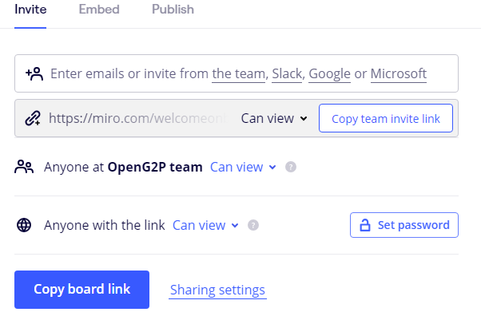
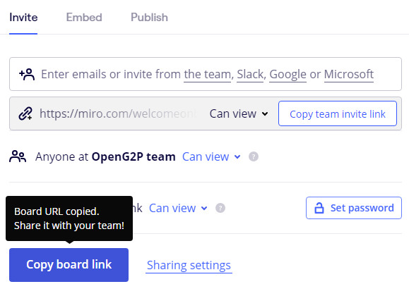
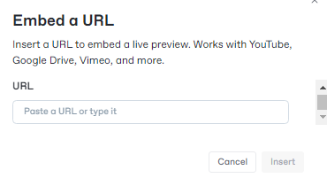
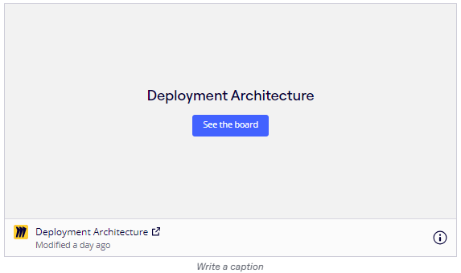

---
layout:
  title:
    visible: true
  description:
    visible: false
  tableOfContents:
    visible: true
  outline:
    visible: true
  pagination:
    visible: true
---

# Embed the Miro diagram

1. Open the board in Miro.

<figure><figcaption></figcaption></figure>

The board is displayed.

2. Click the _**Share**_ button on the board.

<figure><figcaption></figcaption></figure>

3. In the _**Invite**_ tab, choose the _**Can view**_ option in the three drop-downs as shown in the above image.
4. Click the _**Copy board link**_ button.
5. A message pops up that the link for this board copied.

<figure><figcaption></figcaption></figure>

6. Use the link [https://app.gitbook.com/](https://app.gitbook.com/) to access the OpenG2P documentation.
7. Choose one of the available sign in options to access the  OpenG2P documentation. The available options are:

* Continue with GitHib.
* Continue with Google.
* Sign in using email.

**Sign in using email**

8. Click the sign in using email link.
9. Enter the valid work email ID.
10. Click the Continue tab.
11. Click the Password button.
12. Enter the valid password.
13. Click the Sign in button.

The OpenG2P documentation gitbook is displayed.

14. Choose the relevant page to incorporate the Miro image.
15. Click the + sign and choose _**Embed a URL**_ option.

<figure><figcaption></figcaption></figure>

16. Paste the board URL which is copied in step 5 above.

<figure><figcaption></figcaption></figure>

17. Click the Insert button.

The  Miro image is embed in GitBook.

<figure><figcaption></figcaption></figure>

