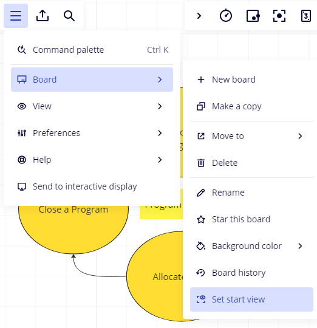
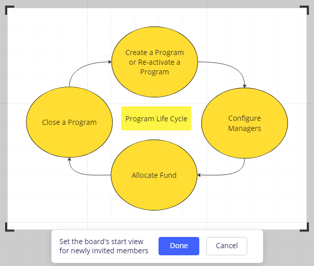
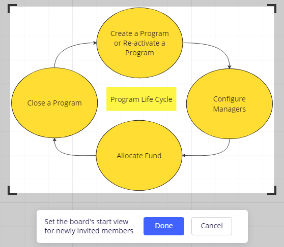

---
layout:
  title:
    visible: true
  description:
    visible: false
  tableOfContents:
    visible: true
  outline:
    visible: true
  pagination:
    visible: true
---

# Set the Image for a Start View

1. Open the board in Miro.
2. Click the _**Main menu**,_ select the _**Board**_, and then choose _**Set start view**_.

<figure><figcaption></figcaption></figure>

The image is displayed with an alterable frame.

<figure><figcaption></figcaption></figure>

3. Alter the frame to capture only the image as shown below.

<figure><figcaption></figcaption></figure>

4. Click the _**Done**_ button.

You can able to view the image within the frame on the page where you have embedded the image in the GitBook documentation.&#x20;

<figure><figcaption></figcaption></figure>

