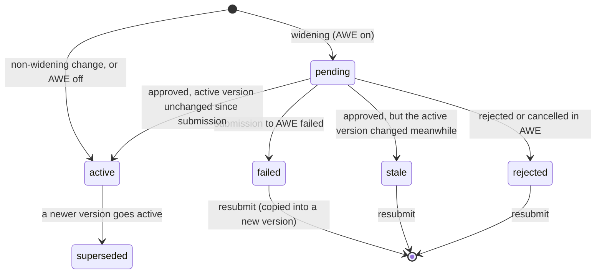

# Approval Workflow (AWE) Integration

The Consent Manager (CM) integrates the shared **Approval Workflow Engine (AWE)** to gate
**data-share policy changes** behind configurable, multi-stage human approval. Widening a partner's
policy — granting more scopes, purposes, subject-id types, signing algs, or longer validity /
`data_life` — does not take effect until AWE delivers an approved outcome. CM acts as a **caller
service**: it submits requests, proxies approver task interactions on behalf of its own users, and
reacts to terminal outcomes via a webhook.


This integration governs **policy changes only**. Partner identity, keys, and onboarding live in
the Partner Management service (see
[Partner Management Integration](partner-management-integration.md)) — AWE does **not** gate partner
onboarding in CM.



**Deployment note:** AWE is installed **once per environment** (part of `commons-services`), not
bundled with each CM. CM points `awe_base_url` at the environment's AWE, and its chart registers
CM's callback secret and seeds CM's approval policy into the shared AWE database. Because callbacks are addressed
per request (each caller passes its own callback URL and `callback_secret_id`), one shared AWE
serves the registry, SPAR, CM, and other callers in the same environment.


## Two distinct "policies"

The word *policy* means two different things here — do not conflate them:

| Term | What it is | Where it lives |
| --- | --- | --- |
| **CM data-share policy** | The artefact / rules: `allowed_data_scopes`, purposes, subject-id types, signing algs, validity, fetch semantics, `data_life`. Versioned per partner binding. | CM (`PartnerPolicy`) |
| **AWE approval policy** (`policy_key`) | The workflow: stages, approvers, SLA, delegation. | AWE |

A **change to the CM data-share policy** is the *artifact* that is routed through an **AWE approval
policy** (the *workflow*). CM references the approval policy by its `policy_key`.

## End-to-end flow

```mermaid
sequenceDiagram
  participant Admin as CM Admin
  participant CM as Consent Manager
  participant AWE as AWE
  participant Approver as Approver (CM UI)

  Admin->>CM: PUT policy (widening)
  CM->>CM: new PartnerPolicy version (status=pending); prior active stays in force
  CM->>AWE: POST /v1/awe/requests (admin's own JWT)
  AWE-->>CM: {request_id}
  Approver->>CM: open approver inbox (own JWT)
  CM->>AWE: GET /v1/awe/tasks?assignee=me&status=open|claimed (approver JWT proxied)
  AWE-->>CM: tasks
  Approver->>CM: submit decision
  CM->>AWE: POST /v1/awe/tasks/{id}/decision (approver JWT proxied)
  AWE->>CM: terminal webhook (HMAC-signed)
  CM->>CM: approved → active + supersede prior (or stale if the active version changed)<br/>rejected/cancelled → rejected
```

1. **Widen** — an admin saves a policy that grants more than the current active version. CM
   creates a new `PartnerPolicy` version in status `pending`, recording the version that was active
   at that moment (`base_version`). The **prior active version stays in force** — the hot path is
   unaffected. What counts as widening: a scope, purpose, subject-id type or signing alg not
   allowed before (clearing an "any when empty" list widens to *any*), a longer or removed
   `max_validity_duration` / `data_life`, `oneshot` → `periodic` fetching, or a shorter / removed
   `max_fetch_frequency` (minimum interval between fetches).
2. **Submit to AWE** — CM calls `POST {awe_base_url}/v1/awe/requests` with
   `policy_key=<AWE approval policy>`, `artifact_type=consent_manager.policy_change`,
   `artifact_id=<policy version id>`, `requester=<the admin's username>`, a **context snapshot**
   (partner label, controller, version and the policy fields) and the **callback URL**. The
   `Idempotency-Key` is `cm-partner-<policy version id>`: one AWE request per version, never reused
   by a later version. AWE returns a `request_id`, which CM stores on the pending version.
3. **Approver acts in CM's UI** — approvers use CM's own **approver inbox**, never AWE's UI. CM
   **proxies** AWE's task-list and decision calls, forwarding the **approver's own Keycloak JWT** so
   AWE's task ownership (`preferred_username`, then `sub`) works.
4. **Terminal webhook** — when the workflow completes, AWE POSTs a terminal event to CM's callback
   URL; CM applies it under a lock on the binding (see the state machine below).

A non-widening change, or an environment with AWE disabled, skips steps 2–4 and activates
immediately.

## Policy version state machine



* **One pending version per binding.** A second widening while one awaits approval is refused with
  `409 policy_pending` (enforced by a partial unique index too). Narrowing changes still apply
  immediately.
* **Approval after a narrowing.** If the active version changed after the pending one was created
  (e.g. an admin narrowed the live policy meanwhile), an approval is **not** applied — the version
  ends `stale` with a reason, and the narrower policy stays in force. Resubmitting re-evaluates it
  against the current active version.
* **Submission failure.** If AWE is unreachable or refuses the request (e.g. no active approval
  policy, `401` on the token), the save returns `502 awe_submit_failed` and the version ends
  `failed` with the AWE error as its reason — nothing is left `pending` without an AWE request.
* **Resubmit.** `POST /consent/v1/partners/{id}/policies/{version}/resubmit` copies a `failed`,
  `stale` or `rejected` version into a new version and saves it like any other change (pending
  again if it still widens, else active). The admin console offers this on the version history.
* **Duplicates and races.** Webhooks are de-duplicated by event id; a re-delivered decision for an
  already-decided version is acknowledged without change. A decision that arrives before CM has
  stored the `request_id` is correlated by `artifact_id` (the version id). Concurrent saves and
  decisions on one binding are serialised on the binding row.
* **Partner api cache.** The partner api caches the active policy per pod; an approval applied by
  the staff api reaches it within `global.partnerPolicyCacheTtlSeconds` (default 60 s).

### First policy of a binding

A new binding's first policy is a grant from nothing, so with AWE on it is **gated by default**
(`awe_gate_first_policy` / chart `global.aweGateFirstPolicy: true`): the binding denies everything
until an approver signs off. Set it to `false` to let first policies go active immediately and gate
only later widenings.


Automated flows that create a binding and use it straight away — the CM sanity e2e and the
Agri Stack composite e2e — do not get an active policy while the first version waits for a
human approval. Run them with AWE off, set `aweGateFirstPolicy: false`, or approve the version in
the inbox before the permit step. The CM sanity e2e is AWE-aware: when its policy goes `pending`
it skips the signed permit round-trip (smoke and contract checks still run).


## Two token types

| Token | Used for |
| --- | --- |
| **Acting admin's own JWT** (forwarded) | `create_request` — submitting the policy change (also on resubmit). It carries the issuer users log in with, which is the one AWE trusts, and AWE records the admin as the requester. |
| **Service token** (client-credentials, `consent-manager` client) | Fallback for `create_request` when there is no caller bearer (auth disabled, or `awe_forward_caller_token=false`). Fetched from the **external** Keycloak issuer by default so its `iss` matches AWE's. |
| **Approver's own JWT** (forwarded unchanged) | All proxied approver calls: list my tasks, submit decision, claim a task, get a request + its events. |

## Approver proxy &amp; inbox

AWE ships only an `/admin` operator UI — it has **no approver UI**. CM therefore exposes an
**approver inbox** in its own console and proxies the approver-facing AWE calls under
`/consent/v1/awe/…` (plain REST):

| CM proxy route | Proxies to AWE | Token |
| --- | --- | --- |
| `GET /consent/v1/awe/tasks` | `GET /v1/awe/tasks?assignee=me` (default `status=actionable`: open **and** claimed tasks, merged) | approver JWT |
| `POST /consent/v1/awe/tasks/{id}/decision` | submit decision | approver JWT |
| `POST /consent/v1/awe/tasks/{id}/claim` | claim task | approver JWT |
| `GET /consent/v1/awe/requests/{id}` | get request | approver JWT |
| `GET /consent/v1/awe/requests/{id}/events` | get request events | approver JWT |

The proxy routes are gated on the CM approver role (`CONSENT_MANAGER_APPROVER`). Which users get a
task is decided by the AWE approval policy — the seeded one assigns every user holding the
`consent-manager` client role `CONSENT_MANAGER_APPROVER`, the same role that opens the inbox.

## Inbound webhook (HMAC)

The terminal callback from AWE is **HMAC-only — no bearer token**; the route
(`POST /consent/v1/awe/webhooks/decision`, staff api) has no Keycloak dependency. AWE signs:

```
X-Approval-Signature: sha256=HMAC_SHA256(secret, "<X-Approval-Timestamp>." + raw_body)
```

CM verifies the signature against the **raw request bytes**, rejects stale timestamps (outside the
allowed skew), and **deduplicates** by `X-Approval-Event-Id`. AWE signs with the raw secret stored in
its `callback_secret.secret_hash` column for the request's `callback_secret_id`; CM holds the same
raw secret. Terminal events: `request_approved`, `request_rejected`, `request_cancelled`
(non-terminal events such as `request_created` are acknowledged and ignored).

## Configuration

AWE integration is off by default (`awe_enabled = false` → policy changes activate immediately).
Settings (env prefix `CONSENT_MANAGER_`) and the chart values that set them:

| Setting | Chart value | Purpose |
| --- | --- | --- |
| `awe_enabled` | `global.aweEnabled` (`false`) | Master switch. |
| `awe_gate_first_policy` | `global.aweGateFirstPolicy` (`true`) | Gate a binding's first policy too. |
| `awe_base_url` | `global.aweBaseUrl` (`https://<global.aweHostname>`) | The environment's shared AWE. |
| `awe_policy_change_policy_key` | `global.awePolicyChangePolicyKey` | The AWE approval `policy_key` (`consent-manager.policy_change.v1`). |
| `awe_callback_url` | `global.aweCallbackUrl` (empty = derived) | Where AWE POSTs decisions. Derived as `http://<staff api Service>/consent/v1/awe/webhooks/decision`, following `consentManagerApi.nameOverride` (`commons-services-cm-api` under commons). |
| `awe_callback_secret_id` / `awe_callback_hmac_secret` | `global.aweCallbackSecretId`, Secret `global.aweCallbackHmacSecretName` | The `callback_secret` row id and the raw HMAC secret (minted by the chart). |
| `awe_forward_caller_token` | `global.aweForwardCallerToken` (`true`) | Forward the admin's JWT on `create_request`. |
| `awe_token_url` / `awe_client_id` / `awe_client_secret` | `global.aweTokenUrl` (empty = `<keycloakExternalIssuerUrl or keycloakIssuerUrl>/protocol/openid-connect/token`), client `consent-manager` | Service-token fallback. |
| `auth_approver_role` | `global.consentManagerApproverRole` | Role that gates the approver inbox / proxy routes. |
| `partner_cache_ttl_sec` | `global.partnerPolicyCacheTtlSeconds` (`60`) | Bound on how long other pods serve a superseded policy. |

## Enabling AWE approval

With the shared AWE from `commons-services`, set **`global.aweEnabled: true`** on the CM chart
(under commons: `openg2p-consent-manager.global.aweEnabled: true`) and upgrade. The chart then:

1. **Mints the callback HMAC secret** (`<release>-awe-callback-hmac`; under commons
   `consent-manager-awe-callback-hmac`).
2. **Runs the `awe-callback-seed` Job** against the shared AWE database (`global.aweDB*`), which
   * registers CM's callback secret (`callback_secret` row, id `global.aweCallbackSecretId`;
     `consent-manager` under commons), and
   * **seeds the approval policy** `consent-manager.policy_change.v1` for artifact type
     `consent_manager.policy_change` — one stage, mode `any-n` (1 approval), `on_empty: block`, one
     approver rule `role CONSENT_MANAGER_APPROVER` on client `consent-manager`. It is inserted only
     if no policy with that key exists, so changes made in the AWE admin UI survive upgrades. Tune
     it with `global.aweApprovalPolicy` (`mode`, `modeValue`, `slaHours`, `approverRole`,
     `approverClient`, `forbidSelfApproval`), or set `seed: false` and manage it in AWE.
3. Wires the callback URL, AWE base URL and token URL as above.

Then **grant approvers** the `consent-manager` client role `CONSENT_MANAGER_APPROVER` (the
first-install `admin` user already has it, plus `CONSENT_MANAGER_ADMIN`). For production, set
`global.aweApprovalPolicy.forbidSelfApproval: true` so the admin who made a change cannot approve
it.

The Job and the HMAC Secret are Helm hooks by default; `commons-services` nulls the hook keys
(`aweSeed.annotations`, `aweCallbackHmacSecret.annotations`) so they run as plain resources, like
its other Jobs.

**Smoke check:** widen a binding's policy → the response is `pending` with an `awe_request_id`;
open **Approvals** as an approver and approve → within seconds the version is `active` and the
prior one `superseded`. If the save returns `502 awe_submit_failed`, the reason names AWE's error
(`No active policy…` → the seed did not run; `Invalid bearer token…` → issuer mismatch, check
`aweTokenUrl` / AWE's `keycloak.issuer`).

## Related pages

* [Partner policy binding &amp; approval](partner-onboarding-and-policy.md) — the policy model and
  what "widening" means.
* [Architecture](architecture.md) — the PDP/PEP model and where the policy engine sits.
* [Approval Workflow Engine (AWE)](https://docs.openg2p.org/platform/platform-services/approval-workflow-engine)
  — AWE functional specs, API reference, and deployment guide.
