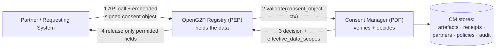
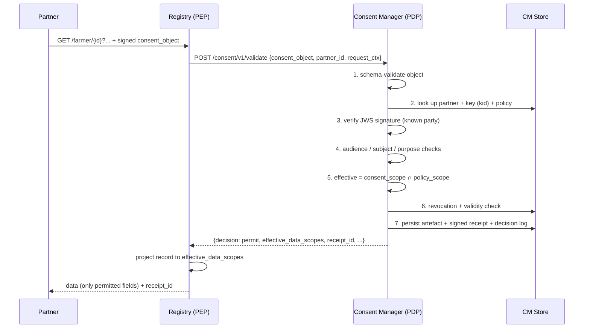
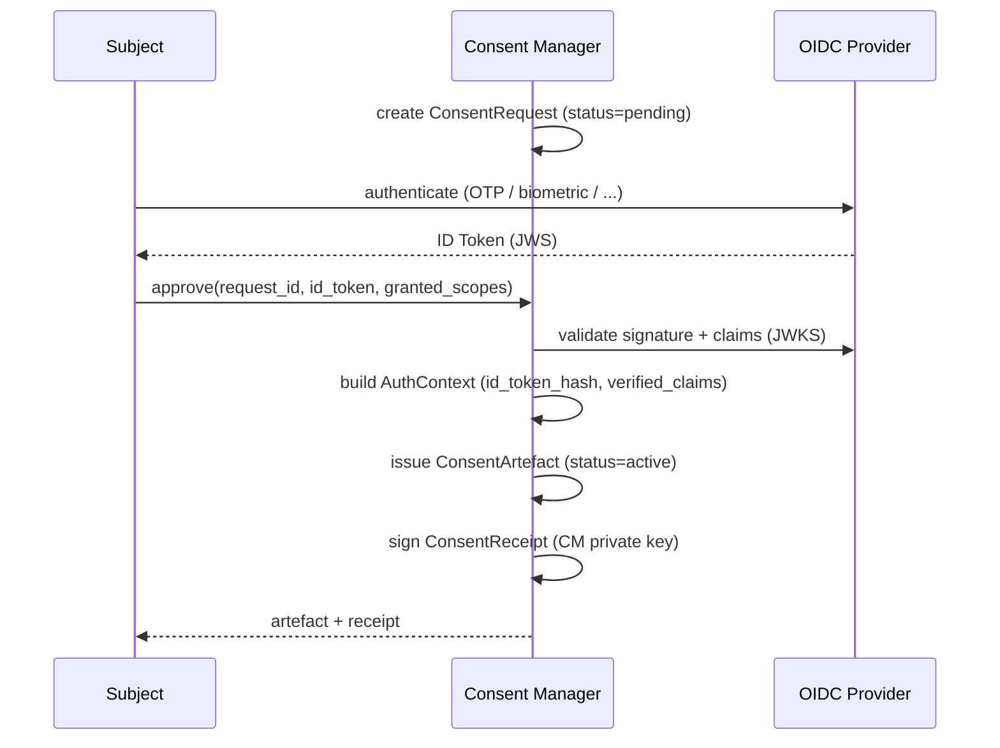

# Architecture

## The PDP / PEP model

The Consent Manager (CM) is a **Policy Decision Point (PDP)**. Any service that holds personal
data — primarily the OpenG2P Registry — is a **Policy Enforcement Point (PEP)**. The PEP holds
the data; the PDP holds the consent and policy logic and renders decisions.

The registry never parses or interprets the consent object. It forwards it, receives a decision
that includes the **effective set of fields**, and releases only those.

## Components

| Component | Responsibility |
| --- | --- |
| **Verification API** | Validates an embedded consent object and returns a decision (the hot path). |
| **Policy Engine** | Evaluates a consent object against the onboarded partner's versioned policy; computes the effective scope. |
| **Partner Registry** | Stores partners, their public keys (JWKS), and their policies. |
| **Trust / Key Store** | Partner public keys for verifying consent objects; the CM's own key pair for signing receipts. |
| **Artefact &amp; Receipt Service** | Produces canonical consent artefacts and CM-signed receipts (JSON-LD). |
| **Origination Service** | The secondary flow — consent requests, OIDC authentication, approval. |
| **Revocation &amp; Expiry** | Revocation store + status endpoint; background expiry of stale consents. |
| **Audit / Decision Log** | Append-only, tamper-evident record of every decision and state change. |
| **Notification Worker** | Async notifications to subjects/partners on grant, revoke, and expiry. |

## Primary flow — verify &amp; enforce

A partner already holds (or has collected) consent and embeds a **partner-signed consent
object** in its data request to the registry.

If any check fails, the CM returns `decision: deny` with a precise `reason_code`, the registry
releases nothing, and the denial is still logged.

## Secondary flow — originate consent

When OpenG2P itself collects consent (no pre-existing partner-signed object), the CM drives an
authentication + approval flow and issues the artefact and receipt.

This is covered in detail in [Consent lifecycle](consent-lifecycle.md).

## Registry integration

The registry's consent-aware data sharing supports two ingestion patterns, both terminating at
`POST /consent/v1/validate`:

1. **Stored consent** — the individual previously consented; the registry passes the request
   context and the CM matches an existing active artefact.
2. **Embedded consent payload** — the partner includes a signed consent object directly
   (DCI / UNDP-style). The CM validates it, generates a canonical artefact + signed receipt,
   stores them, and returns the decision.


[consent-aware-data-sharing.md](../../products/registry/registry/features/consent-aware-data-sharing.md)


## Information flow

<figure><figcaption>
End-to-end information flow across subject, identity provider, registry, and Consent Manager.
</figcaption></figure>
