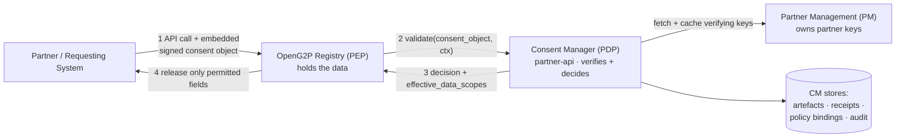
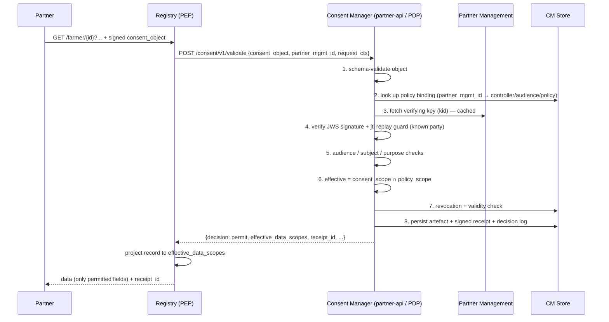
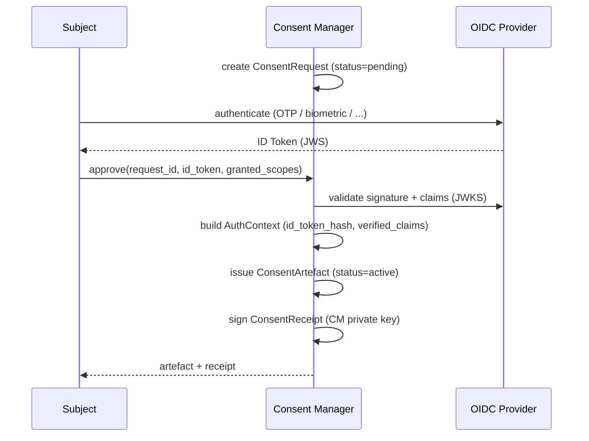
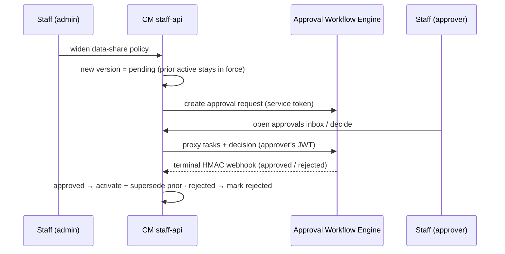

# Architecture

## The PDP / PEP model

The Consent Manager (CM) is a **Policy Decision Point (PDP)**. Any service that holds personal
data — primarily the OpenG2P Registry — is a **Policy Enforcement Point (PEP)**. The PEP holds
the data; the PDP holds the consent and policy logic and renders decisions.

The registry never parses or interprets the consent object. It forwards it, receives a decision
that includes the **effective set of fields**, and releases only those.

CM does **not** store partner signing keys or onboard partner identity. Partner identity and
signing keys are owned by **Partner Management (PM)**; the CM `partner-api` fetches a partner's
verifying keys from PM's key API and caches them, and holds only a **policy binding** (which PM
partner, under which controller/audience, is bound to which data-share policy). See
[Partner Management integration](partner-management-integration.md).

## One shared CM across modules

A single Consent Manager is deployed **per environment** and shared by every data-holding module
(farmer registry, social registry, PBMS, …). This keeps the policy bindings, policy engine,
audit log, and signing key central — one consent authority for the whole installation.

The module a consent concerns is a **per-binding attribute**: each partner binding carries a
`controller_id` (its module), and a consent object's `data_controller` is validated against that
binding's `controller_id` (check 4 below). There is no single global controller — the same CM
serves all modules, and a consent issued for one module can never authorise data from another. A
partner that needs data from two modules has one binding per module, each with its own policy.

## APIs by audience

CM follows the OpenG2P platform **4-API audience pattern**: distinct API audiences — **staff**,
**beneficiary**, **agent**, **partner** — where the first three authenticate via Keycloak (each in
its own realm) and the partner audience authenticates via partner keys rather than Keycloak. CM
today ships a **staff** API and a **partner** API, has a **beneficiary** API scaffolded for a later
phase, and has **no agent** API.

It is **one Helm chart and one Docker image**, with a separate Deployment/Service per audience —
selected by the env var `CONSENT_MANAGER_API_AUDIENCE=staff|partner|beneficiary` — each exposed on
its own hostname.

| Audience | Auth | Hosts |
| --- | --- | --- |
| **staff-api** | Keycloak (staff realm; roles `CONSENT_MANAGER_ADMIN` + `CONSENT_MANAGER_APPROVER`) | Policy-binding + versioned data-share-policy admin; the AWE approvals inbox (CM proxies AWE) + webhook receiver; a decisions/audit view. |
| **partner-api** | **No Keycloak** — trust is the partner-signed consent object verified against PM keys, replay-guarded by `jti`; registry↔CM secured at transport (Istio mTLS). | The PDP `POST /consent/v1/validate`, consent status, receipts, and `/.well-known/jwks.json`. Mints CM receipts (mounts the `.p12` signing key). |
| **beneficiary-api** *(later)* | Keycloak (beneficiary realm) | `/my/*` self-service + consent origination. |
| **agent-api** | — | Not applicable to CM. |

The hot path (`/validate`) therefore lands on the **partner-api**, which has no Keycloak: it
verifies the partner-signed object against keys fetched from PM. Admin, approvals, and audit views
live on the **staff-api** behind Keycloak.

## Components

| Component | Audience | Responsibility |
| --- | --- | --- |
| **Verification API** | partner | Validates an embedded consent object and returns a decision (the hot path). |
| **Policy Engine** | partner · staff | Evaluates a consent object against the bound partner's versioned data-share policy; computes the effective scope. |
| **Policy Binding &amp; Policy Admin** | staff | Manages the per-partner **policy binding** (`partner_mgmt_id` + `controller` + `audience` + policy) and the versioned data-share policies. |
| **PM Key Client** | partner | Fetches partner verifying keys from **Partner Management** and caches them; CM stores no partner keys of its own. |
| **Approval Proxy &amp; Webhook** | staff | Proxies the **AWE** approvals inbox with the approver's JWT and receives AWE's terminal HMAC webhook for policy-change approvals. |
| **Trust / Signing Store** | partner | The CM's own key pair (`.p12`) for signing receipts. Partner verifying keys are **not** stored here — they come from PM. |
| **Artefact &amp; Receipt Service** | partner | Produces canonical consent artefacts and CM-signed receipts (JSON-LD). |
| **Origination Service** | beneficiary *(later)* | The secondary flow — consent requests, OIDC authentication, approval. |
| **Revocation &amp; Expiry** | partner | Revocation store + status endpoint; background expiry of stale consents. |
| **Audit / Decision Log** | staff (view) | Append-only, tamper-evident record of every decision and state change. |
| **Notification Worker** | — | Async notifications to subjects/partners on grant, revoke, and expiry. |

## Primary flow — verify &amp; enforce

A partner already holds (or has collected) consent and embeds a **partner-signed consent
object** in its data request to the registry.

The registry calls the CM **partner-api**, which has no Keycloak — trust rests on the
partner-signed object, verified against keys fetched from Partner Management (PM).

If any check fails, the CM returns `decision: deny` with a precise `reason_code`, the registry
releases nothing, and the denial is still logged.

## Secondary flow — originate consent

When OpenG2P itself collects consent (no pre-existing partner-signed object), the CM drives an
authentication + approval flow and issues the artefact and receipt.

This is covered in detail in [Consent lifecycle](consent-lifecycle.md).

## Policy-change approval (AWE)

Data-share policies are a **ceiling** on what a partner may receive. **Widening** a policy — adding
scopes/purposes, loosening validity — must be approved before it takes effect. CM integrates the
shared **Approval Workflow Engine (AWE)** for this: a widening edit creates a new **pending** policy
version (the prior active version stays in force), CM submits an approval request to AWE, and only on
approval does the new version become **active** and supersede the prior one.

AWE has no approver UI. Approvers act in CM's **own** UI on the **staff-api**, which **proxies** the
AWE task-list and decision calls, forwarding the approver's own JWT (role
`CONSENT_MANAGER_APPROVER`). AWE signals the terminal outcome back to the staff-api via an
**HMAC-signed webhook**.

Details in [Approval Workflow integration](approval-workflow-integration.md).

## Registry integration

The registry's consent-aware data sharing supports two ingestion patterns, both terminating at
`POST /consent/v1/validate`:

1. **Stored consent** — the individual previously consented; the registry passes the request
   context and the CM matches an existing active artefact.
2. **Embedded consent payload** — the partner includes a signed consent object directly
   (DCI / UNDP-style). The CM validates it, generates a canonical artefact + signed receipt,
   stores them, and returns the decision.


[consent-aware-data-sharing.md](../../products/registry/registry/features/consent-aware-data-sharing.md)


## Information flow

<figure><figcaption>
End-to-end information flow across subject, identity provider, registry, and Consent Manager.
</figcaption></figure>
