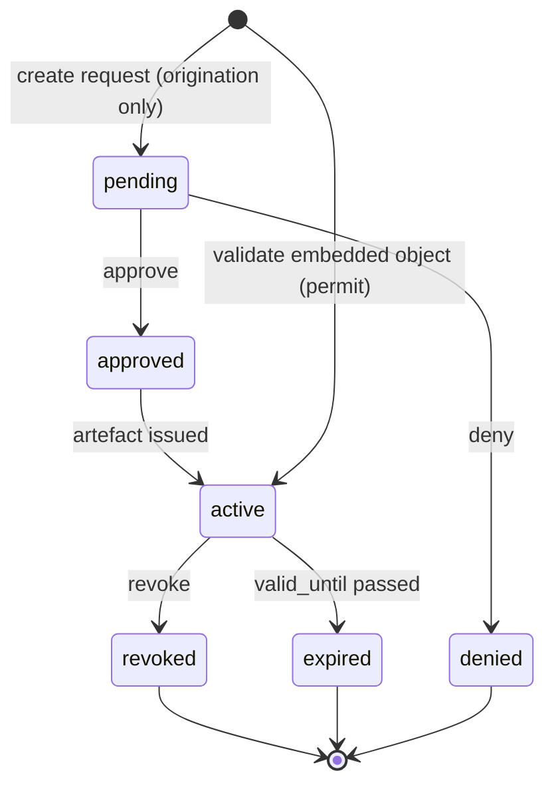

# Consent lifecycle

The **secondary** flow covers cases where OpenG2P itself collects consent rather than receiving a
pre-signed object from a partner. It also defines revocation and expiry, which apply to every
artefact regardless of how it was created.

## Origination

```mermaid
sequenceDiagram
  participant App as Subject app / staff portal
  participant CM as Consent Manager
  participant IdP as OIDC Provider

  App->>CM: POST /consent-requests {subject, partner, scopes, purpose}
  CM-->>App: request_id (status=pending)
  App->>IdP: subject authenticates (OTP / biometric)
  IdP-->>App: ID Token (JWS)
  App->>CM: POST /consent-requests/{id}/authenticate {id_token}
  CM->>IdP: fetch JWKS, validate signature + claims
  CM->>CM: build AuthContext (id_token_hash, verified_claims)
  App->>CM: POST /consent-requests/{id}/approve {granted_scopes}
  CM->>CM: effective = granted ∩ policy ; issue ConsentArtefact (active)
  CM->>CM: sign ConsentReceipt (CM private key)
  CM-->>App: { consent_id, receipt_id }
```

### Steps

1. **Create request** — a subject app, staff portal, or partner integration creates a
   `ConsentRequest` (status `pending`) naming the subject, the partner (audience), requested
   scopes, and purpose. The request is validated against the partner's policy up front, so an
   impossible request is rejected early.
2. **Authenticate** — the subject authenticates with the configured OIDC provider and the ID token
   is posted to the CM. The CM validates the token signature and claims (`iss`, `aud`, `exp`,
   `auth_time`, `amr`) against the IdP's JWKS, stores only the **hash**, and builds an
   `AuthContext`. See [Security &amp; trust](security-and-trust.md).
3. **Approve** — the subject chooses which requested scopes to grant. The CM computes
   `effective = granted ∩ policy.allowed_data_scopes`, issues a `ConsentArtefact`
   (`source = originated`, status `active`) linked to the `AuthContext`, and signs a
   `ConsentReceipt`.
4. **Deny** — alternatively the subject denies; the request becomes `denied`. **No artefact or
   receipt is created on denial.**

### Key rules

* An **artefact is only ever created on approval** — never on a request or a denial.
* A **receipt is only created after an artefact** exists.
* The **granted scope can never exceed policy**, even if the subject "approves" more.
* Approval requires a valid **AuthContext** — the subject must have authenticated.

## Revocation

A subject (or the controller, or the partner) can revoke an active consent at any time.

```mermaid
sequenceDiagram
  participant Sub as Subject
  participant CM as Consent Manager
  participant Sink as Enforcement points / partner

  Sub->>CM: POST /consents/{consent_id}/revoke {reason}
  CM->>CM: artefact.status = revoked ; write RevocationRecord (append-only)
  CM->>CM: enqueue revocation notification
  CM-->>Sub: { status: revoked }
  Sink-->>CM: GET /consents/{consent_id}/status (live check)
  CM-->>Sink: { status: revoked }
```

* Revocation is **append-only**: the artefact moves to `revoked`, a `RevocationRecord` is written,
  and the original timestamps are preserved.
* A `revoked` consent **fails validation immediately** (reason `revoked`).
* Revocation is **propagated** two ways: a live **status endpoint**
  (`GET /consents/{id}/status`, OCSP-like) that enforcement points consult, and **webhook /
  notification** to the partner and subject. This closes the gap where a cached "permit" could
  outlive a revocation.

## Expiry

A background job runs on a schedule:

1. Select artefacts where `status = active` and `valid_until < now`.
2. Set `status = expired`, stamp `expired_at`, and (origination flow) move the linked request to
   `expired`.
3. Enqueue an expiry notification to the subject.

Validation also performs a **lazy expiry check** so an artefact past `valid_until` is treated as
expired even before the batch job runs (reason `expired`).

## State machine



Every transition is recorded immutably in the decision/audit log for non-repudiation.
