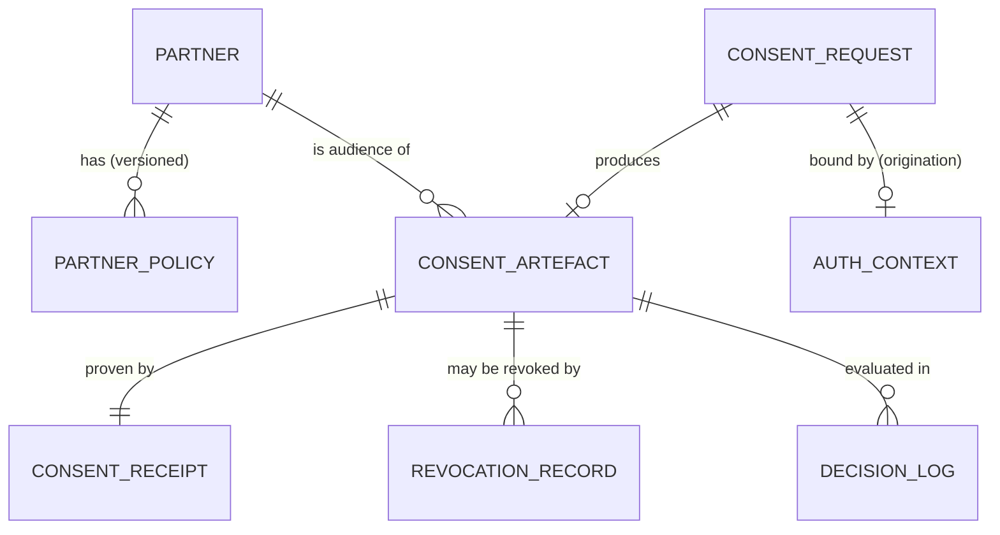

# Data model

The Consent Manager keeps two kinds of structures:

* **Stored entities** — relational records it owns (partners, policies, artefacts, receipts, logs).
* **Exchanged documents** — JSON-LD documents passed in/out (the consent object a partner embeds,
  the ID token from the IdP, and the artefact + receipt the CM issues).

All status transitions are **append-only**: a new status and timestamp are written, prior
timestamps are never overwritten, and the decision log is immutable.

## Entity overview



### Partner (policy binding)

Partner **identity and signing keys live in the Partner Management (PM) service**, not in the CM.
The CM's `Partner` record is a **thin policy binding** — it maps a PM partner to a CM authorization
context and carries nothing more. There is **no local `PartnerKey` table** and the CM does **not**
poll a `jwks_url`; at verification time the CM fetches the partner's public key (PEM) from PM by
`partner_mgmt_id` + the object's `kid`. See
[Partner Management Integration](partner-management-integration.md).

| Field | Type | Notes |
| --- | --- | --- |
| partner_id | UUID | Primary key (the CM-local binding id) |
| partner_mgmt_id | str | Reference to the partner in PM; falls back to `audience` if not set |
| name | str | Optional display name, for the admin UI only |
| status | enum | `active`, `suspended` — whether this binding is active in the CM |
| audience | str | The `aud` value the partner's consent objects must carry |
| controller_id | UUID | The data controller / module this partner is onboarded under |
| created_at / updated_at | datetime | |

### PartnerPolicy

The data-share contract a partner was onboarded under. **Consent can never grant more than the
policy.** Versioned; every decision records the version used, and the hot path only evaluates the
`active` version. A **widening** change sits `pending` until approved via the
[Approval Workflow Engine](approval-workflow-integration.md), then becomes `active` and supersedes
the prior version; a rejected/cancelled request marks the new version `rejected` and the prior
active version stays in force.

| Field | Type | Notes |
| --- | --- | --- |
| policy_id | UUID | Primary key |
| partner_id | UUID | FK → Partner |
| version | int | Monotonic; the active version is evaluated |
| allowed_data_scopes | list[str] | Fields/registers the partner may ever receive |
| allowed_purposes | list[str] | Purpose codes the partner may assert |
| allowed_subject_id_types | list[str] | e.g. `national_id`, `farmer_id` |
| allowed_signing_algs | list[str] | Acceptable JWS algorithms |
| max_validity_duration | duration | ISO-8601 upper bound on consent validity (e.g. `P1Y`) |
| fetch_type | enum | `oneshot`, `periodic` (DEPA-style) |
| max_fetch_frequency | duration | For `periodic` — minimum interval between fetches |
| data_life | duration | How long the partner may retain data after fetch |
| status | enum | `pending`, `active`, `superseded`, `rejected` |
| awe_request_id | str | The AWE request id for the approval of a widening change (null for narrowing / AWE-disabled) |
| effective_from | datetime | |

### ConsentArtefact (CM-issued, canonical)

The CM's canonical representation of a consent decision — whether re-canonicalised from a
partner-embedded object or produced by the origination flow.

| Field | Type | Notes |
| --- | --- | --- |
| consent_id | UUID | Primary key |
| subject_id_type / subject_id_value | str | The data subject |
| controller_id | UUID | Data controller (registry tenant) |
| partner_id | UUID | Audience / data recipient |
| purpose | json | `{code, text}` |
| data_scopes | list[str] | Consented fields (pre-policy-intersection) |
| effective_data_scopes | list[str] | `data_scopes ∩ policy.allowed_data_scopes` at issue time |
| valid_from / valid_until | datetime | |
| fetch_type | enum | `oneshot`, `periodic` |
| auth_context_id | UUID | FK → AuthContext (origination) or `null` (embedded, partner-attested) |
| source | enum | `embedded` (partner-signed) or `originated` (CM-collected) |
| policy_version | int | Policy version evaluated at issue |
| status | enum | `active`, `revoked`, `expired` |
| created_at / revoked_at / expired_at | datetime | Append-only |

### AuthContext (origination flow)

Created after the CM validates an ID token. The raw token is **never** persisted — only its hash.

| Field | Type | Notes |
| --- | --- | --- |
| auth_context_id | UUID | Primary key |
| consent_request_id | UUID | FK → ConsentRequest |
| auth_provider | str | e.g. `keycloak` |
| auth_method | str | `otp`, `biometric`, … (from `amr`) |
| auth_timestamp | datetime | |
| issuer | str | `iss` |
| id_token_hash | str | `sha256:…` |
| token_validated | bool | |
| verified_claims | json | `iss, sub, aud, amr, iat, exp, auth_time, kid` |

### ConsentReceipt

Kantara/ISO-27560-aligned, **signed with the CM's own `.p12` key**. The CM is self-verifying — it
publishes its signing public keys at `GET /.well-known/jwks.json`, so any party can verify a receipt
without PM. (The CM is **not** a PM partner.) See the JSON below.

| Field | Type | Notes |
| --- | --- | --- |
| receipt_id | UUID | Primary key |
| consent_id | UUID | FK → ConsentArtefact |
| artefact_hash | str | `sha256:…` over the canonical artefact |
| algorithm | enum | `EdDSA` (ed25519), `ES256`, or `RS256` — the CM `.p12` key's alg |
| kid | str | CM key id used to sign |
| signature | text | Detached/compact JWS over the artefact hash |
| version | str | Receipt schema version |
| issued_at | datetime | |

### ConsentRequest · RevocationRecord · DecisionLog

| Entity | Key fields |
| --- | --- |
| **ConsentRequest** (origination) | request_id, subject, controller_id, partner_id, requested_scopes, purpose, status (`pending`/`approved`/`denied`/`expired`), timestamps |
| **RevocationRecord** | revocation_id, consent_id, originated_by (`subject`/`controller`/`partner`), reason, created_at |
| **DecisionLog** (immutable) | decision_id, consent_id (nullable on deny), partner_id, request_ctx_hash, decision, reason_code, policy_version, evaluated_at |

---

## Exchanged documents (JSON-LD)

### ID Token

Received from the identity provider after subject authentication (origination flow).

```json
{
  "@context": "https://openg2p.org/contexts/id_token.jsonld",
  "@type": "IDToken",
  "iss": "https://idp.example.org",
  "sub": "FARMER_1234",
  "aud": "my.registry.org",
  "amr": ["otp"],
  "iat": 1714555200,
  "exp": 1714558800,
  "auth_time": 1714555190,
  "kid": "key-2025-01",
  "signature": "BASE64URL(JWS_signature)"
}
```

### Consent object (partner-embedded, the primary flow)

The **partner signs this** and embeds it in the registry request. The CM verifies the signature
locally, using the partner's public key **fetched from Partner Management** by `partner_mgmt_id` +
the object's `kid` (see [Partner Management Integration](partner-management-integration.md)).
`jti` + `issued_at` give replay protection.

```json
{
  "@context": "https://openg2p.org/contexts/consent_object.jsonld",
  "@type": "ConsentObject",
  "jti": "b2f1...-unique-per-object",
  "subject_id": { "type": "national_id", "value": "FARMER_1234" },
  "data_controller": "my.registry.org",
  "partner_system": "PARTNER_SYSTEM_A",
  "aud": "PARTNER_SYSTEM_A",
  "purpose": { "code": "share_farm_profile", "text": "Share farmer profile with Partner A" },
  "data_scopes": ["farmer_profile.basic", "farmer_profile.crops", "farmer_profile.landholdings"],
  "fetch_type": "oneshot",
  "validity": { "valid_from": "2025-05-01T12:00:00Z", "valid_until": "2026-05-01T12:00:00Z" },
  "issued_at": "2025-05-01T11:59:50Z",
  "signature": { "algorithm": "EdDSA", "kid": "partnerA-2025-01", "value": "BASE64URL(...)" }
}
```

### Auth Context

Generated by the CM after validating the ID token (origination flow).

```json
{
  "@context": "https://openg2p.org/contexts/auth_context.jsonld",
  "@type": "AuthContext",
  "auth_provider": "keycloak",
  "auth_method": "otp",
  "auth_timestamp": "2025-05-01T12:01:22Z",
  "issuer": "https://idp.example.org",
  "subject_id": "FARMER_1234",
  "kid": "key-2025-01",
  "id_token_hash": "sha256:ab349faa12bc908d...",
  "token_validated": true,
  "verified_claims": {
    "iss": "https://idp.example.org", "sub": "FARMER_1234", "aud": "my.registry.org",
    "amr": ["otp"], "iat": 1714555200, "exp": 1714558800, "auth_time": 1714555190, "kid": "key-2025-01"
  }
}
```

### Consent Artefact

The CM's canonical decision document. Stored, and checked before any data is released.

```json
{
  "@context": "https://openg2p.org/contexts/consent_artefact.jsonld",
  "@type": "ConsentArtefact",
  "consent_id": "CONSENT-123456",
  "subject_id": "FARMER_1234",
  "data_controller": "my.registry.org",
  "partner_system": "PARTNER_SYSTEM_A",
  "source": "embedded",
  "purpose": { "code": "share_farm_profile", "text": "Share farmer profile with Partner A" },
  "data_scopes": ["farmer_profile.basic", "farmer_profile.crops", "farmer_profile.landholdings"],
  "effective_data_scopes": ["farmer_profile.basic", "farmer_profile.crops"],
  "fetch_type": "oneshot",
  "policy_version": 3,
  "validity": { "consent_timestamp": "2025-05-01T12:02:10Z", "expiry_timestamp": "2026-05-01T12:02:10Z" },
  "auth_context": { "...": "Auth Context (origination) or omitted for partner-attested embedded consent" }
}
```

> `effective_data_scopes` excludes `farmer_profile.landholdings` because the partner's policy did
> not allow it — data minimisation enforced at the point of decision.

### Consent Receipt (Kantara / ISO 27560)

Generated alongside the artefact and **signed with the CM's own `.p12` key**. It is both
cryptographic proof and a human-readable consent record for the subject, audit, and disputes.

```json
{
  "@context": "https://openg2p.org/contexts/consent_receipt.jsonld",
  "@type": "ConsentReceipt",
  "receipt_id": "RECEIPT-998877",
  "version": "1.1",
  "issued_at": "2025-05-01T12:02:12Z",
  "jurisdiction": "IN",
  "data_controller": {
    "id": "my.registry.org",
    "name": "National Farmer Registry",
    "contact": "dpo@registry.org",
    "dpo": "Data Protection Officer"
  },
  "subject_id": "FARMER_1234",
  "purposes": [
    { "code": "share_farm_profile", "text": "Share farmer profile with Partner A",
      "legal_basis": "consent", "retention": "P0D-after-fetch" }
  ],
  "data_categories": ["farmer_profile.basic", "farmer_profile.crops"],
  "sensitive": false,
  "third_parties": ["PARTNER_SYSTEM_A"],
  "withdrawal": { "method": "POST /consent/v1/consents/CONSENT-123456/revoke" },
  "consent_artefact": { "@id": "CONSENT-123456", "hash": "sha256:7b0a933e7cd398a..." },
  "signature": {
    "algorithm": "EdDSA", "kid": "registry-2025-01",
    "value": "BASE64URL(cm_private_key.sign(consent_artefact_hash))"
  }
}
```

The CM publishes its signing public keys at `GET /.well-known/jwks.json` so any party can verify
a receipt independently.
