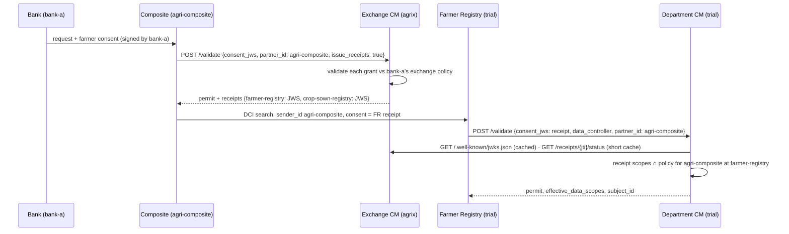

# Exchange receipts (Agri Stack exchange)

In the [distributed Agri Stack deployment](../../open-agri-stack/design/distributed-deployment-architecture.md)
a partner (e.g. a bank) onboards and the farmer consents **only at the exchange** (`agrix`), while
each department registry (`trial`, `csr`) still decides at its own boundary through its own Consent
Manager. The link between the two is a **consent receipt**: a short-lived JWS the exchange CM signs
for one registry, which the department CM verifies and evaluates against its own policy.

Everything here is **opt-in and off by default**. With the settings empty — every standalone
install — no new code path runs, `/validate` behaves exactly as before, and the Helm chart renders
the same manifests. API changes are additive only (an optional request field, an optional response
field, a new status endpoint, new reason codes).

## Two roles, one codebase

| Role | Install | Configured by | What it does |
| --- | --- | --- | --- |
| **Exchange CM** | `agrix` | `receipt_issuer` + `receipt_presenters` | Validates the partner's consent as usual and, when a configured **presenter** (the composite, `agri-composite`) asks with `issue_receipts: true`, signs one receipt per registry. Serves the receipts' status. |
| **Department CM** | `trial`, `csr` | `trusted_receipt_issuers` | Accepts a receipt from a trusted issuer on `/validate`, checks it, applies its **standing policy for the presenter**, and returns its normal decision to the registry. |

The registry is unchanged: it calls its **own** CM `/validate` with the consent JWS it received (now
a receipt), its `data_controller`, and the DCI `sender_id` as `partner_id` — as it always has.

## Consent receipt

A compact JWS signed with the CM's **existing receipt-signing key** — the same key, `kid` and
algorithm as its [Kantara receipts](data-model.md#consent-receipt-kantara-iso-27560), published at
`/.well-known/jwks.json` on the partner API.

**Header:** `{"alg": "<EdDSA|ES256|RS256>", "kid": "<CM kid>", "typ": "consent-receipt+jwt"}`

| Claim | Meaning |
| --- | --- |
| `iss` | The exchange CM's issuer ID (`receipt_issuer`, e.g. `agri-stack-exchange-cm`) |
| `jti` | Receipt ID (UUID) — the key for its status |
| `consent_id` | The exchange CM's consent artefact for this registry |
| `aud` | The data controller the receipt is for (e.g. `farmer-registry`) |
| `presenter` | Who may present it — the caller that asked for it (e.g. `agri-composite`) |
| `partner` | The partner that obtained the consent (the consent's `aud`, e.g. `bank-a`) |
| `sub` | The subject, `{"type": "FAYDA_FAN", "value": "…"}` — same shape as the consent's `subject_id` |
| `purpose` | Purpose code |
| `scopes` | Data scope IDs for this registry: the consent's grant ∩ the exchange policy for the partner |
| `consent_issued_at` | When the farmer's consent was issued (ISO-8601). Registries use it as "consent time" for data-scope versions |
| `consent_exp` | Consent expiry (epoch seconds) |
| `iat`, `nbf`, `exp` | Receipt times (epoch seconds); `exp` = min(consent expiry, now + `receipt_ttl_seconds`, default 900) |

> `sub` is an object, as the spec requires, so a generic RFC 7519 JWT validator (which wants a
> string `sub`) rejects it. Verify a receipt at the **JWS** level (signature with the JWKS key),
> then read the claims — as the department CM does.

## Exchange role: issuing

`POST /consent/v1/validate` with `issue_receipts: true`:

1. **Caller check** — the request's `partner_id` must be in `receipt_presenters` and `receipt_issuer`
   must be set; otherwise the decision is `deny` / `receipt_presenter_not_allowed`. The partner API
   has no Keycloak (transport is Istio mTLS), so — as for every partner-API call — the caller is
   identified by the `partner_id` it sends. That value becomes the receipt's `presenter`, which the
   department CM then matches against the `sender_id` the registry verified on the signed DCI
   request: a receipt is only usable by the presenter it was issued to.
2. **Validation** — each granted controller (or only `data_controller`, if sent) is validated
   exactly as a registry's call would be: signature via Partner Management, the partner's binding and
   policy for that controller, replay, validity. Each writes its artefact and decision log as usual.
3. **Receipts** — if every controller permits, one receipt per controller is signed and recorded
   (`issued_receipts`), and the response carries `receipts: {data_controller: JWS}`. If any
   controller denies, that deny is returned and **no** receipts are issued.

**Status** — `GET /consent/v1/receipts/{jti}/status` → `active | revoked | expired`. A receipt is
`revoked` when its consent artefact is revoked (per registry: revoking the farmer-registry consent
revokes only that receipt), `expired` after its `exp` or when its consent expires. Auth follows the
partner API (no Keycloak; the jti is an unguessable UUID and the answer is only the status).

## Department role: accepting

When `/validate` receives a JWS whose header `typ` is `consent-receipt+jwt`:

1. **Issuer** — `iss` must be in `trusted_receipt_issuers`; otherwise deny
   `receipt_issuer_not_trusted` (also when no issuers are configured — a receipt is never accepted
   by default).
2. **Signature** — verified against the issuer's JWKS (cached `receipt_jwks_cache_ttl_seconds`,
   refetched — throttled — when the `kid` is unknown, so a key rotation is picked up at once). A bad
   signature, `alg` mismatch or missing claims → `receipt_invalid`.
3. **Audience, presenter, time** — `aud` must equal `data_controller` (`audience_mismatch`);
   `presenter` must equal the caller's `partner_id` (the registry's DCI `sender_id`) and the trusted
   issuer's configured `presenter`, if set (`presenter_mismatch`); `nbf`/`exp` (`expired`, 30 s
   clock leeway on `nbf`).
4. **Status** (`receipt_status_check: always`, the default) — `GET` the receipt's status at the
   issuer (cached `receipt_status_cache_ttl_seconds`, default 10 s). `revoked`/`expired` deny with
   that reason; unreachable → `receipt_status_unavailable` (fail closed).
5. **Standing policy** — this CM's binding for **audience = presenter** at this controller and its
   active policy (none → `unknown_partner`). Subject type and purpose must be allowed; validity
   (`consent_issued_at` → `consent_exp`) is checked against `max_validity_duration`; **effective
   scopes = receipt `scopes` ∩ policy `allowed_data_scopes`** (∩ `requested_scopes`, if sent).
6. **Decision** — the normal response (`permit`/`deny`, `effective_data_scopes`, `subject_id` from
   `sub`, `policy_version`, `consent_id`). A permit mints an artefact (`source: receipt`, valid until
   the receipt expires) and a Kantara receipt as usual; presenting the same receipt again returns the
   stored decision. Every decision on a receipt — permit or deny — logs `receipt_jti` and
   `receipt_issuer` in the decision log.

The policy's `allowed_signing_algs` governs partner signatures and is not applied to receipts (the
exchange CM's key is trusted through `trusted_receipt_issuers`).

## Setting up a department for the exchange

1. Set the trusted issuer (Helm `global.agriStackExchange.trustedIssuer`, see
   [Deployment](../deployment/README.md#agri-stack-exchange-optional)).
2. Bind the presenter (`agri-composite`) at this CM **for each registry** it may read, with a policy:
   that policy is the department's standing decision on what the exchange may receive.
3. The registry needs no change beyond accepting the presenter as a DCI sender.
