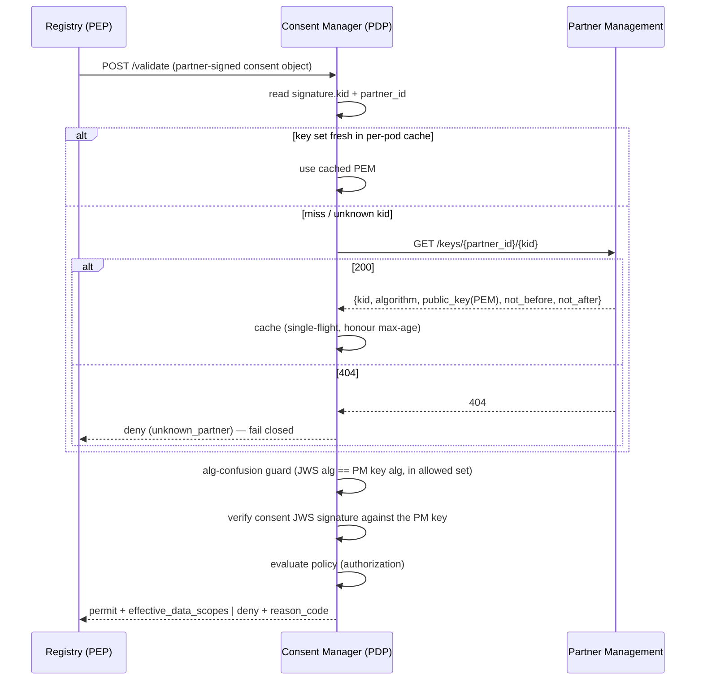

# Partner Management Integration

The Consent Manager (CM) no longer owns partner identity or partner signing keys. Both moved to the
**Partner Management (PM)** service. This page describes that boundary: the PM key API contract, how
the CM caches those keys, what the CM's own `Partner` record now holds, and how the CM fails closed.

## Why keys live in PM

The trust model splits **authentication** from **authorization** (see
[Security & trust](security-and-trust.md)):

* **PM = who the partner is + its keys** (authentication material) — identity, organisation,
  lifecycle, and the partner's public signing keys.
* **CM = what the partner may receive** (authorization + consent) — the data-share policy and the
  consent decision.

Keeping partner identity in one place means the CM never has a stale copy of a partner's keys, a
partner is enabled/disabled/rotated in exactly one system, and the CM stays a pure **verifier / PDP**.
The CM is **not** onboarded as a PM partner — it is a verifier, not a partner.

## PM key API contract

PM exposes an **unauthenticated** read API for partner public keys. In-cluster the base URL is
`http://partner-management-partner-api`.

```
GET {pm}/keys/{partner_id}
GET {pm}/keys/{partner_id}/{kid}
GET {pm}/keys/{partner_id}/jwks.json
```

The primary response:

```json
{
  "partner_id": "PARTNER_SYSTEM_A",
  "keys": [
    {
      "kid": "partner-key-1",
      "algorithm": "ES256",
      "public_key": "-----BEGIN PUBLIC KEY-----\n...\n-----END PUBLIC KEY-----",
      "not_before": "2026-01-01T00:00:00Z",
      "not_after":  "2026-12-31T23:59:59Z"
    }
  ]
}
```

* `algorithm` is one of **`RS256`**, **`ES256`**, **`EdDSA`**.
* `public_key` is a **PEM** — the CM verifies the consent object's JWS signature against it
  (via the shared `CryptoHelper`; the key is sourced from PM by the JWS `kid`).
* PM sets **`Cache-Control: public, max-age=300`** so caches — including the CM's — know how long the
  key set is fresh.


**`404` means REJECT.** A `404` from PM — the partner is unknown, disabled, or has no active keys —
is treated by the CM as a **fail-closed reject**, never as "skip the check". There is no fallback to
a local key store, because the CM no longer has one.


## CM key-caching discipline

The CM caches PM keys **per pod** with a layered TTL strategy that balances freshness, rotation, and
resilience to a PM outage:

| Behaviour | What it does |
| --- | --- |
| **Soft TTL** | Keys are considered fresh for `min(partner_key_cache_ttl_seconds, response max-age)`. Within it, no PM call. |
| **Hard TTL** | If PM is unreachable past the soft TTL, the last-known-good key set is still served up to `partner_key_hard_ttl_seconds`. Beyond that, the CM **fails closed**. |
| **Negative cache** | A `404` is cached for `partner_key_negative_ttl_seconds`, so a flood of requests for an unknown/disabled partner does not hammer PM. |
| **Unknown-kid refresh** | If a consent object presents a `kid` not in cache, the CM triggers a **rate-limited** refresh (bounded by `partner_key_refresh_cooldown_seconds`) — this catches **key rotation** promptly without allowing refresh spam. |
| **Single-flight** | Concurrent misses for the same partner collapse into **one** upstream fetch; the rest wait on its result. |

### Config keys

All under the `consent_manager_` prefix:

| Key | Purpose |
| --- | --- |
| `consent_manager_partner_mgmt_api_url` | Base URL of the PM key API (in-cluster: `http://partner-management-partner-api`) |
| `consent_manager_partner_key_cache_ttl_seconds` | Soft TTL (min'd with the response `max-age`) |
| `consent_manager_partner_key_hard_ttl_seconds` | Hard TTL — how long last-known-good is served during a PM outage before failing closed |
| `consent_manager_partner_key_negative_ttl_seconds` | How long a `404` (negative result) is cached |
| `consent_manager_partner_key_refresh_cooldown_seconds` | Minimum interval between unknown-`kid` refreshes |
| `consent_manager_partner_key_fetch_timeout_seconds` | Per-request timeout for a PM key fetch |

## The binding model

With identity in PM, the CM's `Partner` record is a **thin policy binding** — it maps a PM partner to
a CM authorization context, nothing more:

| Field | Meaning |
| --- | --- |
| `partner_mgmt_id` | Reference to the partner in PM (falls back to `audience` if not set) |
| `controller_id` | The module the partner is onboarded under; a consent object's `data_controller` is checked against this |
| `audience` | The `aud` value the partner's consent objects must carry |
| `status` | Whether this binding is active in the CM |
| display name | Optional, for the admin UI only |

Identity, organisation, and lifecycle live in **PM**. The policy (allowed scopes, purposes, validity
ceiling) is attached to this binding — see [Partner onboarding & policy](partner-onboarding-and-policy.md).

## Sequence: validate → fetch key → verify locally



The signature check is always **local** to the CM; PM only supplies the verifying key. Policy
evaluation and the algorithm-confusion guard are detailed in
[Verification & enforcement](verification-and-enforcement.md).
