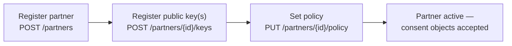

# Partner onboarding &amp; policy

A partner can only have its consent objects accepted if it has been **onboarded** with (a) at
least one **public key** and (b) an active **policy**. The policy is the ceiling on everything
that partner can ever be granted.

## Onboarding steps



1. **Register the partner** — name, organisation, the `audience` identifier it will use, and the
   `controller_id` of the **module** it is onboarded under (e.g. farmer registry, social registry).
   One shared CM serves all modules; a partner that needs data from two modules is registered once
   per module. A consent object's `data_controller` is later checked against this `controller_id`.
2. **Register its public key(s)** — one or more keys with a `kid` and algorithm. The partner signs
   consent objects with the matching private key; the CM verifies with the public key.
3. **Set its policy** — the allowed scopes, purposes, validity ceiling, and fetch semantics.

Only an administrator (or the controller's onboarding service) may perform these steps — see the
[Partner &amp; Policy API](../api/partner-and-policy-api.md).

## Key management

* A partner may have **multiple active keys** to support **rotation** without downtime: publish
  the new key, switch signing, then revoke the old key.
* Each key carries `not_before` / `not_after`. The CM resolves the verifying key by the `kid` in
  the consent object's JWS header.
* Revoking a key (`DELETE /partners/{id}/keys/{kid}`) immediately invalidates objects signed with
  it — useful on key compromise.
* Partners may instead expose a **JWKS URL** the CM polls, mirroring OIDC key rotation.

## Policy model

The policy is the enforceable contract. It is **versioned** — changing it creates a new version;
the previously active version is retained, and every decision records the `policy_version` it was
evaluated against.

| Dimension | Meaning | Enforced in validation |
| --- | --- | --- |
| `allowed_data_scopes` | The maximal set of fields/registers this partner may ever receive | Step 7 — `data_scopes ⊆ allowed_data_scopes`; effective = intersection |
| `allowed_purposes` | Purpose codes the partner may assert | Step 6 |
| `allowed_subject_id_types` | Which subject identifier types are acceptable | Step 5 |
| `max_validity_duration` | Upper bound on `valid_until − valid_from` | Step 8 |
| `fetch_type` | `oneshot` or `periodic` (DEPA-style recurring access) | recorded on artefact |
| `max_fetch_frequency` | For `periodic`, the minimum interval between fetches | enforced per fetch |
| `data_life` | Retention the partner may keep data for after fetch | recorded on receipt |
| `allowed_signing_algs` | Acceptable JWS algorithms (reject weak/none) | Step 3 |

### Example policy

```json
{
  "version": 3,
  "allowed_data_scopes": ["farmer_profile.basic", "farmer_profile.crops"],
  "allowed_purposes": ["share_farm_profile", "subsidy_eligibility"],
  "allowed_subject_id_types": ["national_id", "farmer_id"],
  "max_validity_duration": "P1Y",
  "fetch_type": "oneshot",
  "data_life": "P30D",
  "allowed_signing_algs": ["EdDSA", "ES256"],
  "status": "active",
  "effective_from": "2025-04-01T00:00:00Z"
}
```

A partner presenting a consent object for `farmer_profile.landholdings`, or with a two-year
validity, is partially or fully denied — the policy caps it regardless of what the subject
"consented" to in the object.

## Policy as a decision function

Evaluation is **deterministic and side-effect-free** (logging aside): given a consent object,
the active policy version, and the request context, it always yields the same decision. This
keeps it testable and auditable, and lets enforcement points reason about outcomes.

```
decide(consent_object, policy, request_context) -> {
  decision: permit | deny,
  effective_data_scopes: requested ∩ consented ∩ policy.allowed_data_scopes,
  reason_code,
  policy_version
}
```

## Consent templates (optional)

To standardise common partnerships, a controller can define **consent templates** — named
bundles of purpose + scopes + validity that align with a partner policy. Templates make
origination flows consistent and give subjects predictable, comparable consent prompts. See
[Standards &amp; best practices](standards-and-best-practices.md).
