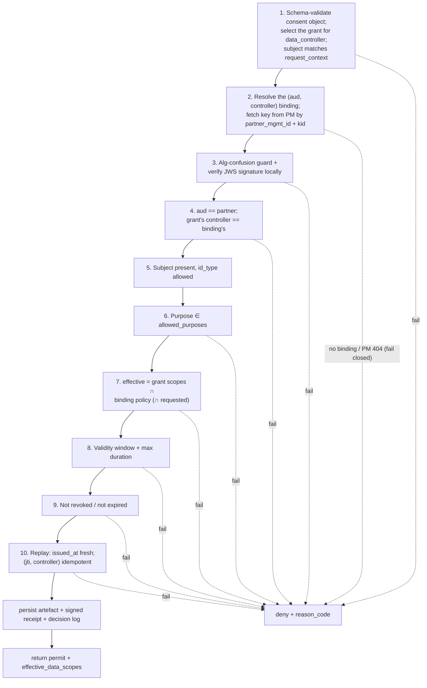

# Verification & enforcement

This is the **primary** use case. A partner already holds consent (collected out-of-band or via the origination flow) and embeds a **partner-signed consent object** when it calls a registry API. The registry enforces; the Consent Manager (CM) decides.

## Roles

* **Registry (PEP)** — holds the data, extracts the embedded consent object, calls the CM, and releases only the fields the CM returns. It does not interpret consent.
* **Consent Manager (PDP)** — verifies the object, evaluates policy, and returns a decision with the **effective set of fields**.

## Request shape

The partner calls a registry endpoint and embeds the consent object (e.g. in a header, a `consent` body field, or per the interop protocol). The registry forwards it unchanged to the CM's `/validate` endpoint. `/validate` is on the **partner API** and requires **no Keycloak token** — trust rests on the partner-signed object (verified with keys from Partner Management) plus the `jti` replay guard; the registry↔CM hop is transport-secured (Istio mTLS).

```
POST /consent/v1/validate
{
  "consent_jws": "eyJhbGciOiJFZERTQS...<compact JWS>...",
  "partner_id": "PARTNER_SYSTEM_A",
  "data_controller": "farmer-registry",
  "request_context": {
    "requested_scopes": ["farmer_profile.basic", "farmer_profile.crops"],
    "subject_id": { "type": "national_id", "value": "FARMER_1234" }
  }
}
```

The consent object is a **compact JWS** (RFC 7515); the CM recovers the claims from its payload and verifies the signature against the partner's Partner-Management key referenced by the JWS `kid`.

**One consent, one grant per registry.** A partner asks the subject once for everything it needs; the consent lists a grant per registry (`grants: [{data_controller, data_scopes}]`). Each registry sends its own `data_controller` and is evaluated **only on its grant**, against **its own binding's policy**. The earlier single-registry form (`data_controller` + `data_scopes` in the claims) is still accepted as one grant. See the [Verification API](../api/verification-api.md) for the claim shapes and examples.

`requested_scopes` lets the CM intersect three sets: what the partner is **asking for now**, what the subject **consented to** (for this registry), and what **policy allows** (for this registry).

## Validation pipeline (the PDP)

The CM evaluates these checks in order. The first failure short-circuits to `deny` with a precise `reason_code`; the denial is still logged.


```mermaid
flowchart TD
  A["1. Schema-validate consent object;\nselect the grant for data_controller;\nsubject matches request_context"] --> B["2. Resolve the (aud, controller) binding;\nfetch key from PM by partner_mgmt_id + kid"]
  B --> C["3. Alg-confusion guard +\nverify JWS signature locally"]
  C --> D["4. aud == partner;\ngrant's controller == binding's"]
  D --> E["5. Subject present, id_type allowed"]
  E --> F["6. Purpose ∈ allowed_purposes"]
  F --> G["7. effective = grant scopes ∩\nbinding policy (∩ requested)"]
  G --> H["8. Validity window + max duration"]
  H --> I["9. Not revoked / not expired"]
  I --> J["10. Replay: issued_at fresh;\n(jti, controller) idempotent"]
  J --> K["persist artefact + signed receipt + decision log"]
  K --> L["return permit + effective_data_scopes"]
  A -. fail .-> X["deny + reason_code"]
  B -. "no binding / PM 404 (fail closed)" .-> X
  C -. fail .-> X
  D -. fail .-> X
  F -. fail .-> X
  G -. fail .-> X
  H -. fail .-> X
  I -. fail .-> X
  J -. fail .-> X
```

| #  | Check                                                                                                               | Reason code on failure                |
| -- | ------------------------------------------------------------------------------------------------------------------- | ------------------------------------- |
| 1  | The consent JWS decodes and its claims match the consent-object schema (exactly one of `grants` or `data_controller` + `data_scopes`; no controller twice) | `malformed_object`                    |
| 1a | Grant selection: with `grants`, the request names a `data_controller` (else `malformed_object`) that has a grant; with the single-registry form, a named `data_controller` equals the consent's | `controller_not_granted`              |
| 1b | If `request_context.subject_id` has the consent subject's `type`, its `value` matches (another type is left to the registry) | `subject_mismatch`                    |
| 2  | `aud` + the selected controller resolve to an `active` binding; the key for its `partner_mgmt_id` + JWS `kid` is fetched from PM (a `404` — unknown/disabled/no active key — is a **fail-closed reject**) | `unknown_partner`                     |
| 3  | The JWS `alg` is permitted (allowed set + policy `allowed_signing_algs`, matched to the PM key — **algorithm-confusion guard**), and the JWS signature verifies against that key | `signature_invalid`                   |
| 4  | `aud` == the partner, and the grant's `data_controller` == the binding's `controller_id`                           | `audience_mismatch`                   |
| 5  | Subject present; `subject_id_type` ∈ `allowed_subject_id_types`                                                     | `subject_not_allowed`                 |
| 6  | `purpose.code` ∈ `allowed_purposes`                                                                                 | `purpose_not_allowed`                 |
| 7  | effective = grant `data_scopes` ∩ `allowed_data_scopes` (∩ `requested_scopes`) is non-empty                       | `scope_exceeds_policy`                |
| 8  | `now ∈ [valid_from, valid_until]` and `(valid_until − valid_from) ≤ max_validity_duration`                          | `expired` / `validity_exceeds_policy` |
| 9  | `consent_id` not in revocation store                                                                                | `revoked`                             |
| 10 | `issued_at` within the freshness window; a `jti` already decided for this controller returns that decision        | `replay`                              |

> **Policy is a ceiling, consent is a request.** Step 7 never widens scope. The effective scope is `requested_scopes ∩ grant.data_scopes ∩ allowed_data_scopes`, where the grant and the policy are both those of the calling registry. If that intersection is empty, the result is `deny` with `scope_exceeds_policy`.

> **The verifying key comes from Partner Management, not a CM table.** At step 2 the CM fetches the partner's public key (PEM) from PM by `partner_mgmt_id` + `kid`, caching it per pod (soft/hard/negative TTL, unknown-`kid` refresh). The signature check itself is always **local** to the CM. A `404` from PM fails closed. See [Partner Management Integration](partner-management-integration.md).

## Decision object (CM → registry)

```json
{
  "decision": "permit",
  "consent_id": "CONSENT-123456",
  "receipt_id": "RECEIPT-998877",
  "subject_id": { "type": "national_id", "value": "FARMER_1234" },
  "data_controller": "farmer-registry",
  "effective_data_scopes": ["farmer_profile.basic", "farmer_profile.crops"],
  "valid_until": "2026-05-01T12:02:10Z",
  "policy_version": 3,
  "reason_code": "ok",
  "evaluated_at": "2025-05-01T12:02:12Z"
}
```

On denial:

```json
{ "decision": "deny", "reason_code": "scope_exceeds_policy",
  "detail": "requested 'farmer_profile.landholdings' not permitted by policy",
  "evaluated_at": "2025-05-01T12:02:12Z" }
```

## Enforcement at the registry (PEP)

The registry's contract is intentionally tiny:

1. Call `POST /consent/v1/validate`, naming itself as `data_controller`.
2. If `decision != "permit"` → return nothing (HTTP 403 with `reason_code`).
3. Check that the decision's `subject_id` (the consent's subject) is the person being searched — directly, or through the registry's own data (e.g. a farmer ID recorded with the farmer's national ID). See [Registry integration](registry-integration.md#subject-enforcement).
4. Project the record down to `effective_data_scopes` and return only those fields, echoing `receipt_id` for the partner's audit trail.

Because the CM returns the field list and the subject, the registry needs **no consent logic** — only a subject check and a field-projection step. This is the deliberate division of labour decided in the design: **CM returns the effective fields; the registry is a dumb enforcement point.**

## What the CM persists

On every evaluation (permit or deny) the CM writes an immutable **DecisionLog** entry, including the `data_controller` it was made for. On a permit it additionally:

* records the verified consent claims **for that controller's grant** as a **ConsentArtefact** (`source = embedded`) — one per (`jti`, `data_controller`),
* signs a **ConsentReceipt** with its own `.p12` key (self-verifying via the CM's published JWKS), and
* stores both, returning `consent_id` + `receipt_id`.

This gives non-repudiable proof — independently verifiable via the CM's published JWKS — for audit and dispute resolution.

## Idempotency & performance

* The hot path is a single round trip; partner keys (fetched from PM) are cached per pod, and the active policy version is cached (refreshed on an unknown `kid` / policy change).
* Re-validating the same object (same `jti`) **by the same registry** returns the same `consent_id` / `receipt_id` rather than minting duplicates. Idempotency is keyed on (`jti`, `data_controller`): two registries validating one multi-grant consent each get their own decision, artefact and receipt, and revoking one leaves the other in force.
* Revocation is checked live (see [Consent lifecycle](consent-lifecycle.md)); enforcement points that cache decisions must respect the status endpoint.
