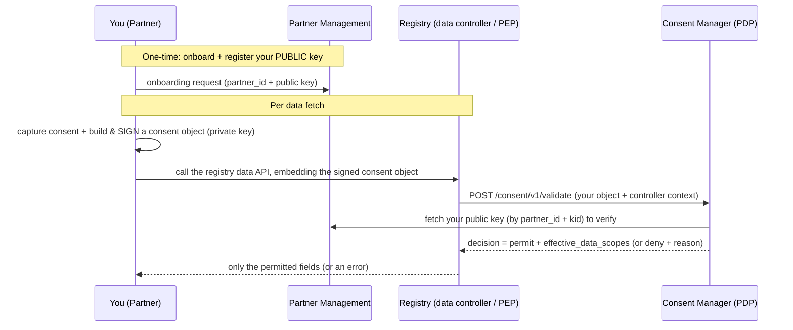

# Partner Integration Guide

You are a **partner** — a system that wants to fetch some data about a beneficiary
(e.g. a farmer's profile) held in an OpenG2P **registry**. Data is released **only**
against a valid, **partner-signed, policy-bound consent**. This page walks the whole
journey from your side.

> **The one thing to internalise:** you do **not** fetch data from the Consent
> Manager. You call the **registry's** data API and *embed a consent object you
> signed*. The registry (the enforcement point) asks the Consent Manager to
> validate it, and returns **only** the fields the consent + policy allow. The
> Consent Manager is the decision-maker, never the data source.

## Who you talk to



| You interact with | For | How |
| --- | --- | --- |
| **Partner Management (PM)** | onboarding, registering + rotating your keys | PM admin/self-service API |
| **The Registry** | the actual data fetch (embed your signed consent) | the registry's data API |
| **Consent Manager (CM)** | *(optional)* fetch receipts, check consent status, read its JWKS | its public/partner endpoints |

---

## Step 1 — Generate and hold your signing key

You sign every consent object with your **private key**; only your **public key** is
shared (with PM). Supported algorithms: **EdDSA (Ed25519, recommended)**, **ES256**
(EC P-256), **RS256** (RSA).

- Keep the private key in a secure keystore. A **PKCS#12 (`.p12`)** file is the
  recommended format (it holds the private key, optionally with a cert):

  ```bash
  # Ed25519 example
  openssl genpkey -algorithm ed25519 -out partner_priv.pem
  openssl pkey -in partner_priv.pem -pubout -out partner_pub.pem   # PUBLIC half → PM
  # bundle the private key into a .p12 you keep
  openssl pkcs12 -export -inkey partner_priv.pem -nocerts -out partner.p12
  ```

- Choose a stable **`kid`** (key id), e.g. `partnerA-2025-01`. You put it in every
  consent object and use it to rotate keys (Step 10). **Never** share the private key
  or the `.p12` — the Consent Manager never needs it and never asks for it.

---

## Step 2 — Onboard in Partner Management

Register yourself as a partner in **Partner Management (PM)** and upload your
**public** key(s). See [Partner Management](https://docs.openg2p.org/platform/platform-services/partner-management)
and [how CM consumes PM keys](design/partner-management-integration.md).

- Submit an onboarding request with a stable **`partner_id`** (your business
  identifier, e.g. `PARTNER_SYSTEM_A`), a name, and your public key(s) as PEM or JWK
  with `kid` + `algorithm`. A PM operator approves it.
- After approval, your keys are served at `GET {pm}/keys/{partner_id}` (PEM + kid +
  algorithm). Verify you can fetch them — that's exactly what CM will do to verify
  your signatures. PM returns `404` for unknown/disabled partners, which the CM
  treats as **reject**, so make sure your partner is **active**.

> PM stores only your **public** key. Rotation and revocation are also done here
> (Step 10).

---

## Step 3 — Get a data-share policy binding (per registry)

For each registry whose data you want, that registry's administrator creates a
**policy binding** in their Consent Manager that ties your PM partner to their
controller with a **data-share policy** — the set of data scopes, purposes,
subject-id types, validity limit, fetch type and signing algorithms you may **ever**
receive. See [Partner policy binding & approval](design/partner-onboarding-and-policy.md).

- This policy is the **ceiling**: what you actually get back is always
  `consent scope ∩ policy`. You cannot exceed it, no matter what the consent says.
- You request this binding from the registry operator (out of band). Ask for exactly
  the scopes/purposes you need. Widening an existing policy may go through an
  approval workflow on their side — plan for lead time.
- You'll agree on the **`data_controller`** identifier and the **audience** (your
  `partner_id`) to use in the consent object (Step 5).

---

## Step 4 — Obtain the beneficiary's consent

Sharing requires the **beneficiary's consent** for the specific purpose and scopes.
Consent is captured one of two ways:

1. **Via the Consent Manager's consent-giving flow** — the beneficiary is directed to
   the Consent Manager, authenticates, and approves; the Consent Manager records the
   grant. *(The beneficiary-facing origination surface is being finalised — confirm
   availability with the platform operator.)*
2. **Via your own authorised consent-capture** — you obtain the beneficiary's consent
   through your channel and **assert** it in the consent object you sign.

Either way, the consent you assert must stay within what the beneficiary agreed to
**and** within the policy (Step 3). Misrepresenting consent is a compliance breach —
the signed object + the issued receipt (Step 9) are the audit evidence.

---

## Step 5 — Construct the consent claims

Build the consent claims — these become the **payload** of the JWS you sign in Step 6.
Fields:

| Field | Meaning |
| --- | --- |
| `jti` | Unique id for THIS object (replay guard — never reuse) |
| `subject_id` | `{ type, value }` — the beneficiary (e.g. `national_id` / `FARMER_1234`) |
| `data_controller` | The registry's controller id (agreed in Step 3) |
| `aud` | The audience — **your** `partner_id` |
| `purpose` | `{ code, text }` — must be allowed by the policy |
| `data_scopes` | The fields you're requesting (subset of the policy) |
| `fetch_type` | `oneshot` or `periodic` |
| `validity` | `{ valid_from, valid_until }` (within the policy's max) |
| `issued_at` | Now (UTC) — must be within the freshness window |

```json
{
  "@context": "https://openg2p.org/contexts/consent_object.jsonld",
  "@type": "ConsentObject",
  "jti": "b2f1-unique-per-object",
  "subject_id": { "type": "national_id", "value": "FARMER_1234" },
  "data_controller": "my.registry.org",
  "aud": "PARTNER_SYSTEM_A",
  "purpose": { "code": "share_farm_profile", "text": "Share farmer profile with Partner A" },
  "data_scopes": ["farmer_profile.basic", "farmer_profile.crops"],
  "fetch_type": "oneshot",
  "validity": { "valid_from": "2025-05-01T12:00:00Z", "valid_until": "2026-05-01T12:00:00Z" },
  "issued_at": "2025-05-01T11:59:50Z"
}
```

There is **no `signature` field** — the whole object is signed as a JWS in Step 6.

---

## Step 6 — Sign the consent object as a compact JWS

The consent object is signed as a **compact JWS** (RFC 7515) — the standard `header.payload.signature`
form used by JWTs and OIDC. The claims from Step 5 are the payload; the protected header
carries `alg` and `kid`. This is a standard operation in any JWS/JWT library — **no custom
canonicalisation to get wrong**.

```python
from cryptography.hazmat.primitives.serialization import load_pem_private_key
from jwt.api_jws import PyJWS  # PyJWT
import json

def sign_consent_jws(claims: dict, priv, kid: str, alg: str = "EdDSA") -> str:
    payload = json.dumps(claims, separators=(",", ":")).encode("utf-8")
    return PyJWS().encode(payload, priv, algorithm=alg, headers={"kid": kid})

priv = load_pem_private_key(open("partner_priv.pem", "rb").read(), password=None)
consent_jws = sign_consent_jws(consent_claims, priv, kid="partnerA-2025-01", alg="EdDSA")
# -> "eyJhbGciOiJFZERTQS<...>.eyJqdGkiOiJ<...>.<signature>"
```

> The JWS header `kid` **must** match a key you registered in PM (Step 2), and `alg` must
> match that key's algorithm and be permitted by your policy's `allowed_signing_algs` —
> otherwise verification fails. Any RFC-7515 JWS library (jose, jsonwebtoken, etc.) works;
> you don't have to use Python/PyJWT.

---

## Step 7 — Call the registry's data API (embed the consent JWS)

Send the **consent JWS** to the **registry's** data endpoint, per that registry's API
contract. For the OpenG2P registry (DCI search) you embed it at
`search_criteria.authorize.consent_jws` — see
[Registry integration](design/registry-integration.md). You do **not** call the Consent
Manager's `/validate` — the registry does that for you, adding its own controller context.
For reference, the call the registry makes on your behalf is
[`POST /consent/v1/validate`](api/verification-api.md); it returns `permit` +
`effective_data_scopes` or `deny` + a `reason_code`, and the registry releases **only**
the permitted fields.

*(You may optionally call the Consent Manager's `partner-api` `/validate` yourself to
pre-check an object before sending it to the registry — but the authoritative
decision and the data both come via the registry.)*

---

## Step 8 — Read the outcome & handle denials

You receive back **only** the effective fields (`consent scope ∩ policy`), or an
error the registry surfaces from the decision's `reason_code`:

| `reason_code` | What it means / what to fix |
| --- | --- |
| `ok` | Permitted — you got `effective_data_scopes`. |
| `unknown_partner` | Your partner/kid isn't active/known in PM. Re-check Step 2. |
| `signature_invalid` | The consent JWS didn't verify — wrong `kid`, a key/alg mismatch, or the JWS was altered after signing. |
| `audience_mismatch` | `aud` / `data_controller` don't match the binding. Re-check Steps 3 & 5. |
| `purpose_not_allowed` | Purpose isn't in the policy — ask the controller to add it. |
| `scope_exceeds_policy` | You requested a field outside the policy ceiling — narrow it or ask to widen the policy. |
| `expired` | `validity` window passed — issue a fresh consent. |
| `revoked` | The subject revoked this consent — stop; you may need fresh consent. |
| `replay` | `issued_at` outside the freshness window, or reused — sync clocks, issue fresh. |
| `malformed_object` | The object failed schema validation — check required fields. |

---

## Step 9 — Receipts, status & revocation

- **Receipt (proof):** a permit issues a signed **consent receipt** (`receipt_id`).
  Fetch it — [`GET /consent/v1/receipts/{receipt_id}`](api/verification-api.md) — it's
  public and **self-verifying** against the Consent Manager's
  `GET /.well-known/jwks.json`, so you can prove independently that the decision
  happened. Keep receipts for audit.
- **Status:** for cached or periodic access, re-check
  `GET /consent/v1/consents/{consent_id}/status` (`active | revoked | expired`) rather
  than trusting a stale decision.
- **Revocation:** the beneficiary can revoke consent at any time. Honour it — a
  revoked/expired consent must stop further fetches.

---

## Step 10 — Maintain your keys (rotation & compromise)

- **Rotate** by registering a **new** key (new `kid`) in PM (a key-update request),
  keeping the old key active briefly so in-flight objects still verify, then revoking
  the old one. Start signing new objects with the new `kid`. The Consent Manager
  picks up rotations quickly (it re-fetches on an unknown `kid`).
- **Compromise:** revoke the affected key in PM immediately. The Consent Manager
  fails **closed** for anything signed with a revoked/absent key.
- Never rotate by reusing a `kid` for a different key.

---

## Common pitfalls (checklist)

- [ ] The consent object is a valid **compact JWS** (Step 6), signed with your PM key.
- [ ] JWS header `kid` + `alg` match a key you registered in PM (and the policy's
      `allowed_signing_algs`).
- [ ] `aud` = your `partner_id`; `data_controller` = the binding's controller.
- [ ] Requested `data_scopes` / `purpose` are within the policy (else widen the
      policy first).
- [ ] `issued_at` is fresh and clocks are synced; `jti` is unique.
- [ ] You handle `deny` outcomes and honour `revoked` / `expired`.

## Related pages

* [Verification API](api/verification-api.md) — the exact `/validate` request/response
  the registry makes on your behalf, plus receipts, status and JWKS.
* [Partner Management integration](design/partner-management-integration.md) — how your
  keys are fetched + cached.
* [Partner policy binding & approval](design/partner-onboarding-and-policy.md) — the
  policy that bounds what you can receive.
* [Security & trust](design/security-and-trust.md) · [Data model](design/data-model.md)
  — the consent object, artefact and receipt in detail.
