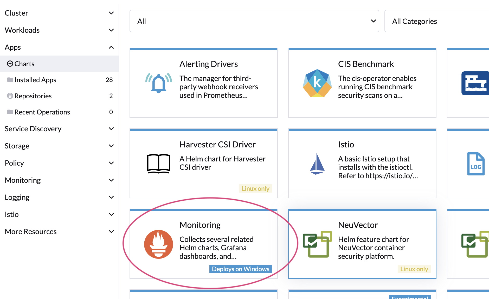

# Prometheus & Grafana

Prometheus and Grafana provide power [system health](../../monitoring-and-reporting/system-health.md) monitoring tools along with visualisation.  Deploy both the above tools using Rancher's admin console.

1. Login into the Rancher admin console
2. Select your cluster
3. Install Monitoring app

<figure><figcaption></figcaption></figure>
