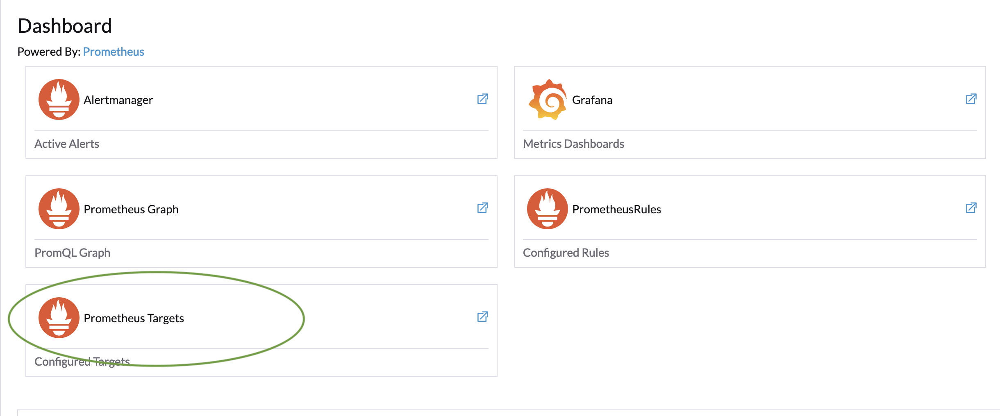

# Prometheus & Grafana

Prometheus and Grafana provide powerful [system health](../../monitoring-and-reporting/system-health.md) monitoring tools along with visualisation.  Deploy both the above tools using Rancher's admin console.

1. Login into the Rancher admin console
2. Select your cluster
3. Install Monitoring app

<figure><figcaption></figcaption></figure>

4. After installation, click on the _Monitoring_ menu on the left to reach the below page.  Click on _Prometheus Targets_ and make sure all scrape URLs have the status "Up".  If not, check if the ports indicated on the URL are accessible across nodes. For information on ports to be opened on nodes refer [Firewall Requirements](cluster-setup.md#firewall-requirements).

<figure><figcaption></figcaption></figure>

