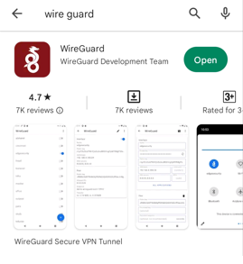
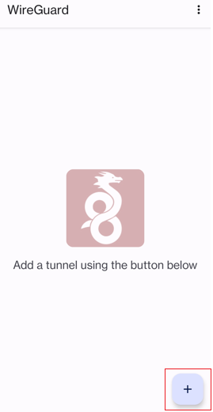
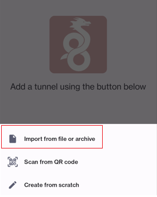
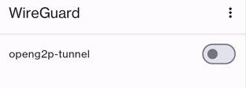
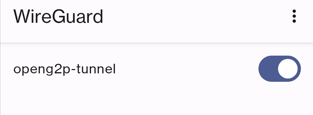

# Install WireGuard Client on Android Device

## Description

The guide here provides steps to install WireGuard app on Android device and to activate the tunnel. This app allows users to create an encrypted VPN for secure communication.

## Prerequisites

The prerequisites to install WireGuard on Android device are:

1. A user must have an Android Phone.
2. Before proceeding with the installation, obtain the WireGuard conf file from a System Administrator.

## Procedure

The steps to install WireGuard in an Android device are:

1. In the Android play store, search for "wireguard" and then tap **Install**.
2. After the successful installation, tap **Open**

<figure><figcaption>
WireGuard application
</figcaption></figure>

2. Tap the + icon to add the tunnel.

<figure><figcaption>
WireGuard application - Add tunnel
</figcaption></figure>

3. A list of options appear at the bottom of the app. Tap the _Import from file or archive_ option.

<figure><figcaption></figcaption></figure>

4. Tap the WireGuard conf file provided by the system administrator.
5. On successful tunnel creation, the tunnel name will appear at the top of the app.

<figure><figcaption></figcaption></figure>

5. Tap to activate the tunnel in WireGuard.

<figure><figcaption></figcaption></figure>
