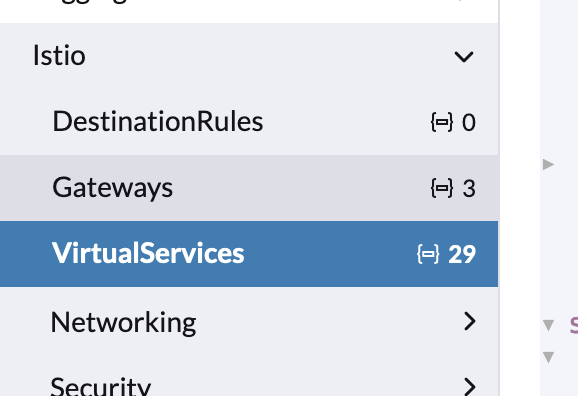

# Finding URLs in the System

Several applications in any installation of OpenG2P like admin console, OpenSearch dashboards, portals etc.  You can find the exact names of the URLs as follows:

1. Logging into Rancher&#x20;
2. Switch to the namespace of interest
3. List all the VirtualServices from the menu on the left. &#x20;

<figure><figcaption></figcaption></figure>

4. Expand any of the VirtualService YAML to find the URL under `hosts` parameter. Example

`hosts:`

&#x20;`- beneficiary.explore.openg2p.org`
