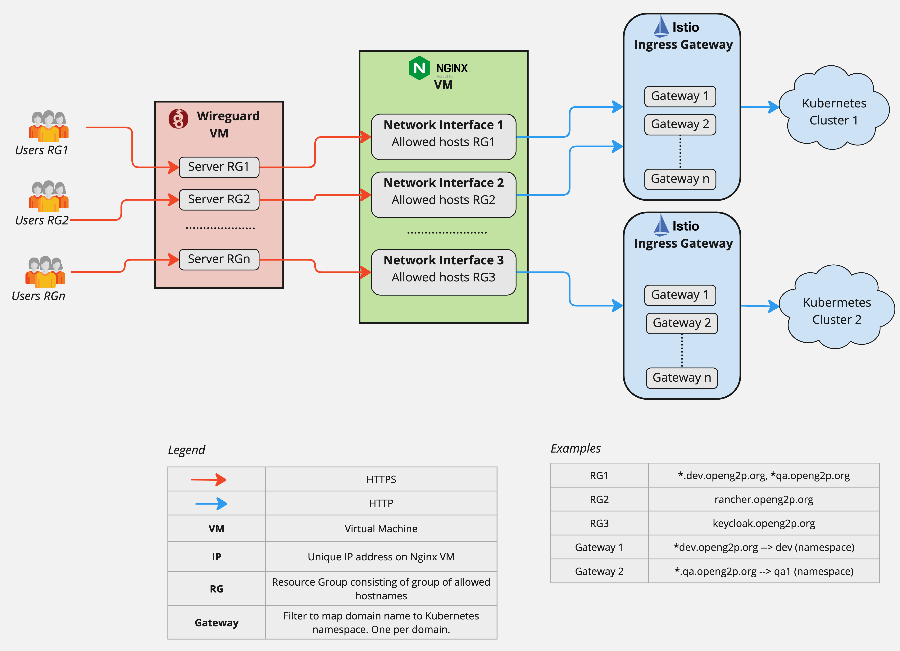

# Private Access Channel

A Private Access Channel (PAC) provides control over a user accessing a particular domain. Not all users will be required to control every domain. A PAC implemented as  a tuple of **Wireguard, Load Balancer, and Ingress gateway**.  A channel provides a group of users **access to resources** of the infrastructure. The users assigned to the Wireguard server determine the group of users with access to these channels. All users with access to a Wireguard server have access to all channels to which the Wireguard server is connected. The visual below depicts a high-level view of the PAC setup.

<figure><figcaption></figcaption></figure>

The Wireguard server routes traffic to a specific network interface on Nginx.  The network interface on Nginx is configured to accept traffic for certain domain names only. Nginx forwards traffic to Istio ingress gateway of a cluster which further routes the traffic for these domains to respective resources in the cluster.  Note that a "resource group" is a group of Kubernetes resources, NOT, user groups.  Let's look at an end2end example:

_**RG1**_ is resource group for _\*.dev.openg2p.org_ and _\*.qa.openg2p.org._  We would like only developers to access these domains. The machine that runs Nginx is assumed to have multiple network interface cards (physical or virtual) with unique IPs for each of them.  In our example, we define an Nginx conf file (under `/etc/ngixn/sites-available`  for the above domains associated with _network interface 1_.  This interface has IP 172.29.16.40.  The conf files looks like below:

```
server {
	listen 172.29.16.40:443 ssl;
	server_name qa.openg2p.org *.qa.openg2p.org;

	ssl_certificate /etc/letsencrypt/live/qa.openg2p.org/fullchain.pem;
	ssl_certificate_key /etc/letsencrypt/live/qa.openg2p.org/privkey.pem;

	location / {
		proxy_pass                      http://openg2pClusterUpstream;
		proxy_http_version              1.1;
		proxy_buffering	                on;
		proxy_buffers                   8 16k;
		proxy_buffer_size               16k;
		proxy_busy_buffers_size         32k;
		proxy_set_header                Upgrade $http_upgrade;
		proxy_set_header                Connection "upgrade";
		proxy_set_header                Host $host;
		proxy_set_header                Referer $http_referer;
		proxy_set_header                X-Real-IP $remote_addr;
		proxy_set_header                X-Forwarded-Host $host;
		proxy_set_header                X-Forwarded-For $proxy_add_x_forwarded_for;
		proxy_set_header                X-Forwarded-Proto $scheme;
		proxy_pass_request_headers      on;
	}
}
server {
	listen 172.29.16.40:443 ssl;
	server_name dev.openg2p.org *.dev.openg2p.org;

	ssl_certificate /etc/letsencrypt/live/qa.openg2p.org/fullchain.pem;
	ssl_certificate_key /etc/letsencrypt/live/qa.openg2p.org/privkey.pem;

	location / {
		proxy_pass                      http://openg2pClusterUpstream;
		proxy_http_version              1.1;
		proxy_buffering	                on;
		proxy_buffers                   8 16k;
		proxy_buffer_size               16k;
		proxy_busy_buffers_size         32k;
		proxy_set_header                Upgrade $http_upgrade;
		proxy_set_header                Connection "upgrade";
		proxy_set_header                Host $host;
		proxy_set_header                Referer $http_referer;
		proxy_set_header                X-Real-IP $remote_addr;
		proxy_set_header                X-Forwarded-Host $host;
		proxy_set_header                X-Forwarded-For $proxy_add_x_forwarded_for;
		proxy_set_header                X-Forwarded-Proto $scheme;
		proxy_pass_request_headers      on;
	}
}

```

Note that we can have multiple server definitions for the same network interface (same IP) and all the traffic is forward to `openg2pClusterUpstream`  which points to nodes of one of the Kubernetes clusters.

Multiple Wireguard servers (bastions) can run on a single Virtual Machine (VM).  Similarly, multiple Nginx servers (vhosts) can run on a single Nginx instance.  Each network interface on Nginx has a unique IP. Each Nginx vhost forwards traffic to an Istio Ingress gateway server which further routes traffic to Kubernetes resources.  On the Istio Ingress gateway server,  gateways (or filters) are defined for each wildcard domain specifying the rule to forward traffic to the respective namespace on the cluster. See the example above.

In the above example, Users RG1 can access only RG1 domains.

