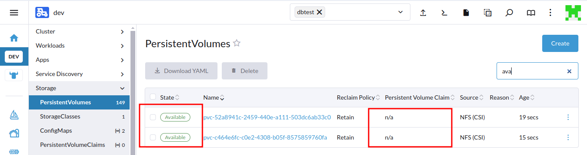
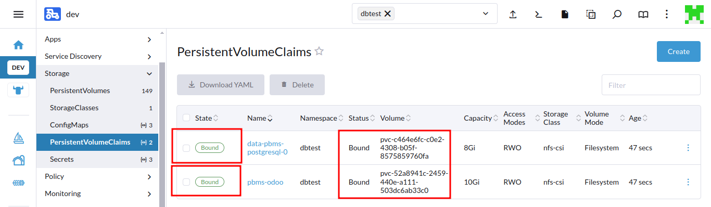

# Restore a PVC from an NFS Folder and Attach it to a Pod

In case the cluster crashes completely and we need to recreate StatefulSets or Deployment pods, we should be able to reconnect to the corresponding folder in NFS. This can be achieved by creating a PersistentVolume (PV) that points to the folder and binding a PersistentVolumeClaim (PVC) to that PV.

### Verify the NFS data folder

Make sure the NFS folder still contains your data. If your PostgreSQL pod was using `/path` to store data, confirm that the contents are available. Use the same NFS instance as the storage backend for the new cluster's storage class.

### Create a persistentvolume (PV)

1. Once your new cluster setup is complete with the old NFS instance attached, ensure that the old storage class is properly attached and ready for use.
2.  And before deploying the services, make sure to create all the required PVs using the provided `pv.yaml` file. Update the YAML file with your PV details and apply it. The deployed services will then use the same PVCs already present in the existing NFS storage class.\


    **Note:** Ensure you use the correct PV names and details from the existing PVs and update them accordingly in the YAML file. Additionally, you must retain the old secrets of the respective services to ensure proper connectivity, and these secrets need to be updated back into Kubernetes.\


    ```yaml
    apiVersion: v1
    kind: PersistentVolume
    metadata:
      name: pvc-477f63d2-9cf2-42ff-bf99-1e5b74c5f0f9  # Update with actual PV name
      annotations:
        pv.kubernetes.io/provisioned-by: nfs.csi.k8s.io
      finalizers:
        - kubernetes.io/pv-protection
    spec:
      capacity:
        storage: 8Gi
      accessModes:
        - ReadWriteOnce  # Use ReadWriteMany if needed
      persistentVolumeReclaimPolicy: Retain
      storageClassName: nfs-csi
      volumeMode: Filesystem
      claimRef:
        name: data-pbms-postgresql-0  # Update with actual PVC name
        namespace: dev  # Update with actual namespace
      csi:
        driver: nfs.csi.k8s.io
        volumeHandle: 172.29.68.134#srv/nfs/dev#dev-data-pbms-postgresql-0-pvc-477f63d2-9cf2-42ff-bf99-1e5b74c5f0f9  # Update with host, path, and full PVC name
        volumeAttributes:
          server: 172.29.68.134  # Update with NFS server IP address
          share: /srv/nfs/dev  # Update with NFS path
          subDir: dev-data-pbms-postgresql-0-pvc-477f63d2-9cf2-42ff-bf99-1e5b74c5f0f9  # Update with full PVC name
          mountPermissions: '0777'
    status:
      phase
    ```


3.  &#x20;Once you create the `pv.yaml` file, use the command below to apply it. This will create the PersistentVolume (PV) in the respective namespace, and it will be in the "Available" state.\


    ```bash
    kubectl apply -f <pv.yaml> -n <namespace>
    ```


    <figure><figcaption></figcaption></figure>

### **Deploy the services**

1.  After the PV is configured, deploy your service pods. They will automatically bind to the PVC and utilize the existing NFS data. **While deploying,** **ensure that the old secrets are updated accordingly.**

    Below is a example template for configuring credentials.\


    ```yaml
    odooPassword: <odooPassword>

    postgresql:
      auth:
        database: <databaseName>
        username: <username>
        password: <dbPassword>
        postgresPassword: <postgresPassword>
    ```

    \
    Make sure to replace placeholders like `<odooPassword>`, `<databaseName>`, `<username>`, `<dbPassword>`, and `<postgresPassword>` with old references/secrets.\
    \
    PVs will automatically bind with the PVCs created.

    <figure><figcaption></figcaption></figure>


2. Verify the application is functioning correctly and that data is being read from the NFS.

By following these steps, you will ensure the persistence and availability of your data across pod recreations and cluster setups.
