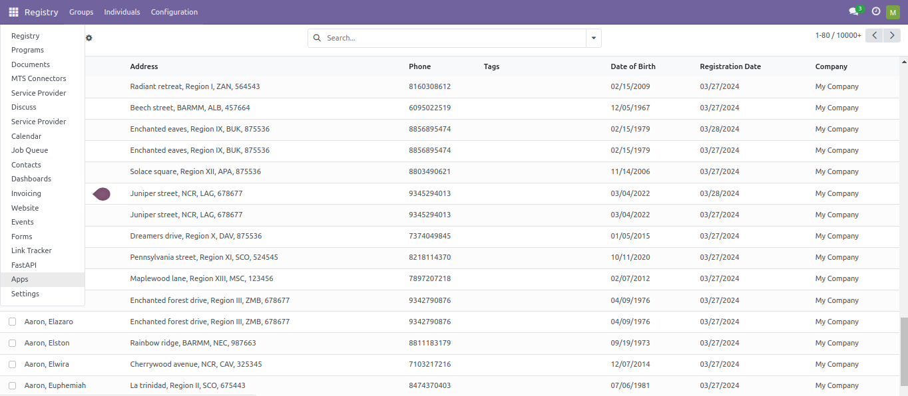
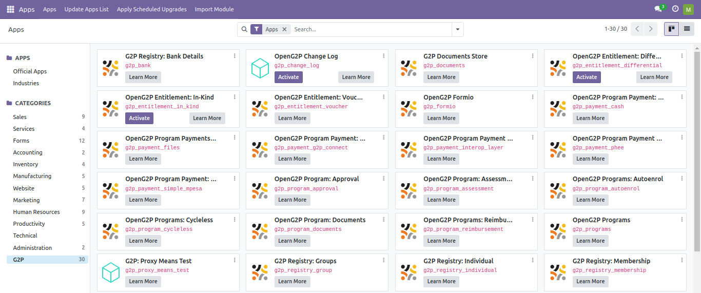

---
layout:
  title:
    visible: true
  description:
    visible: false
  tableOfContents:
    visible: true
  outline:
    visible: true
  pagination:
    visible: true
---

# Install Modules Applicable for PBMS

This document provides instructions on installing modules applicable for PBMS from Odoo platform.

## Procedure

1. Use the link [https://explore.openg2p.org/](https://explore.openg2p.org/) to access PBMS module.
2. Click the main menu icon  and select _**Apps**_.

<figure><figcaption></figcaption></figure>

Apps screen is displayed.

3. Click the _**G2P**_ from the _**CATEGORIES**_ menu in the left pane.

<figure><figcaption></figcaption></figure>

You can find all the modules applicable for PBMS in the right pane.

4. Choose the module, click the _**Install**_ button to install the module based on your project requirements.&#x20;
5. Click the _**Learn More**_ button to know about OpenG2P.
6. Click the  icon

<table><thead><tr><th width="206">Feature</th><th>Description</th></tr></thead><tbody><tr><td>Module Info</td><td>It contains the information of the module.</td></tr><tr><td>Upgrade</td><td>It upgrades to the latest version of the module, if applicable. </td></tr><tr><td>Uninstall</td><td>It uninstalls the module from the PBMS system.</td></tr></tbody></table>

After the successful installation, the status of the module is changed from Install to Installed.&#x20;

Similarly, you can install the other modules for PBMS based on your project requirements.
