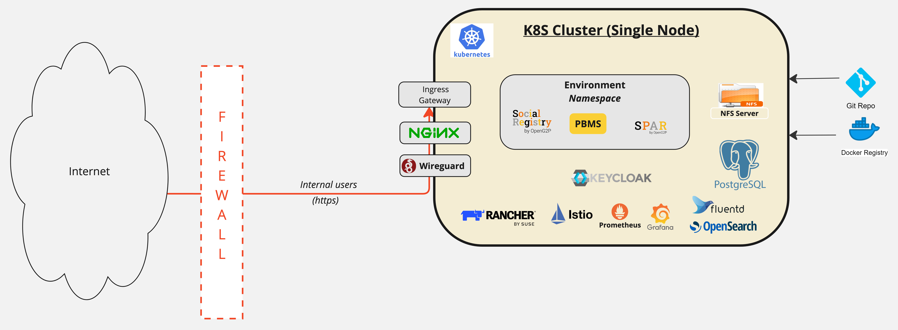

# OpenG2P Deployment Model

OpenG2P’s **deployment model** offers a **production-grade, Kubernetes-based platform** designed to deliver secure, scalable, and reliable deployments of OpenG2P modules. Built on a robust Kubernetes orchestration framework, it supports multiple isolated environments—such as Development, QA, and Demo sandboxes—within a single organisational setup, enabling seamless management across the entire software lifecycle. &#x20;

The OpenG2P deployment model is inspired by [V4 deployment architecture](v4-deployment-architecture.md) developed by OpenG2P team. Considering OpenG2P's use cases, resource availability with departments of countries, and ease of deployment,  we have adapted the V4 architure to be deployed in a "single box" - the entire installation in one sufficiently sized virtual machine or bare metal.

This deployment model ensures **secure access for internal development teams** and has been rigorously tested, earning an [**A+ rating in third-party penetration testing**](../privacy-and-security/security-audits/security-audit-2025-march.md), underscoring its strong security posture. By leveraging the same deployment model for development as well as production, it facilitates an **easy and efficient transition from development to production environments**, significantly reducing complexity and risks.

For System Integrators, the OpenG2P deployment model represents a substantial time and resource saver by eliminating the need to build production-grade deployment setups from scratch. This turnkey solution accelerates implementation while maintaining enterprise-level security and operational excellence, making it the ideal foundation for organisations aiming to deploy OpenG2P at scale with confidence.

The deployment is offered as a set of instructions, scripts, [Helm charts](../releases/helm-charts.md), utilities and guidelines.

<figure><figcaption></figcaption></figure>

## Role of various components

The deployment utilizes several open source third party components. The concept and role of these components is given below:


{% column width="33.33333333333333%" %}
Wireguard&#x20;


{% column width="66.66666666666667%" %}
[Wireguard](https://www.wireguard.com/) (WG) is the recommended VPN to enable [private access channel](deployment-guide/private-access-channel.md) to your clusters and resources. Wireguard is a fast secure & open-source VPN, with P2P traffic encryption.

> _Note that the terms WG Bastion and WG server are interchangeably used in this document._

Multiple WG servers will be required to provide a group of users access to certain resources. Multiple  WG server may run on the same Virtual Machine (VM).  A group of users who access to a particular WG server will have access to all [private access channels](deployment-guide/private-access-channel.md) that are connected to this WG server.

It is recommended to set up at least two channels, one for System Administrators, and one for OpenG2P Application Users (like Program Managers, Service Providers, etc). Further channels may be created based on the need.



## Resource requirements

For a full deployment you need the following

1. Hardware requirements mentioned below.&#x20;
2. Public IP assigned to machine if public access is enabled (for public facing portals and apps)
3. [Domain names](openg2p-deployment-model.md#domain-names)&#x20;
4. [Domain mapping](openg2p-deployment-model.md#domain-mapping)
5. [Certificates](openg2p-deployment-model.md#certificates)

### Hardware requirements

### Domain names&#x20;

To access resources on cluster,  domain names and mappings are required.  The suggested domain name convention is as follows:

\<module>.\<environment>.\<organisation>.\<tld>

Example:&#x20;

* spar.dev.openg2p.org
* socialregistry.uat.openg2p.org

### Domain mapping

| Requirement Description      | Domain Name (examples)                                                                      | Mapped to                                                                                                                                             |
| ---------------------------- | ------------------------------------------------------------------------------------------- | ----------------------------------------------------------------------------------------------------------------------------------------------------- |
| Domain mapping to sandbox    | <ul><li>dev.openg2p.net</li><li>uat.openg2p.net</li><li>staging.openg2p.org</li></ul>       | "A" Record mapped to Load Balancer IP (For sandbox, where LB is not used, this can be mapped directly to nodes of the K8s cluster, at least 3 nodes). |
| Wild card mapping to modules | <ul><li>*.dev.openg2p.net</li><li>*.uat.openg2p.net</li><li>*.staging.openg2p.org</li></ul> | "CNAME" Record mapped to the domain of the above "A" record. (This is a wildcard DNS mapping)                                                         |

The domain name mapping needs to be done on your domain service provider.  For example, on AWS this is configured on Route 53.

### Certificates 

At least one wildcard certificate is required depending on the above domain names used. This can also be generated using Letsencrypt. See guide [here](https://docs.openg2p.org/deployment/deployment-guide/ssl-certificates-using-letsencrypt).

## Deployment instructions


**CONCETPS**: Before proceeding with deployment, read up on the following topics to better understand each infrastructure component required for a successful setup:

1. 🔒 [**Firewall Rules**](https://docs.openg2p.org/deployment/base-infrastructure/openg2p-cluster)
2. 📦 [**Kubernetes Cluster**](https://docs.openg2p.org/deployment/base-infrastructure/openg2p-cluster/cluster-setup#cluster-installation)
3. 🔐 [**WireGuard Bastion**](https://docs.openg2p.org/deployment/base-infrastructure/wireguard-bastion#installation)
4. 📁 [**NFS Server**](https://docs.openg2p.org/deployment/base-infrastructure/nfs-server#installation)
5. 🔗 [**Kubernetes NFS CSI Driver**](https://docs.openg2p.org/deployment/base-infrastructure/openg2p-cluster/cluster-setup#nfs-client-provisioner)
6. 🧩 [**Istio Service Mesh**](https://github.com/OpenG2P/openg2p-deployment/tree/main/kubernetes/istio)
7. 🔐 [**SSL Certificates**](https://docs.openg2p.org/deployment/deployment-guide/ssl-certificates-using-letsencrypt)
8. 🧑‍💻 [**Rancher**](https://github.com/OpenG2P/openg2p-deployment/tree/main/kubernetes/rancher)
9. 🧾 [**Keycloak**](https://docs.openg2p.org/deployment/1.0.0/guides/user-guides/create-payment-manager-types)
10. 📊 [**Prometheus Monitoring**](https://docs.openg2p.org/deployment/base-infrastructure/openg2p-cluster/prometheus-and-grafana)
11. 📝 [**Logging**](https://docs.openg2p.org/pbms/functionality/monitoring-and-reporting/logging) **and** [**Fluentd**](https://docs.openg2p.org/deployment/base-infrastructure/openg2p-cluster/fluentd-and-opensearch)


