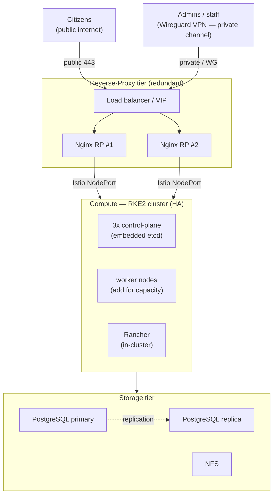
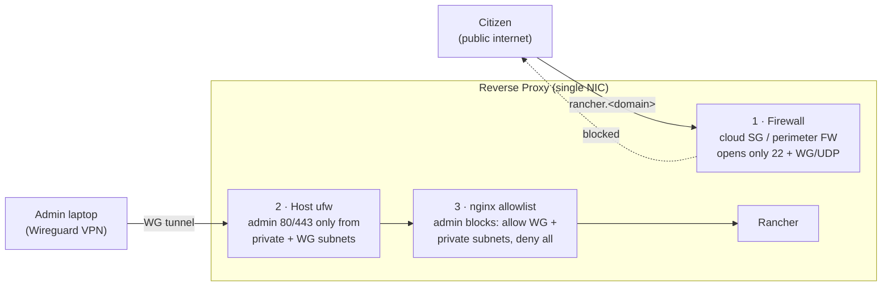

# OpenG2P Deployment Architecture

OpenG2P’s offers a **production-grade, Kubernetes-based deployment architecture** designed to deliver secure, scalable, and reliable deployments of OpenG2P modules. Built on a robust Kubernetes orchestration framework, it supports multiple isolated environments—such as Development, QA, Demo, Staging, Pilot and Production —within a single organisational setup, enabling seamless management across the entire software lifecycle.

This deployment architecture ensures **secure access for internal development teams** and has been rigorously tested, earning an [**A+ rating in third-party penetration testing**](../privacy-and-security/security-audits/security-audit-2025-march.md), underscoring its strong security posture. By leveraging the same deployment model for development as well as production, it facilitates an **easy and efficient transition from development to production environments**, significantly reducing complexity and risks.

The deployment is offered as a **package** of instructions, scripts, [Helm charts](../releases/helm-charts.md), utilities and guidelines. enabling system implementors to rapidly deploy OpenG2P securely thereby saving time and resources substantially and by eliminating the need to build production-grade deployment setups from scratch.

The deployment is **cloud agnostic** - it does not use cloud specific components - completely suitable for on-prem setups.

## Deployment architectures

Depending on availability of compute resources and scale of your deploment we recommend the following deployment architectures:

<table><thead><tr><th width="140.9140625">Architecture</th><th>Descripion</th><th>Purpose</th></tr></thead><tbody><tr><td><strong>Sandbox (Single-node)</strong></td><td>All components including Kubernetes, Wireguard, Nginx, NFS run on the same machine. Multiple environments run in separate Kubernetes namespaces. PostgreSQL runs at Docker within each namespace.</td><td>
<strong>Sandbox</strong>

Well suited for getting started with OpenG2P for creating development sandboxes like dev, qa etc. This setup can also be used for small scale pilots.
</td></tr><tr><td><strong>Production — Minimum</strong></td><td>A four-node topology: <strong>Reverse Proxy</strong>, <strong>Compute</strong> (Kubernetes), <strong>Storage</strong>, and a dedicated <strong>Backup</strong> node. The storage server is separated from the compute server (Kubernetes). PostgreSQL server runs on a separate "storage node" that contains large volumes of SSD storage with high througput disk I/O. The NFS also runs on this node. Thus, there is a separation of concerns between compute and data. The Backup node holds the backup repository and is required for production.</td><td>
<strong>Pilots | Small scale production</strong>

For pilots and small scale production setups, specifically where I high uptime is not critical. If systems are predominantly used by administrators and some down time of services and portals is acceptable, then this architecture would be sufficient.
</td></tr><tr><td><strong>Production — High-Availability</strong></td><td>The same production architecture scaled out by <strong>adding nodes</strong> — additional Kubernetes control-plane nodes (HA), redundant reverse proxies behind a load balancer, PostgreSQL primary/replica, and redundant storage. No new components or channels; just more nodes for redundancy and capacity.</td><td>
<strong>Large-scale production</strong>

For deployments where high availability and near-zero downtime are required — typically citizen-facing portals that must stay up — or where compute scale is high.
</td></tr></tbody></table>


Over and above all these, there is minimally one more node required for backups and running local Git and Docker repositories. Refer to [Prerequisites & Procurement → Compute](../operations/deployment/prerequisites-procurement.md#compute-the-four-vms).


### Sandbox (Single-node)

<figure><figcaption></figcaption></figure>

* Single virtual machine running all services
* One Kubernetes cluster hosting both Rancher and OpenG2P services
* **Rancher uses local authentication** — there is no infrastructure-level Keycloak/SSO. Admin users are created directly in Rancher. Keycloak is installed **per environment** (by the commons-base chart) only for the OpenG2P applications.
* **Local DNS + self-signed TLS** — the automation runs `dnsmasq` for `*.<local_domain>` (default `openg2p.test`) and a local CA for self-signed certificates. No public domain names, DNS provider, or Let's Encrypt are involved.
* Nginx, Wireguard, NFS server running outside the Kubernetes cluster but on the same node
* Multiple environments like dev, qa, demo etc. as Kubernetes namespaces
* Access to each environment (namespace) is controlled via [private access channels](../operations/deployment/deployment-guide/private-access-channel.md) — a single network interface is sufficient; channel separation is enforced by the firewall and Nginx, not by extra NICs.
* **Private by default** — the automation configures the host firewall (`ufw`) so the web UIs (`80/443`) are reachable only over Wireguard or from inside the VPC, even if the VM has a public IP. A `public_access` flag opts into exposing them to the Internet (sandbox-only, with a security warning). The perimeter/cloud firewall remains the operator's responsibility.
* SSL termination (HTTPS) happens on the Nginx. The traffic further to Ingress gateway is HTTP.
* Git repo and Docker Registry are assumed externally hosted (public or private). For on-prem hosting you will need more resources to host the same as in the [Production — Minimum](openg2p-deployment-model.md#production-minimum) setup.
* As this deployment is based on Kubernetes, the system can be easily scaled up by adding more nodes (machines) as in the [Production — High-Availability](openg2p-deployment-model.md#production-high-availability) setup.

### Production — Minimum

<figure><figcaption></figcaption></figure>

* Separation of concerns - storage and reverse proxy on separate nodes
* PostgreSQL server runs on the Storage Node.
* Only one environment like Pilot or Prod is expected to run on the cluster. _Sharing same PosgreSQL server for multiple envirornments is not recommended. If you would like to do the same, make sure names of all databases are different for different environments._
* NFS server runs on the storage node
* A dedicated **Backup node** (the 4th node) holds the backup repository (pgBackRest, etcd snapshots, rancher-backup, restic for NFS/configs). It is **required for production** — provisioned separately and reached pull-based over the private subnet. So Production — Minimum is a **four-node** topology: Reverse Proxy, Compute, Storage, and Backup. See [Backups](../operations/deployment/backups/).
* Storage node is expected to have larger SSD disks and not very high compute capability, while Compute node must have high compute power and RAM. See [Prerequisites & Procurement → Compute](../operations/deployment/prerequisites-procurement.md#compute-the-four-vms).
* Storage Node can be managed - in terms of access, scale up and backups indendently.
* Local Git repo and Docker Repositories may be hosted on Storage Node.
* Access to each environment (namespace) is controlled via [private access channels](../operations/deployment/deployment-guide/private-access-channel.md) — a single network interface is sufficient; channel separation is enforced by the firewall and Nginx, not by extra NICs.
* SSL termination (HTTPS) happens on the Nginx. The traffic further to Ingress gateway is HTTP.
* Firewall is outside the purview of this deployment.

### Production — High-Availability

The same production architecture, scaled out for high availability — **more nodes, not a different design**. The two channels remain (private over Wireguard, public for citizen-facing); Rancher continue to run in-cluster (no separate management cluster).

* **HA Kubernetes control plane** — 3 RKE2 server nodes (embedded etcd) instead of one; add worker nodes for capacity.
* **Redundant reverse proxies** — two or more Nginx nodes behind a load balancer / VIP, so both channels survive an RP failure.
* **PostgreSQL primary/replica** on the storage tier for database high availability.
* **Redundant storage** (NFS HA, distributed MinIO) as needed.
* Multiple environments still run as namespaces in the one OpenG2P cluster; Rancher stay in-cluster.
* Recommended for citizen-facing portals needing near-zero downtime, or where compute scale is high.


The current automation provisions the **minimum** (single control-plane) configuration. Scaling to the HA layout above — extra control-plane nodes, redundant reverse proxies, PostgreSQL replication — is a supported architecture but a manual/extension step today, not yet automated.


## Channel separation: public vs private access

Across every architecture above, OpenG2P uses exactly **two access channels**:

* **Private channel** — admin tools (Rancher, Keycloak), reached only over the Wireguard VPN or from inside the private network. Never exposed to the public internet.
* **Public channel** — citizen-facing services, reached over the internet.

The Reverse Proxy has a **single network interface**; the separation is enforced not by physical NICs but by **three independent layers**. A citizen is stopped by all three; an admin over the VPN passes all three.

| Layer                   | What it does                                                                                                                     | On-prem                          | AWS / cloud                  |
| ----------------------- | -------------------------------------------------------------------------------------------------------------------------------- | -------------------------------- | ---------------------------- |
| **1 — Firewall**        | Only `22` (admin CIDR) and Wireguard UDP are open to the internet during infra setup. Public `80/443` is **not** opened.         | Perimeter firewall / router ACLs | Security Group inbound rules |
| **2 — Host ufw**        | Configured automatically. Admin `80/443` accepted only from the private subnet and the Wireguard subnet.                         | identical (automated)            | identical (automated)        |
| **3 — nginx allowlist** | Admin server blocks carry `allow <wg_subnet>; allow <private_subnet>; deny all;`. A request from any other source IP gets `403`. | identical (automated)            | identical (automated)        |

Admin traffic reaches Rancher only after Wireguard **decrypts it inside the host** (it never crosses the firewall as plaintext) or from inside the private network. The nginx allowlist (layer 3) is the **durable** guarantee: it still rejects a citizen even after the environment automation opens public `80/443` for citizen-facing services — because a forged `Host: rancher.<domain>` request to the public IP still arrives with the citizen's real source IP, which fails the allowlist.


**Why the nginx bind alone isn't enough on AWS.** An Elastic IP is a 1:1 NAT onto the instance's private IP, so "bind admin to the private IP" does **not** hide it from the internet — the public side maps onto that same private IP. The firewall and the nginx source-allowlist (not the bind) enforce the boundary. On-prem this is cleaner: your perimeter firewall simply doesn't forward `80/443` to the RP until citizen services exist.


## Role of various components

The deployment utilizes several open source third party components. The concept and role of these components is given below:

<table><thead><tr><th width="165">Component</th><th>Description</th></tr></thead><tbody><tr><td><mark style="color:$primary;">Wireguard</mark></td><td>
<a href="https://www.wireguard.com/">Wireguard</a> is a fast secure &#x26; open-source VPN, with P2P traffic encryption that can enable secure (non-public) access to the resources. A combination of Wireguard, Nginx and Isto gateway is used to enable fine-grained access control to the environments. See <a href="../operations/deployment/deployment-guide/private-access-channel.md">Private Access Channels</a>.

If you have your own VPN setup, Wireguard is not required. However, it is expected that the implementers take care of setting up secure access; OpenG2P only provides guidance for Wireguard.

<blockquote>
<em>The terms Wireguard, Wireguard Bastion and Wireguard Server are used interchangeably in this document.</em>
</blockquote></td></tr><tr><td>Nginx</td><td>Nginx as a reverse-proxy for incoming external (public) traffic. It serves as HTTPS termination and together with Wireguard and Istio Gateway it can be used to create <a href="../operations/deployment/deployment-guide/private-access-channel.md">private access channels</a>. Nginx isolates the internal network such that traffic does not directly fall on the Istio Gateway of the Kubernetes cluster. Nginx node needs to have public IP for public facing portals.</td></tr><tr><td>Istio</td><td><a href="https://istio.io/">Istio</a> is a service mesh that provides a way to connect, secure, control, and observe microservices. It is a powerful mesh management tool. It also provides an ingress gateway for the Kubernetes cluster. See note below.</td></tr><tr><td>Ingress Gateway</td><td>The <a href="https://istio.io/latest/docs/tasks/traffic-management/ingress/ingress-control/">Ingressgateway</a> component of Istio enables routing external traffic into Kubernetes services. Istio can be configured to do much more. Seen note below.</td></tr><tr><td>Rancher</td><td>Rancher provides advanced cluster management capabilities. It can also manage several clusters.</td></tr><tr><td>Keycloak</td><td>Keycloak provides <strong>organisation-wide authorisation</strong> and offers single sign-on for all resources.</td></tr><tr><td>NFS</td><td>Network File System (NFS) provides persistence to the resources of the Kubernetes cluster. Although on a single machine installation we can directly use the underlying SSD storage, we prefer to use NFS, keeping in mind scalability in case more nodes (machines) need to be added to the cluster.</td></tr><tr><td>Prometheus &#x26; Grafana</td><td>For system monitoring. <a href="../platform/platform-services/_archive/system-health.md">Learn more >></a></td></tr><tr><td>OpenTelemetry + Grafana Loki</td><td>Cluster-wide log pipeline (OTel agent → gateway → Loki, backed by dedicated MinIO); replaces Fluentd/OpenSearch</td></tr><tr><td>PostgreSQL</td><td>Primary database of OpenG2P platform. For production deployment, PostgreSQL is installed on the VM directly (natively) while for sandboxes, PostgreSQL is installed on the Kubernetes cluster inside a namespace using PostgreSQL Docker.</td></tr></tbody></table>


**Why Istio? What are the benefits of using Istio in OpenG2P setup?**

* We can have advanced traffic management setups like load balancing, retries & failovers, and fault injection for testing resilience.
* We can use advanced deployment strategies like canary deployments and A/B testing, where Istio can route higher percentage of traffic to specific service versions.
* We can enable security features like mTLS encryption for service-to-service traffic. Istio can also provide an authentication & authorization layer for services.
* We can also define policies related to access control & rate limiting. One can define which services are allowed to access other services or limit the rate of requests accepted by a service.
* More importantly Istio provides comprehensive observability features. We can visualize & monitor service-to-service traffic real-time, with tools like [Kiali](https://istio.io/latest/docs/ops/integrations/kiali/), which would help identify performance bottlenecks and diagnose issues.


## Base infrastructure

In all the architectures above there is a base infrastructure (comprising of Kubernetes, Nginx, Wireguard, NFS etc) over which specific environments are installed. Refer to the base infrastructure installation instructions [here](../operations/deployment/_archive/deployment-instructions/infrastructure-setup.md).

## Environments

An environment is an insolated setup for a specific purpose like development, testing, staging, production etc. In OpenG2P's deployment model each environment resides in a _namespace_ in Kubernetes. The namespace contains set of common shared modules - [`openg2p-commons`](openg2p-commons-helm-chart.md) - and the modules (Registry, PBMS, SPAR, G2P Bridge) themselves along with any third-party dependency modules. Access to each environment can be controlled using [private access channels](../operations/deployment/deployment-guide/private-access-channel.md) and RBAC of Kubernetes. Generally, all modules share the common resources like Postgres, MinIO, Kafka etc. These resources are installed as part of the [`openg2p-commons`](openg2p-commons-helm-chart.md) . Only one instance of PostgreSQL server is run per environment which means all modules use the same PostgreSQL server (Dockerized or external - depending on the choice of installation). An environment needs the following:

1. A short name of the environment (without hyphens, to keep it simple) like 'qa'. This name is used for domain name and namespace
2. Wildcard domain name like '\*.qa.openg2p.org' 'cause several services will run within this domain.
3. Installation of opengp2-commons
4. Installation of any (or all modules): Registry, PBMS, SPAR, G2P Bridge, Beneficiary Portal.

While the installation can be easily achieved by provided Helm Charts, tear down of the environment involves few manual steps. Refer to tear down section in the deployment documentation for each module.
