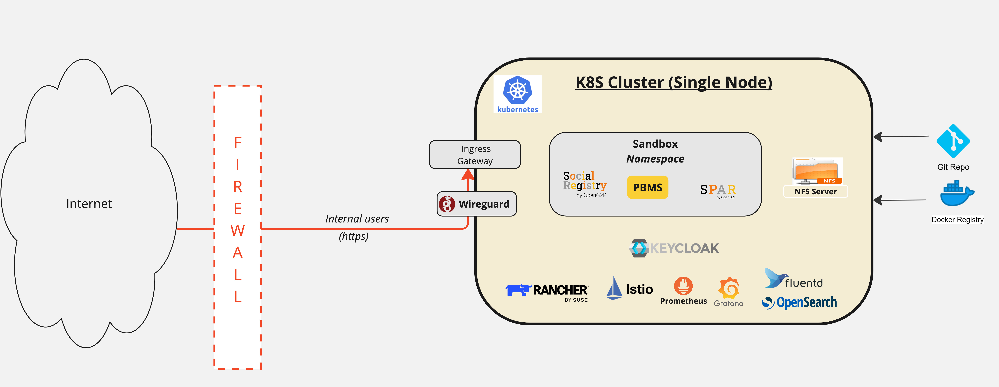

# OpenG2P In a Box

This document describes a deployment model wherein the infrastructure and components required by OpenG2P modules can be set up on a single node/VM/machine.  This will help you to get started with OpenG2P and experience the functionality without having to meet all r[esource requirements](hardware-requirements.md) for a production-grade setup. This is based on [V4 architecture](./#deployment-architecture), but a compact version of the same.  The essence of the V4 is preserved so that upgrading the infra is easier when more hardware resources are available.

## Deployment architecture

<figure><figcaption><p>OpenG2P In a Box</p></figcaption></figure>


Do NOT use this deployment model for production/pilots.


## Installation

### Prerequisites

*   Take Machine with the following configuration.

    <table><thead><tr><th width="186">Purpose</th><th width="209">Compute/Memory/Storage</th><th>Note</th></tr></thead><tbody><tr><td>Wireguard Bastion / NFS Server / Rancher Cluster / OpenG2P Cluster / Nginx Server</td><td><p>16vCPU / 64 GB RAM /</p><p>256 GB storage /<br>OS:Ubuntu 22.04</p></td><td>All the components mentioned will be installed on a single node.</td></tr></tbody></table>
* Before proceeding with the deployment, review the following topics to better understand each infrastructure component required for a successful setup:
  1. 🔒 **Firewall Rules**: Review basic firewall concepts and how to configure rules to allow traffic to and from required services.\
     [Read about Firewall Rules](https://docs.openg2p.org/deployment/base-infrastructure/openg2p-cluster/cluster-setup/firewall)
  2. 📦 **Kubernetes Cluster (RKE2 Server):** Understand how to set up and configure a lightweight, secure RKE2 Kubernetes cluster.\
     [Read about RKE2 Setup](https://docs.openg2p.org/deployment/base-infrastructure/openg2p-cluster/cluster-setup#cluster-installation)
  3. 🔐 **WireGuard Bastion:** Learn how to configure WireGuard as a secure VPN tunnel to access internal resources in your cluster.\
     [Read about WireGuard Bastion](https://docs.openg2p.org/deployment/base-infrastructure/wireguard-bastion#installation)
  4. 📁 **NFS Server:** Set up a Network File System to provide shared persistent storage across your Kubernetes workloads.\
     [Read about NFS Server](https://docs.openg2p.org/deployment/base-infrastructure/nfs-server#installation)
  5. 🔗 **Kubernetes NFS CSI Driver:** Deploy the CSI driver to enable dynamic NFS volume provisioning in Kubernetes.\
     [Read about NFS CSI Driver](https://docs.openg2p.org/deployment/base-infrastructure/openg2p-cluster/cluster-setup#nfs-client-provisioner)
  6. 🧩 **Istio Service Mesh:** Use Istio to manage traffic flow, security, and observability between microservices.\
     [Read about Istio](https://github.com/OpenG2P/openg2p-deployment/tree/main/kubernetes/istio)
  7. 🔐 **SSL Certificates (Let's Encrypt):** Configure Let's Encrypt to automate SSL certificate issuance and renewal for secure access.\
     [Read about Let's Encrypt Setup](https://docs.openg2p.org/deployment/deployment-guide/ssl-certificates-using-letsencrypt)
  8. 🧑‍💻 **Rancher:** Use Rancher to manage and monitor your Kubernetes clusters through an intuitive web interface.\
     [Read about Rancher](https://github.com/OpenG2P/openg2p-deployment/tree/main/kubernetes/rancher)
  9. 🧾 **Keycloak:** Implement Keycloak for identity, authentication, and authorization management using SSO and OIDC.\
     [Read about Keycloak](https://github.com/OpenG2P/openg2p-deployment/tree/main/kubernetes/keycloak)
  10. 📊 **Prometheus Monitoring:** Set up Prometheus to collect metrics from your Kubernetes services and visualize them via Grafana.\
      [Read about Prometheus and Monitoring](https://docs.openg2p.org/deployment/base-infrastructure/openg2p-cluster/prometheus-and-grafana)
  11. 📝 **Logging and Fluentd:** Collect and centralize application logs using Fluentd for easier debugging and analysis.\
      Read about [Logging](https://docs.openg2p.org/pbms/functionality/monitoring-and-reporting/logging) and [Fluentd](https://docs.openg2p.org/deployment/base-infrastructure/openg2p-cluster/fluentd-and-opensearch)

### Base infrastructure setup

To set up the **base infrastructure**, log in to the machine and install the following. Make sure to follow each **verification step** to ensure that everything is installed correctly and the setup is progressing smoothly.\
**Note:** Perform all necessary installations on a **single node** as this configuration is designed to operate completely.

1.  Ensure that all the listed tools are installed on the node. After installation, verify the version of each tool to confirm that they have been installed correctly.\
    Tools: `wget` , `curl` , `kubectl` , `istioctl` , `helm` , `jq` \
    🔍 <mark style="color:red;">Verification Checkpoint:</mark>\
    <mark style="color:green;">Run the following commands and verify that each returns the version information:</mark>

    <pre><code><strong>wget --version
    </strong><strong>curl --version
    </strong>kubectl version --client
    istioctl version
    helm version
    jq --version
    </code></pre>

    ✅ <mark style="color:green;">You should see version details for each tool without any errors.</mark>
2. Follow the document linked below to set up the **firewall rules** required for the deployment.\
   🔒[Set up Firewall rules](https://docs.openg2p.org/deployment/base-infrastructure/openg2p-cluster/cluster-setup/firewall)\
   **Note:** Make sure to include K8s Firewall, NFS Firewall, Wireguard Firewall, and LB Firewall.\
   🔍 Verification Checkpoint:\
   <mark style="color:green;">Run</mark> <mark style="color:green;"></mark><mark style="color:green;">`iptables -L`</mark> <mark style="color:green;"></mark><mark style="color:green;">or</mark> <mark style="color:green;"></mark><mark style="color:green;">`ufw status`</mark> <mark style="color:green;"></mark><mark style="color:green;">to ensure the rules are active in case you're using on-premises or self-managed native server nodes. If you're deploying on AWS cloud infrastructure, verify or configure the necessary firewall rules within the</mark> <mark style="color:green;"></mark><mark style="color:green;">**Security Groups**</mark> <mark style="color:green;"></mark><mark style="color:green;">associated with your instances.</mark>
3. Follow the below steps to Setup **Kubernetes Cluster** (RKE2 Server) as a **root user**.
   1. Create the rke2 config directory - `mkdir -p /etc/rancher/rke2`
   2. &#x20;Create a `config.yaml` file in the above directory, using the following config file template.\
      Use [rke2-server.conf.primary.template](https://github.com/OpenG2P/openg2p-deployment/blob/main/kubernetes/rke2/rke2-server.conf.primary.template). The token can be any arbitrary string.
   3. Edit the above `config.yaml` file with the appropriate names, IPs, and tokens.
   4.  Run the following commands to set the **RKE2 version** and **download** and **start RKE2** **server:**

       ```
       export INSTALL_RKE2_VERSION="v1.28.9+rke2r1"
       curl -sfL https://get.rke2.io | sh - 
       systemctl enable rke2-server
       systemctl start rke2-server
       ```
   5.  To export KUBECONFIG, run:

       ```
       echo -e 'export PATH="$PATH:/var/lib/rancher/rke2/bin"\nexport KUBECONFIG="/etc/rancher/rke2/rke2.yaml"' >> ~/.bashrc
       source ~/.bashrc
       kubectl get nodes 
       ```

       **Note**:Download the Kubeconfig file `rke2.yaml` and keep it securely.\
       🔍 <mark style="color:red;">Verification Checkpoint:</mark>\ <mark style="color:green;">Run the below command to check the status of rke2 server shown in the screenshot below.</mark>\
       <mark style="color:green;">`sudo systemctl status rke2-server`</mark>&#x20;

       <figure><figcaption></figcaption></figure>
4. Install **Wireguard** Bastion servers for secure VPN access:
   1. Clone the [openg2p-deployment](https://github.com/OpenG2P/openg2p-deployment) repo and navigate to the [kubernetes/wireguard](https://github.com/OpenG2P/openg2p-deployment/tree/main/kubernetes/wireguard) directory
   2.  Run this command to install wireguard server/channel with root user:

       ```bash
       WG_MODE=k8s ./wg.sh <name for this wireguard server> <client ips subnet mask> <port> <no of peers> <subnet mask of the cluster nodes & lbs>
       ```

       For example:

       ```
       WG_MODE=k8s ./wg.sh wireguard_app_users 10.15.0.0/16 51820 254 172.16.0.0/24
       ```
   3.  Check logs of the servers and wait for all servers to finish startup. Example:

       ```bash
       kubectl -n wireguard-system logs -f wireguard-app-users
       ```
   4. Once it finishes, navigate to `/etc/wireguard-app-users`. You will find multiple peer configuration files and cd in to `peer1` folder and copy `peer1.conf`  to your notepad.
   5.  Follow the document provided below to setup a WireGuard on your local system.\
       [Install WireGuard Client on Desktop](base-infrastructure/wireguard-bastion/install-wireguard-client-on-machine.md)\
       🔍 <mark style="color:red;">Verification Checkpoint:</mark>\ <mark style="color:green;">Make sure the WireGuard server is running and the setup is completed on your local machine. You can refer to the screenshots below for guidance.</mark>\ <mark style="color:green;">On server node:</mark>

       <figure><figcaption></figcaption></figure>

       <mark style="color:green;">On you local machine:</mark>

       <figure><figcaption></figcaption></figure>
   6. Once WireGuard is running and setup on your local machine, you can easily set up kubectl locally and access the cluster from your machine. (Optional)
5. Install [NFS Server](base-infrastructure/nfs-server.md#installation).
6. Install [Kubernetes NFS CSI Driver](base-infrastructure/openg2p-cluster/cluster-setup/#nfs-client-provisioner).
7.  Istio: Setup; from [kubernetes/istio](https://github.com/OpenG2P/openg2p-deployment/tree/main/kubernetes/istio) directory, run the following:

    ```bash
    istioctl operator init
    kubectl apply -f istio-operator-no-external-lb.yaml
    kubectl apply -f istio-ef-spdy-upgrade.yaml
    ```
8. Set up TLS using the following:
   *   Create [SSL Certificate using Letsencrypt](deployment-guide/ssl-certificates-using-letsencrypt.md) for Rancher (Edit hostname below):

       ```bash
       certbot certonly --agree-tos --manual \
           --preferred-challenges=dns \
           -d rancher.your.org
       ```
   *   Create Rancher TLS Secret (Edit certificate paths below):

       ```bash
       kubectl -n istio-system create secret tls tls-rancher-ingress \
           --cert /etc/letsencrypt/live/rancher.your.org/fullchain.pem \
           --key /etc/letsencrypt/live/rancher.your.org/privkey.pem
       ```
   *   Create [SSL Certificate using Letsencrypt](deployment-guide/ssl-certificates-using-letsencrypt.md) for Keycloak (Edit hostname below):

       ```bash
       certbot certonly --agree-tos --manual \
           --preferred-challenges=dns \
           -d keycloak.your.org
       ```
   *   Create Keycloak TLS Secret, using (Edit certificate paths below):

       ```bash
       kubectl -n istio-system create secret tls tls-keycloak-ingress \
           --cert /etc/letsencrypt/live/keycloak.your.org/fullchain.pem \
           --key /etc/letsencrypt/live/keycloak.your.org/privkey.pem
       ```
9. Set up DNS for Rancher and Keycloak hostnames to point to the IP of the node.
10. Rancher Install; from [kubernetes/rancher](https://github.com/OpenG2P/openg2p-deployment/tree/main/kubernetes/rancher) directory, run the following (Edit hostname below):

    ```bash
    RANCHER_HOSTNAME=rancher.your.org \
    TLS=true \
        ./install.sh --set replicas=1
    ```

    * Login to Rancher using the above hostname and bootstrap the `admin` user according to the instructions. After successfully logging in to Rancher as admin, save the new admin user password in `local` cluster, in `cattle-system` namespace, under `rancher-secret`, with key `adminPassword`.
11. Keycloak Install; from [kubernetes/keycloak](https://github.com/OpenG2P/openg2p-deployment/tree/main/kubernetes/keycloak) directory, run the following (Edit hostname below):

    ```bash
    KEYCLOAK_HOSTNAME=keycloak.your.org \
    TLS=true \
        ./install.sh --set replicaCount=1
    ```
12. [Integrate Rancher & Keycloak](base-infrastructure/rancher.md#rancher-keycloak-integration).
13. Continue to use the same cluster (`local` cluster) for OpenG2P Modules also.
    * In Rancher, create a Project and Namespace, on which the OpenG2P modules will be installed. The rest of this guide will assume the Namespace to be `dev` .
    * In Rancher -> Namespaces menu, enable "Istio Auto Injection" for `dev` namespace.
14. Follow [Istio Namespace setup](base-infrastructure/openg2p-cluster/cluster-setup/istio.md#namespace-setup):
    1.  Edit and run this to define the variables:

        ```
        export NS=dev
        export WILDCARD_HOSTNAME='*.dev.your.org'
        ```
    2.  Run this apply gateways

        ```bash
        kubectl create ns $NS
        envsubst < istio-gateway-tls.yaml | kubectl apply -f -
        ```
    3.  Create [SSL Certificate using Letsencrypt](deployment-guide/ssl-certificates-using-letsencrypt.md) for the wildcard hostname used above. Example usage:

        ```bash
        certbot certonly --agree-tos --manual \
            --preferred-challenges=dns \
            -d dev.your.org \
            -d *.dev.your.org
        ```
    4.  Add the certificate to K8s.

        ```bash
        kubectl -n istio-system create secret tls tls-openg2p-$NS-ingress \
            --cert=<certificate path> \
            --key=<certificate key path>
        ```
15. Install [Prometheus and Monitoring](base-infrastructure/openg2p-cluster/prometheus-and-grafana.md) from Rancher
16. Install Logging and Fluentd. (TODO)

### OpenG2P modules' installation

[Install OpenG2P modules via Rancher](../spar/deployment/#installation-using-rancher-ui). &#x20;


**How is "In a Box" different from** [**V4**](./#deployment-architecture-v4)**? Why should this not be used for production?**

* In-a-box does not use the Nginx Load Balancer. The HTTPS traffic directly terminates on the Istio gateway via Wireguard. However, Nginx is required in production as described [here](base-infrastructure/load-balancer/nginx.md).
* The SSL certificates are loaded on the Istio gateway while in V4 the certificates are loaded on the Nginx server.
* The Wireguard bastion runs inside the Kubernetes cluster itself as a pod. This is not recommended in production where Wireguard must run on a separate node.
* A single private[ access channel](deployment-guide/private-access-channel.md) is enabled (via Wireguard).  In production, you will typically need several channels for access control.
* In-a-box **does not offer high availability** as the node is a single point of failure.&#x20;
* NFS runs inside the box. In production, NFS must run on a separate node with its access control, allocated resources and backups.

