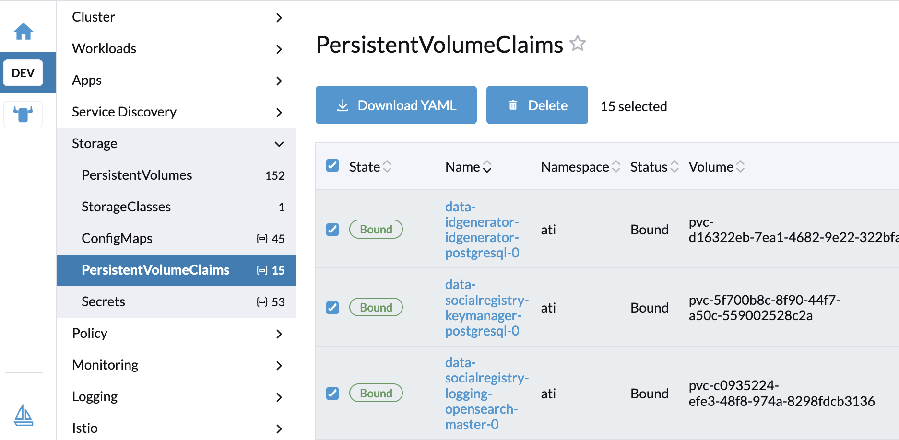

# Production Deployment

The guide here provides some useful hints for production deployment. It is assumed that you are familiar with the [V4 deployment architecture](./#v4-deployment-architecture) and have already deployed the same for your development. This guide is NOT intended to be a comprehensive production deployment handbook. Since production environments can vary widely, OpenG2P implementers—such as system integrators—have flexibility in choosing production configurations, orchestration platforms, and components. We also encourage our partners to contribute updates to this guide based on their real-world experiences and insights.

## Air gaped deployment

### Private Docker registry

### Private Git repositories

## Standalone Postgresql installation&#x20;

* Postgres on a separate machine with high capacity.&#x20;
* Number of instances of Postgresql pods
* Cloud native if available
* Production configuratio
* Master / Slave configuration

## MinIO

## Kubernetes configurations

### RBAC

Carefully assign roles to Rancher users. Pre-defined role templates are available on Rancher. Follow [this guide](https://ranchermanager.docs.rancher.com/how-to-guides/new-user-guides/authentication-permissions-and-global-configuration/manage-role-based-access-control-rbac/cluster-and-project-roles).  Specifically, protect the following action on resources:

* Deletion of deployments/statefulsets
* Viewing of secrets - at all levels - Cluster, Namespace
* Deletion of configmaps, secrets
* Access to DB via port forwarding
* Logging into DB pods

### High availability of services

#### Pod replication

* Replication of pods for high-availability.

#### Node replication

* Provisioning of VMs across different underlying hardware and subnets for resilience.&#x20;
* Minimum 3 nodes for Rancher and OpenG2P cluster (3 control planes).

## Backups

### ETCD&#x20;

Refer to the guide [here](deployment-guide/etcd-backup-and-restore.md).

### Cluster reset <a href="#cluster-reset" id="cluster-reset"></a>

RKE2 provides a feature to reset the cluster to a single-member cluster using the `--cluster-reset` flag. When this flag is passed to the RKE2 server, it resets the cluster while preserving the existing data directory. The etcd data directory is located at `/var/lib/rancher/rke2/server/db/etcd`. This flag can be used in the event of quorum loss in the cluster.

To use the reset flag, you must first stop the RKE2 service if it is enabled via systemd:

```bash
# Stop the RKE2 server service
systemctl stop rke2-server

# Perform a cluster reset
rke2 server --cluster-reset

```

A message in the logs states that RKE2 can be restarted without the flags. Start RKE2 again, and it should initialize as a single-member cluster.

### Backup of persistent volume information

The mapping between PVCs and PV must be saved after the installation so in case the cluster goes down, or NFS has issues, one can recreate the pods with original data.  Download the YAML as shown below and keep it securely accessible to system administrators. &#x20;

<figure><figcaption></figcaption></figure>

## NFS&#x20;

### Cluster access key

Downloading of user's cluster access key to be able to operate OpenG2P cluster directly using `kubectl` in case Rancher is not accessible. Sys Admins may download this key using Rancher console and keep them safely and protected with them.

## Image pull policy

Generally, Helm charts have Docker image pull policy mentioned as `Always`. This is not advisable in production as the image will get updated if Docker images change for the same tag.  Set the `imagePullPolicy: IfNotPresent` or `imagePullPolicy: Never` in the Helm chart and upgrade the Helm chart on production.

## Data cleanup

Make sure any test or stray data in Postgres, OpenSearch or any other persistence is cleaned up completely before rollout.  In case of a fresh version install from scratch, make sure PVCs, and PVs from previous versions are deleted.

## Security

* Creation of [private access channels](deployment-guide/private-access-channel.md).

## Nginx

You may need to set Nginx load balancers in HA mode by having a Nginx cluster (available with Nginx Plus, but it comes with commercial terms). HA for Nginx is critical if user-facing portal traffic lands on the same.  For back-office administration tasks, HA may not be critical.

You must adjust the max request body size according to the number of files/data being uploaded. The general limit is set at 50MiB per request. This can updated by modifying the `client_max_body_size` parameter in nginx.conf.

## OpenSearch

* Enable data nodes in OpenSearch so that backups can be taken of the data node.
* The data node maybe enabled while installing OpenSearch. _(TBD)._

