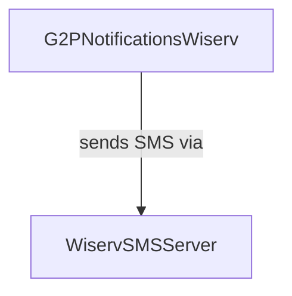

# G2P Notifications: Wiserv SMS Service Provider

### Module name

g2p\_notifications\_wiserv

### Module title

G2P Notifications: Wiserv SMS Service Provider

### Technology base

Odoo and Soap API

### Functionality

The `g2p_notifications_wiserv` module does not override or modify any existing core functionality within Odoo 15. Instead, it extends the capabilities of Odoo by seamlessly integrating with the Wiserv SMS API. This integration allows users to efficiently send SMS notifications for OTPs, enrollment, and voucher generation.

**Key Functionality:**

1. **OTP** : The module seamlessly delivers One-Time Passwords (OTP) to users via the Wiserv SMS API.
2. **Enrollment Notifications**: This feature enables the sending of enrollment notifications to users through SMS.
3. **Voucher Generation**: The module empowers users to generate vouchers through the Wiserv SMS API.

### Design notes

* It extends the **g2p\_notifications\_base** module for the major uses.

### Relationships with other entities

### Dependencies

* **zeep**: A Python external library (install using `pip install zeep`).
* **`g2p_notifications_base`**: A module that may be required for core functionality.

### User interface

Submenu: Program --> Configuration --> Wiservsms Notification Managers

**WiservSMS Notification Managers**: Configuration views for setting up API URL and user credentials.

### Configuration

To utilize the WiservSMS Notification Managers module, configure the following settings within WiservSMS Notification Managers (Configuration Views):

**API URL**

* **API URL**: Enter the WiservSMS API endpoint URL. This should be provided by WiservSMS, and it serves as the gateway for sending SMS notifications.

**User Credentials**

* **User Name**: Provide the username or account identifier associated with your WiservSMS account.
* **Password**: Input the password for your WiservSMS account.

These settings are essential for establishing a secure and reliable connection with the WiservSMS API.

### Error codes

N/A

### Source code

[https://github.com/OpenG2P/openg2p-notifications/tree/15.0-1.1.0/g2p\_notifications\_wiserv](https://github.com/OpenG2P/openg2p-notifications/tree/15.0-1.1.0/g2p\_notifications\_wiserv)

### Installation

Standard odoo package installation
