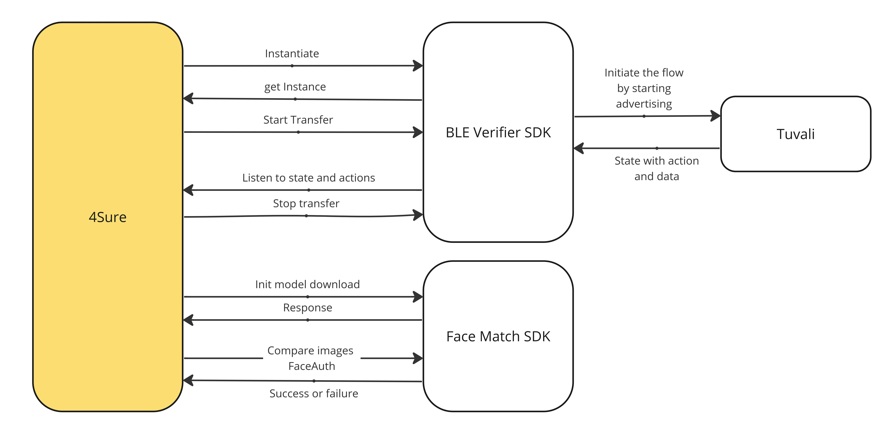
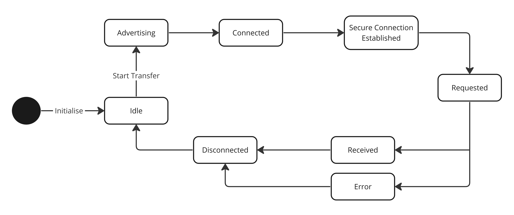

# 4sure

## Introduction

The 4Sure App is designed to streamline the process of verifying digital credentials in a secure and efficient manner. Leveraging the power of [Bluetooth Low Energy (BLE)](https://en.wikipedia.org/wiki/Bluetooth\_Low\_Energy) technology, this app integrates the [MOSIP](https://mosip.io/#1) (Modular Open Source Identity Platform)[ BLE Verifier SDK](https://docs.mosip.io/inji/integration-guide/ble-verifier), facilitating seamless and wireless transfer of verifiable credentials (VCs). Additionally, the app is reinforced with the [Biometric SDK ](https://github.com/biometric-technologies/biometric-sdk-react-native)module, which enables it to perform biometric authentication. This integration allows for accurate identity verification by using biometric data, such as facial recognition, providing an additional layer of security and trust in the verification process. This document aims to provide a comprehensive technical guide to assist developers, and other stakeholders in understanding, integrating, and maintaining the app.

## 4Sure integration workflow <a href="#inji-integration-workflow-with-ble-verifier-sdk-and-face-match-sdk" id="inji-integration-workflow-with-ble-verifier-sdk-and-face-match-sdk"></a>

<figure><figcaption><p>4Sure App Integration</p></figcaption></figure>

## BLE Verifier SDK

### Types of states supported

* Idle
* Advertising
* Connected
* Secure Connection Established
* Requested
* Received
* Error
* Disconnected

<figure><figcaption><p>State diagram</p></figcaption></figure>


If either the sender or receiver decides to cancel the transfer at any stage, the state will transition to Disconnected and become Idle as a result.




## Face Match SDK

This React Native package from the biometric-technologies enhances our app's biometric authentication capabilities through facial recognition. 4Sure utilizes the SDK's functions to capture a user's face and compare it with a stored image.&#x20;

Example usage could look like this:

```javascript
BiometricSDK.captureFace()
  .then(capturedImage => {
    BiometricSDK.compareFaces(capturedImage, storedImage)
      .then(matchResult => {
        if (matchResult) {
          // Handle successful match
        } else {
          // Handle mismatch
        }
      })
      .catch(error => {
        // Handle comparison error
      });
  })
  .catch(error => {
    // Handle capture error
  });

```



## Open source integrations

<table><thead><tr><th>Library</th><th>License</th><th data-hidden></th></tr></thead><tbody><tr><td><a href="https://github.com/mosip/ble-verifier-sdk">mosip/ble-verifier-sdk</a></td><td>MIT License</td><td></td></tr><tr><td><a href="https://github.com/mrousavy/react-native-vision-camera">mrousavy/react-native-vision-camera</a></td><td>MIT License</td><td></td></tr><tr><td><a href="https://github.com/biometric-technologies/biometric-sdk-react-native">biometric-technologies/biometric-sdk-react-native</a></td><td>MIT License</td><td></td></tr></tbody></table>

