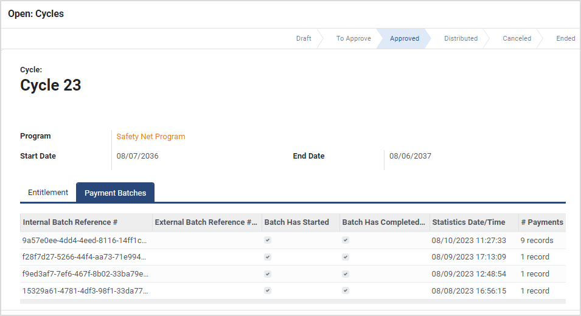

# Payment Batches

## Introduction

Once the payment manager is configured, program administrators can prepare and send payments using single-click options provided by the OpenG2P platform. The platform also provides details of the payment batches, statistics, and payment details.

## Payment batch details

Each program cycle can have multiple payment batches based on the size of the batch. Program administrators can navigate to a cycle and view the details related to all the batches in that cycle. Each batch is assigned an internal reference by the OpenG2P platform.&#x20;

The figure below shows a cycle with multiple payment batches.

<figure><figcaption></figcaption></figure>

## Batch statistics and payments

The program administrator can view the payment details of each batch such as the amount issued, the amount paid, accounting status, and payment status.

The figure below shows the payments for one of the batches in cycle 23 of the program.

<figure><figcaption></figcaption></figure>
