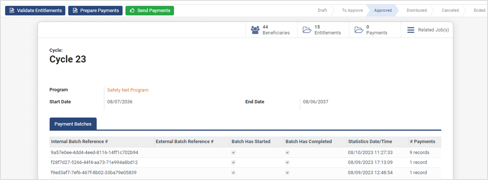

# Payment Manager

## Introduction

Payment Manager is an interface to connect to a downstream payment system, like a payment hub. A program must have exactly one payment manager. Different programs may have different payment managers configured.

## Payment Batches

In each [program cycle](../beneficiary-management/disbursement-cycles.md), the payment transactions can be done in batches. There could be several reasons for batching the payments. The transaction limits may be imposed by payment switch, [DFSP](broken-reference/) or any other entity in the payments chain. The payment batches and batch size are configured in the payment manager.

## Payment manager types

Each program's payment configuration is specific to the payment system employed by that program. Hence there is a dedicated payment manager type for each payment system. OpenG2P supports these payment manager types:

#### Payment Hub EE Payment Managers

This manager uses [Mifos Payment Hub](../integrations/mojaloop-integration.md) for cash disbursements. To learn the steps to create this payment manager type, click [here](../guides/user-guides/create-payment-manager-types/create-payment-hub-ee-payment-manager.md).

#### Default Payment Managers

This is the default manager created automatically. This is the simplest of all payment managers and provides configuration for domain filters and batch size. Program administrators can use this manager to create payment batches. Since it does not have any payment system configuration, it cannot send payments to the beneficiaries. To learn the steps to create this payment manager, click [here](../guides/user-guides/create-payment-manager-types/create-default-payment-manager.md).

#### Payment Interoperability Layer Payment Managers

This payment manager is created for payment through [Mojaloop](../integrations/mojaloop-integration.md). Mojaloop can send payments for a variety of payment modes such as mobile wallets, IBAN, bank account numbers, registrant ID, etc. To learn the steps to create this payment manager, click [here](../guides/user-guides/create-payment-manager-types/create-payment-interoperability-layer-payment-manager.md).

#### Cash Payment Managers

This payment manager is used to record cash payments instead of sending payments to the beneficiary's account/wallet. Once the entitlement is approved, the program administrator provides an [entitlement voucher](../beneficiary-management/entitlement.md#entitlement-voucher) to the beneficiary. Once the cash is disbursed at a bank, cash counter, or disbursement centre, the program administrator records the payment as paid. To learn the steps to configure this payment manager, click [here](../guides/user-guides/create-payment-manager-types/create-cash-payment-manager.md).

#### File Payment Managers

This payment manager is used mainly to send a list of approved beneficiary entitlements to the bank or a similar disbursing authority. The list is sent in a PDF/CSV file. The program administrator can also configure a template and QR code for this file. To learn the steps to configure this payment manager, click [here](../guides/user-guides/create-payment-manager-types/create-file-payment-manager.md).

## Payment manager configuration

Configuring a payment manager in a program is a two-step process.

#### Create a payment manager type

The program administrator must create exactly one payment manager according to the payment system/process employed by the program. To learn more about this step, click [here](../guides/user-guides/create-payment-manager-types/).

#### Add the payment manager to a program

The program administrator needs to add the payment manager created in the first step to the program. To learn more about this step, click [here](../guides/user-guides/create-payment-manager.md).

## Sending payments

Once the payment manager is configured, the program administrator navigates to the program cycles and performs these actions:

* **Validate entitlements:** This step will validate all the entitlements that were approved. To learn more about the approval process, click [here](../beneficiary-management/entitlement.md#approval-process).
* **Prepare payments:** This step will create the payment batches based on the batch size.&#x20;
* **Send payments:** This step will send the payments to the beneficiary accounts/wallets. To learn more about these steps, click [here](../guides/user-guides/prepare-and-send-payment.md).

The figure below shows the cycle view with the action buttons to perform the three tasks described above.

<figure><figcaption></figcaption></figure>

## How-To Guides:

[Create Payment Manager Types](../guides/user-guides/create-payment-manager-types/)

[Create Payment Hub EE Payment Manager](../guides/user-guides/create-payment-manager-types/create-payment-hub-ee-payment-manager.md)

[Create Payment Interoperability Layer Payment Manager](../guides/user-guides/create-payment-manager-types/create-payment-interoperability-layer-payment-manager.md)

[Create Default Payment Manager](../guides/user-guides/create-payment-manager-types/create-default-payment-manager.md)

[Create a Cash Payment Manager](../guides/user-guides/create-payment-manager-types/create-cash-payment-manager.md)

[Create File Payment Manager](../guides/user-guides/create-payment-manager-types/create-file-payment-manager.md)

[Create Payment Manager under Program](../guides/user-guides/create-payment-manager.md)

[Prepare and Send Payment](../guides/user-guides/prepare-and-send-payment.md)
