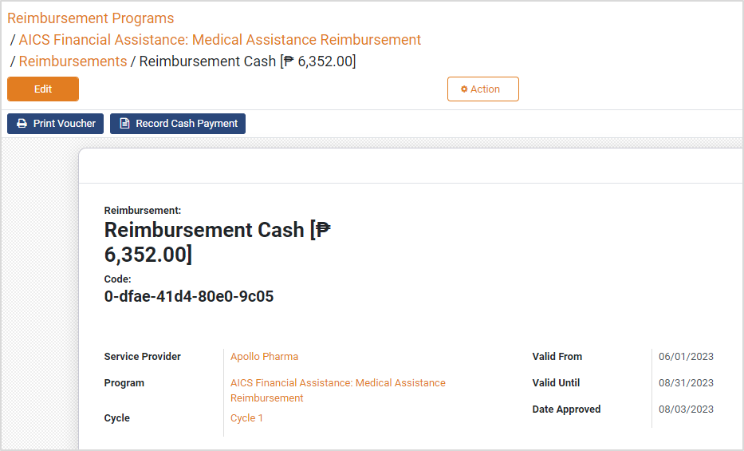

# Reimbursement Programs

## Introduction

Many programs disburse cash and other benefits through third parties such as service providers. These providers provide cash at the counter, medical treatments, and other such assistance. After providing services, they submit the bills to the accounting department of the social benefit delivery program.

Before the era of digitalization, these service providers used to get lumpsum funds in advance and then they managed the distribution of these funds to the beneficiaries. Digitalization of this process greatly reduced the instances of accounting and reconciliation errors and provided proof of delivery to program administrators and accountants.

## Reimbursement Programs

OpenG2P platform's reimbursement programs provide an easy-to-use interface to program administrators and accountants for managing service provider payments. In terms of payment workflow, the reimbursement programs follow the same process as described in the Program Management [Payment Manager](../) section. Instead of beneficiaries and beneficiary payments, the reimbursement program lists the service providers and reimbursements.

<figure><figcaption></figcaption></figure>

## Beneficiary entitlement proof

Service providers need proof from the beneficiary about their entitlement amount and issuing authority. OpenG2P facilitates generating an [entitlement voucher](../../beneficiary-management/entitlement.md#entitlement-voucher) for the beneficiary. The QR code included in the voucher makes the voucher tamper-proof and authenticates/authorizes the registered service provider to provide the service, and the intended beneficiary to claim the service.

## Sending payments to service providers

OpenG2P has a simple interface for payments to service providers. A voucher file can also be generated that acts as a guarantee of payment. The program administrator can also record this payment. To learn more about the reimbursement process, click [here](../../guides/user-guides/reimburse-service-provider.md).

The figure below shows the action buttons for printing vouchers and recording payments.

<figure><figcaption></figcaption></figure>

## How-To Guides

[Reimburse Service Provider](../../guides/user-guides/reimburse-service-provider.md)
