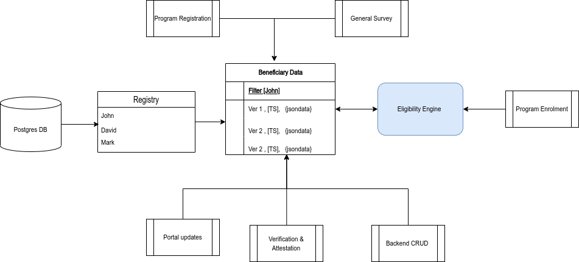

# Program Data & Eligibility Engine

## Current Problems

* Scalability
* Multifaceted data for each beneficiary
* Inability to query deep into the data
* Cross program queries

## Current Technologies

* Odoo
* Postgresql
* Domain notations

<figure><figcaption>
<strong>Current design</strong>
</figcaption></figure>

Proposed Solution

* Graph
* Schema based data
* Search tool
* Geo Spatial data
* Computed values
* Property led storage
* GraphQL

Tools Suggested

* Neo4j
* DGraph (preferred)
* ArangoDB

