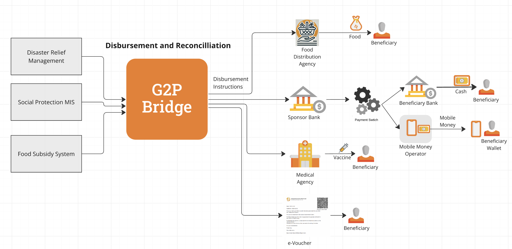
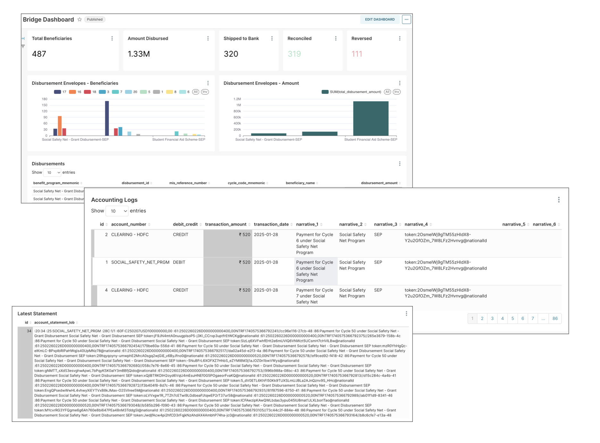

# G2P Bridge

The **G2P Bridge** is a standalone, independent Digital Public Infrastructure (DPI) component designed to seamlessly connect upstream Social Protection Systems and other Government-to-Person (G2P) bulk benefit systems with downstream Disbursement Service Providers\* (DSPs).

The G2P Bridge enables a standardised and efficient mechanism for dispatching **disbursement instructions** while ensuring **reconciliation** with actual deliveries made by DSPs. It supports **digital cash transfer** as well as physical transfers of goods and services, making it a versatile solution for various beneficiary programs.

For **digital cash transfers**—such as payments to beneficiaries' bank accounts or mobile wallets—the G2P Bridge interfaces with the Sponsor Bank (which manages program funding) to initiate transfers. The Sponsor Bank then communicates with the National Switch/Clearing network to execute these payments.

For **in-kind** benefits and services, G2P Bridge issues disbursement instructions to the respective agencies, who are expected to send back the status of disbursements for reconciliation. &#x20;


\* Disbursement Service Provider examples:

* A primary health centre administering government-provided vaccines.
* A commercial bank managing beneficiaries' savings accounts.
* A service provider delivering food aid in disaster-affected areas


<figure><figcaption>
G2P Bridge Overview
</figcaption></figure>

## **Nationwide deployment & benefits**

The G2P Bridge can serve multiple government departments, enabling them to utilize a **single nationwide infrastructure** for diverse benefit programs. A unified G2P Bridge system offers:

* Centralized execution of all benefit transfers (digital & physical, commodities and services).
* Streamlined reconciliation and auditing for transparency and accountability.
* Improved interoperability across government programs and service providers.
* Holisitic and consolidated view of all G2P transactions and their corresponding reconciliations from various upstream social protection systems.

<figure><figcaption></figcaption></figure>

By leveraging the G2P Bridge, governments can enhance the efficiency, scalability, and affordability of benefit transfers while ensuring seamless service delivery to beneficiaries.

## **Design Principles**

The G2P Bridge is specifically built for high-volume, government-led disbursement programs and adheres to the following design principles:

1. **Asynchronous Processing** – Ensures scalability and efficiency.
2. **Batch Transaction Handling** – Facilitates large-scale disbursements effectively.
3. **Cost-Effective Deployment & Maintenance** – Minimizes operational costs.
4. **Robust Reconciliation Mechanism** – Ensures accurate tracking and auditing.
5. **Extensibility & Easy Integration** – Simplifies onboarding for banks and service providers.

Rather than relying on expensive real-time payment processing capabilities, these principles allow the G2P Bridge to optimize deployment and operational expenses while maintaining reliability and efficiency.

## G2P Bridge in the digital cash transfer landscape

The following figure shows how the G2P Bridge digital cash transfer subsystem fits into the overall G2P landscape


G2P Bridge in the G2P landscape


## G2P Bridge technical overview


G2P Bridge - Technical Architecture


