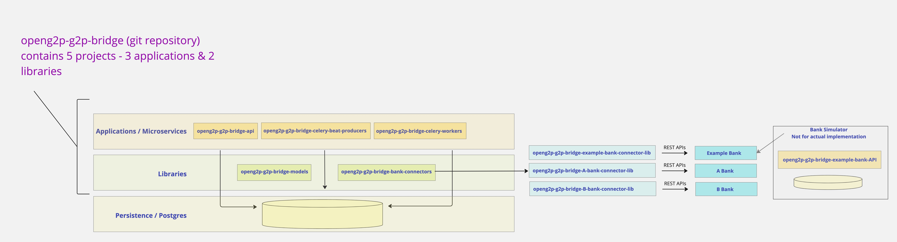

# 💰 G2P Bridge

The role of G2P Bridge subsystem in the G2P landscape is shown in this figure

<figure><figcaption>
G2P Bridge in the G2P landscape
</figcaption></figure>

The G2P Bridge subsystem bridges the PBMS module with the Sponsor Bank to effect large scale / high volume beneficiary transfers. Being a G2P system (not a P2G, P2P, P2M, etc), the platform does not desire to offer high performance and real time transfers, since these features are not typically required in a G2P transfer chain. Rather, the platform is designed to operate asynchronously and emphasises on high volumes, ease of use, low cost of operations and efficient reconciliation.

## Functional Overview

## Technical Overview

<figure><figcaption>
G2P Bridge - Technical Architecture
</figcaption></figure>

