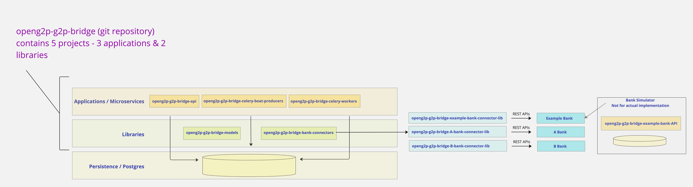

---
layout:
  title:
    visible: true
  description:
    visible: false
  tableOfContents:
    visible: true
  outline:
    visible: true
  pagination:
    visible: true
---

# Interfaces

<figure><figcaption>
openg2p-g2p-bridge - Technical architecture
</figcaption></figure>

Refer to the Technical architecture. As shown in the figure, all outward APIs towards a Sponsor bank are abstracted through an interface. This interface is in the library project - **openg2p-g2p-bridge-bank-connectors**

There is also an implementation of the interface (openg2p-g2p-bridge-example-bank-connector), that provides a reference implementation. This connector connects to a simulator application. The simulator application (openg2p-g2p-bridge-example-bank-api) simulates a Sponsor bank.

The interface defines the following APIs

### check\_available\_funds

| Arguments         | Type   |
| ----------------- | ------ |
| account\_number   | string |
| account\_currency | string |
| funds\_required   | number |

returns

| attributes | Type |
| ---------- | ---- |
|            |      |

### block\_funds\_with\_bank

| Arguments               | Type   |
| ----------------------- | ------ |
| account\_number         | string |
| account\_currency       | string |
| amount\_to\_be\_blocked | number |

returns

| Attributes               | Type               |
| ------------------------ | ------------------ |
| block\_result            | SUCCESS or FAILURE |
| block\_error\_code       | string             |
| block\_error\_message    | string             |
| block\_result\_reference | string             |

### disburse\_funds

It will take a collection of the following structure (payment structure)

This API will only acknowledge receipt of a payment instruction. The actual payment will be effected by the bank asynchronously&#x20;

| Arguments                             | Description |
| ------------------------------------- | ----------- |
| remitter\_account\_number             |             |
| remitter\_account\_currency           |             |
| amount                                |             |
| beneficiary\_account\_number          |             |
| beneficiary\_account\_currency        |             |
| beneficiary\_account\_type            |             |
| beneficiary\_account\_bank            |             |
| beneficiary\_account\_branch          |             |
| beneficiary\_mobile\_number           |             |
| beneficiary\_mobile\_wallet\_provider |             |
| beneficiary\_email\_address           |             |
| beneficiary\_email\_wallet\_provider  |             |

returns

| Attribute | Description        |
| --------- | ------------------ |
| response  | SUCCESS or FAILURE |

### Bank Connector Factory

This Factory will return a BankConnector Interface

This BankConnector class will implement the BankConnector Interface

The Factory will return the Connector based on the "benefit\_program.sponsor\_bank\_code"

<mark style="color:blue;">def get\_bank\_connector (sponsor\_bank\_code : string) -> BankConnectorInterface</mark>
