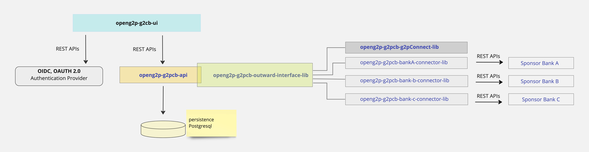

---
layout:
  title:
    visible: true
  description:
    visible: false
  tableOfContents:
    visible: true
  outline:
    visible: true
  pagination:
    visible: true
---

# Interfaces

<figure><figcaption>
openg2p-g2cb - Technical architecture
</figcaption></figure>

Refer to the Technical architecture. As shown in the figure, all outward APIs towards a Sponsor bank is abstracted through an interface - openg2p-g2cb-out-bank-interface-lib.

This interface library (<mark style="color:blue;">**OutwardBankInterface**</mark>) provides for the following method signatures

### check\_funds\_with\_bank

| Arguments          | Type   |
| ------------------ | ------ |
| financial\_address | string |

returns

| attributes         | Type   |
| ------------------ | ------ |
| financial\_address | string |
| account\_balance   | number |
| currency           | string |

### block\_funds\_with\_bank

| Arguments                         | Type   |
| --------------------------------- | ------ |
| financial\_address                | string |
| amount\_to\_be\_blocked           | number |
| currency                          | string |
| block\_request\_reference\_number | string |

returns

| Attributes                | Type               |
| ------------------------- | ------------------ |
| financial\_address        | string             |
| block\_result             | SUCCESS or FAILURE |
| block\_error\_code        | string             |
| block\_error\_message     | string             |
| block\_request\_reference | string             |
| block\_result\_reference  | string             |

### create\_disbursements
