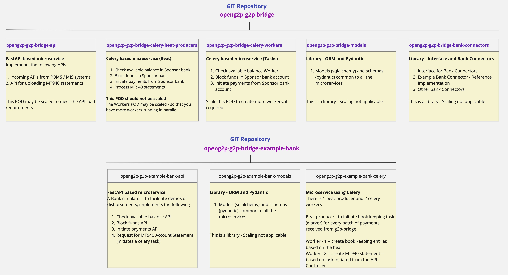

# Physical Organization

The G2P-Bridge system has been organized and baselined in the following manner

<figure><figcaption>
Physical organization of G2P-Bridge subsystem
</figcaption></figure>

### Repositories

<table><thead><tr><th width="293">Repository</th><th>Contents</th></tr></thead><tbody><tr><td><a href="https://github.com/OpenG2P/openg2p-g2p-bridge.git">openg2p-g2p-bridge</a></td><td>
This repository has the following python modules  <mark style="color:orange;"><strong>openg2p-g2p-bridge-partner-api</strong></mark> This is fastapi based module - that provides all REST APIs to partner systems. Upstream systems like PBMS should consume this partner api to handover disbursement instructions to Bridge. This module should be deployed as a k8s pod and should be scaled suitably to handle required volumes. Security is implemented using a partner signature validation (uses MOSIP Keymanager) 

<mark style="color:orange;"><strong>openg2p-g2p-bridge-bene-portal-api</strong></mark> This is fastapi based module - that provides all REST APIs to the OpenG2P Beneficiary Portal. This module should be deployed as a k8s pod and should be scaled suitably to handle required volumes. Security is implemented using a Access-Token issued by an identity provider.

 <mark style="color:orange;"><strong>openg2p-g2p-bridge-celery-beat-producers</strong></mark> This uses Celery and produces periodic Celery beats. This module should be deployed as a k8s pod - but should be restricted to only a single pod. The volumes should be handled by scaling the next pod - openg2p-g2p-bridge-celery-workers  <mark style="color:orange;"><strong>openg2p-g2p-bridge-celery-workers</strong></mark> This uses Celery and spawns workers that listen to the beats produced by the celery beat producer. The following workers exist 1. check available balance with sponsor bank 2. block funds with sponsor bank 3. initiate payments with sponsor bank 4. reconcile disbursements with mt940 This module is a service and should be deployed as a k8s pod and should be scaled suitably to handle the required volumes.  <mark style="color:orange;"><strong>openg2p-g2p-bridge-models</strong></mark> This module is a library (not a service/pod). This library contains the sqlalchemy (persistence) models and pydantic schemas that are shared by the api, the celery beat producer and the celery worker modules.
</td></tr><tr><td><a href="https://github.com/OpenG2P/openg2p-g2p-bridge-deployment.git">openg2p-g2p-bridge-deployment</a></td><td>Helm charts and deployment scripts for the g2p-bridge subsystem.  This repository contains the Helm charts for the 3 services, viz. g2p-bridge-api, g2p-bridge-celery-beat-producers and g2p-bridge-celery-workers.  Apart from the individual helm charts, there is also a single helm chart - openg2p-g2p-bridge - that installs all the 3 services.</td></tr><tr><td><a href="https://github.com/OpenG2P/openg2p-g2p-bridge-example-bank.git">openg2p-g2p-bridge-example-bank</a></td><td>This repository provides an implementation of a Sponsor Bank. This repository will not be used in a Production Deployment. This only simulates a Sponsor Bank so that we can demonstrate end to end working of the g2p-bridge subsystem.  This repository has 3 python modules  <mark style="color:orange;"><strong>openg2p-g2p-bridge-example-bank-api</strong></mark> This is python module built using fastapi. It provides REST APIs of a fictitous bank - called - "Example Bank". It provides REST APIs for checking available balance, blocking funds and initiating payments.  <mark style="color:orange;"><strong>openg2p-g2p-bridge-example-bank-celery</strong></mark> This is a python module that uses Celery to perform all the asynchronous processing - viz. processing payments and producing MT940 statements based on statement requests.  <mark style="color:orange;"><strong>openg2p-g2p-bridge-example-bank-models</strong></mark> This module is a library (not a service/pod). This library contains the sqlalchemy (persistence) models and pydantic schemas that are shared by the api and the celery modules.</td></tr><tr><td><a href="https://github.com/OpenG2P/openg2p-g2p-bridge-example-bank-deployment.git">openg2p-g2p-bridge-example-bank-deployment</a></td><td>Helm charts and deployment scripts for the example bank subsystem.  This repository contains the Helm charts for the 2 services, viz. example-bank-api &#x26; example-bank-celery.  Apart from the individual helm charts, there is also a single helm chart - openg2p-g2p-bridge-example-bank - that installs the 2 services.</td></tr><tr><td><a href="https://github.com/OpenG2P/openg2p-g2p-bridge-test.git">openg2p-g2p-bridge-test</a></td><td>This repository contains all the test artefacts - organized into Unit Testing, Functional Testing and Performance Testing. Functional Testing is a mix of manual as well as automated testing. Automated testing has been done with the help of Postman API tool.</td></tr><tr><td></td><td></td></tr></tbody></table>
