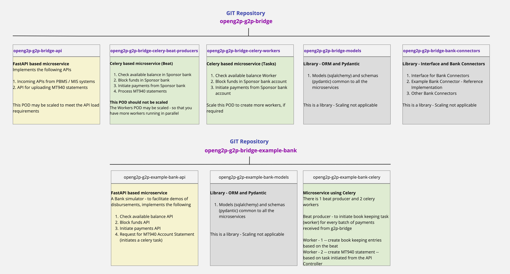

---
layout:
  title:
    visible: true
  description:
    visible: false
  tableOfContents:
    visible: true
  outline:
    visible: true
  pagination:
    visible: true
---

# Physical organization

The G2P-Bridge system has been organized and baselined in the following manner

<figure><figcaption>
Physical organization of G2P-Bridge subsystem
</figcaption></figure>

