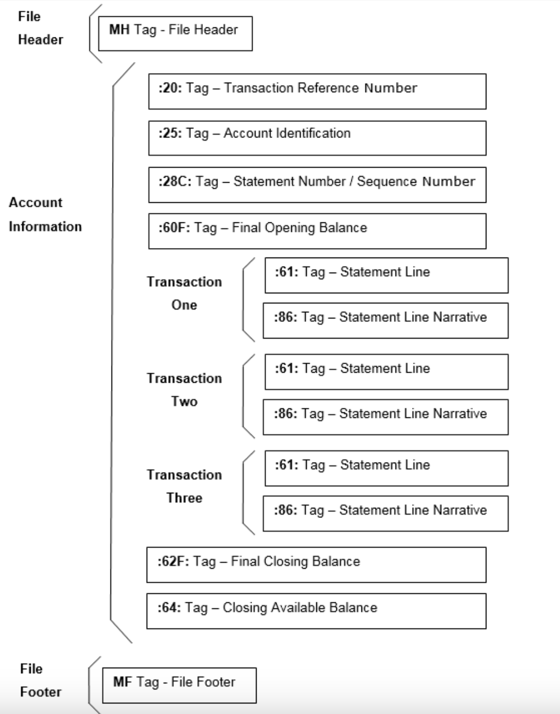

---
layout:
  title:
    visible: true
  description:
    visible: false
  tableOfContents:
    visible: true
  outline:
    visible: true
  pagination:
    visible: true
---

# upload\_mt940

MT940 is a structured account statement. The sponsor bank will send this statement (for the benefit program funding account) everyday.&#x20;

The exact mechanics of how this statement will be delivered to the government department will vary across implementations, viz. FTP, SMTP, API invoked by the bank etc.

Depending on the physical delivery mechanism, the implementation can create an integration layer and use this API to upload the MT940 message.

| API Attributes |                                                                   |
| -------------- | ----------------------------------------------------------------- |
| Direction      | Inward                                                            |
| Invoked by     | Sponsor bank, Implementation Integration work                     |
| Mode           | Synchronous                                                       |
| Tables         | 
benefit_program_account_statement account_statement_lob
 |

## Object design

### account\_statement

<table><thead><tr><th width="287">Attribute</th><th>Description</th></tr></thead><tbody><tr><td><strong>statement_id</strong></td><td><strong>Unique ID</strong></td></tr><tr><td>statement_date</td><td>Tag :60F: of MT940 - Header Section</td></tr><tr><td>account_number</td><td>Tag :25: of MT940 - Header Section</td></tr><tr><td>reference_number</td><td>Tag :20: of MT940 - Header Section</td></tr><tr><td>statement_number</td><td>Tag :28C: of MT940 - Header Section</td></tr><tr><td>sequence_number</td><td>Tag :28C: of MT940 - Header Section</td></tr><tr><td>statement_upload_timestamp</td><td></td></tr><tr><td>statement_process_status</td><td>Enum PENDING PROCESSED</td></tr><tr><td>statement_process_timestamp</td><td></td></tr><tr><td>statement_process_error_code</td><td></td></tr><tr><td>statement_process_attempts</td><td></td></tr></tbody></table>

### account\_statement\_lob

| Attribute      | Description                                            |
| -------------- | ------------------------------------------------------ |
| statement\_id  |                                                        |
| statement\_lob | 
TEXT type Stores the MT940 Statement as TEXT
 |

### Business logic

1. Persist the Account Statement in the two tables - account\_statement & account\_statement\_lob
2. In the table - account\_statement, only the following columns are populated - statement\_id, statement\_upload\_timestamp and statment\_process\_status = PENDING
3. In the table - account\_statement\_lob, the entire text is persisted with the statement\_id

### mt940\_processor\_beat\_producer

<table><thead><tr><th width="235"></th><th></th></tr></thead><tbody><tr><td>frequency</td><td>hourly (specified by configuration yml)</td></tr><tr><td>attempts</td><td>yes. subject to a configurable limit specified by  configuration yml</td></tr><tr><td><mark style="color:purple;">driving table</mark></td><td><mark style="color:purple;">account_statement</mark></td></tr><tr><td>eligible envelopes</td><td><mark style="color:blue;">statement_process_status = 'PENDING'</mark></td></tr></tbody></table>

1. Picks up all eligible account\_statement\_records
2. For each account statement, delegates a task to mt940\_processor\_worker
3. Payload -- statement\_id

### mt940 - statement format

<figure><figcaption>
MT940 - Account Statement - Detailed - Structure
</figcaption></figure>

### mt940\_processor\_worker

1. Payload -- statement\_id
2. Picks up the record from account\_statement
3. Picks up the lob from account\_statement\_lob
4. Parse the mt940 - header and trailer and retrieve the following
   1.  sponsor bank account number - Tag :25: of MT940 - Header Section

       E.g. - <mark style="color:purple;">:25:032000136465</mark>

       Validate the Bank Account - against "benefit\_program\_configuration". This account number should exist\
       If the account number does not exist, mark the MT940 Statement as "ERROR" - No further processing
   2.  reference\_number - Tag :20: of MT940 - Header Section

       E.g. - <mark style="color:purple;">:20:CSCT032000136465</mark>
   3.  statement\_number - Tag :28C: of MT940 - Header Section

       E.g. - <mark style="color:purple;">:28C:00001/001</mark> (section before slash "/" is statement number)
   4.  sequence\_number - Tag :28C: of MT940 - Header Section

       E.g. - :28C:00001/001 (section after slash "/" is sequence number)
5. Update these attributes in the table - account\_statement
6. Now loop through the transaction section of the MT940&#x20;
7. Each Transaction consists of two lines (tags) - :61: & :86: (Statement and Narrative)
8.  :61: is known as the Statement line and has the following structure

    <mark style="color:purple;">:61:1507020702D115945,00F014NARRATIVE//0207150143062089CRLF1234567890</mark>

    1. <mark style="color:purple;">150702 -- 6 digits -- Transaction Value Date in YYMMDD format</mark>
    2. <mark style="color:purple;">0702 -- 4 digits -- Transaction Booking Date in MMDD format</mark>
    3. <mark style="color:purple;">C/D/RC/RD -- 2 digits -- Credit, Debit, Reversal-Credit, Reversal-Debit</mark>
    4. <mark style="color:purple;">115945,00 -- Transaction Amount -- Maximum 19 characters</mark>
    5. <mark style="color:purple;">F014 -- Transaction Code -- Should be a standard transaction code - 1 for Credit and another 1 for Debit</mark>
    6. <mark style="color:purple;">NARRATIVE -- Transaction Narrative -- Should be the Beneficiary Name -- This should be as sent by the g2p-bridge to the Sponsor Bank</mark>
    7. <mark style="color:purple;">// Reference Separator</mark>
    8. <mark style="color:purple;">0207150143062089CRLF1234567890 -- Transaction Reference Number issued by the Bank for this transaction</mark>
9. :86: is known as the Narrative Line - It can have 6 lines of 65 characters each. g2p-bridge should send as many details about the Benefit Program and Beneficiary in the Disbursement payload to ensure that the narrative text is as rich as possible
10. For each MT940 Transaction - retrieve the "disbursement\_id" from the transaction
11. The "disbursement\_id" should ideally be the Customer Reference Number. However, this depends on the Sponsor Bank banking platform
12. The Sponsor Bank may send the "disbursement\_id" in any of these fields - customer\_reference, bank\_reference (unlikely, but possible) and one of the six narrative lines (tag 86)
13. So extracting the "disbursement\_id" from the mt940 transaction - should be abstracted out to an interface - with an adapter implementation for different sponsor banks.
14. For "D" transactions, insert a new record for the "disbursement\_id" in the table - disbursement\_recon\_from\_bank
15. For "RD" transactions, updated the existing record in - disbursement\_recon\_from\_bank
16. Log errors into disbursement\_recon\_errors\_from\_bank. The following error conditions are logged into this table
    1. I get a "D" transaction, but I don't get a valid "disbursement\_id" - INVALID\_DISBURSEMENT
    2. I get a "D" transaction, but the "disbursement\_id" is already present in the table - disbursement\_recon\_from\_bank - DUPLICATE\_DISBURSEMENT
    3. I get a "RD" transaction, but the "disbursement\_id" is not present in the table - disbursement\_recon\_from\_bank - INVALID\_REVERSAL

### disbursement\_recon

<table><thead><tr><th width="312">Attribute</th><th>Description</th></tr></thead><tbody><tr><td>bank_disbursement_batch_id</td><td></td></tr><tr><td>disbursement_id</td><td>Unique Index</td></tr><tr><td>recon_statement_id</td><td>This is the Unique ID that is given to each MT940 that is uploaded into the platform</td></tr><tr><td>recon_statement_number</td><td>This is the Statement Number that is found in the MT940 header - field 28C</td></tr><tr><td>recon_statement_sequence</td><td></td></tr><tr><td>recon_entry_sequence</td><td>This is the sequence number of the entry in this statement - the entry that corresponds to this disbursement. This entry will be reflected as a "Debit" in the Program Account with the Sponsor Bank.</td></tr><tr><td>bank_reference_number</td><td>Bank's unique reference number for the transaction. Every disbursement will have a unique reference assigned by the bank.</td></tr><tr><td>reversal_found</td><td></td></tr><tr><td>reversal_statement_id</td><td></td></tr><tr><td>reversal_statement_number</td><td></td></tr><tr><td>reversal_statement_sequence</td><td></td></tr><tr><td>reversal_entry_sequence</td><td></td></tr><tr><td>reversal_reason</td><td>As found in MT940 statement. This reason may be found in any of the six lines of Narrative. Implementation will differ across sponsor banks Will depdend on an Bank specific adapter implementation to extract the "reversal_reason" from the Narratives</td></tr></tbody></table>

### disbursement\_recon\_error

<table><thead><tr><th width="312">Attribute</th><th>Description</th></tr></thead><tbody><tr><td>bank_disbursement_batch_id</td><td></td></tr><tr><td>recon_statement_id</td><td>This is the Unique ID that is given to each MT940 that is uploaded into the platform</td></tr><tr><td>recon_statement_number</td><td>This is the Statement Number that is found in the MT940 header - field 28C</td></tr><tr><td>recon_statement_sequence</td><td></td></tr><tr><td>recon_entry_sequence</td><td>This is the sequence number of the entry in this statement - the entry that corresponds to this disbursement. This entry will be reflected as a "Debit" in the Program Account with the Sponsor Bank.</td></tr><tr><td>bank_reference_number</td><td>Bank's unique reference number for the transaction. Every disbursement will have a unique reference assigned by the bank.</td></tr><tr><td>disbursement_id</td><td></td></tr><tr><td>error_reason</td><td>INVALID_DISBURSEMENT DUPLICATE_DISBURSEMENT INVALID_REVERSAL</td></tr></tbody></table>
