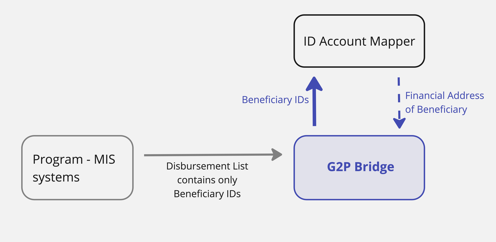

---
layout:
  title:
    visible: true
  description:
    visible: false
  tableOfContents:
    visible: true
  outline:
    visible: true
  pagination:
    visible: true
---

# Account Mapper Resolution

The upstream Program Management (MIS) systems provide a disbursement list for every disbursement cycle. While many MIS systems currently store beneficiary financial address, the DPI paradigm seeks to abstract this financial address information into a de-coupled purpose built account mapper service. This design ensures that the beneficiary has to ensure his correct financial address (either a bank account or a mobile wallet) only in one single place as opposed to registering his financial address in every Program.

Based on this, the G2P Bridge is designed to receive Beneficiary IDs from the upstream MIS systems. The G2P Bridge then looks up into the ID-Account Mapper, using the standard interoperable API specified by G2PConnect (known as mapper resolve API) to retrieve the financial address of the beneficiary.

The following figure illustrates this flow

<figure><figcaption>
G2P Bridge - resolving financial address using beneficiary IDs
</figcaption></figure>

The G2P Bridge then passes this resolved financial address to the downstream Sponsor Bank for further processing by the Banking Network.&#x20;

The financial address in the ID Account Mapper should contain the full financial address in terms of the beneficiary's account number (or mobile number), the required bank/branch code (or mobile service provider code) as applicable in the nation's domestic clearing network (for both bank accounts as well as mobile wallets).&#x20;
