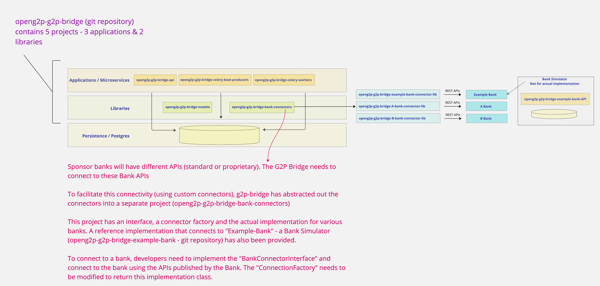

---
layout:
  title:
    visible: true
  description:
    visible: false
  tableOfContents:
    visible: true
  outline:
    visible: true
  pagination:
    visible: true
---

# Extensibility - Connect to Sponsor Banks

Different benefit programs across various government departments can connect to different sponsor banks (treasury banks & commercial banks) to effect their respective disbursements. The following figure represents this

<figure><figcaption>
Connecting to Sponsor Banks - extending the Bank Connector Library
</figcaption></figure>

For details on the methods defined by the BankConnectorInterface and the payload definitions, refer to the [design specification for the Bank Connector](https://docs.openg2p.org/g2p-bridge/development/design-specifications/interfaces).
