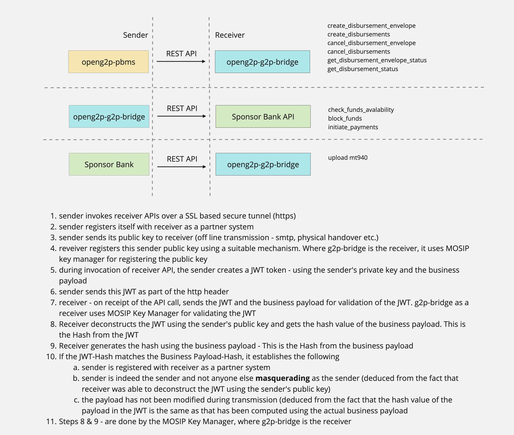

---
layout:
  title:
    visible: true
  description:
    visible: false
  tableOfContents:
    visible: true
  outline:
    visible: true
  pagination:
    visible: true
---

# Privacy & Security

<figure><figcaption>
JWT Security (for g2p-bridge as sender and receiver)
</figcaption></figure>

