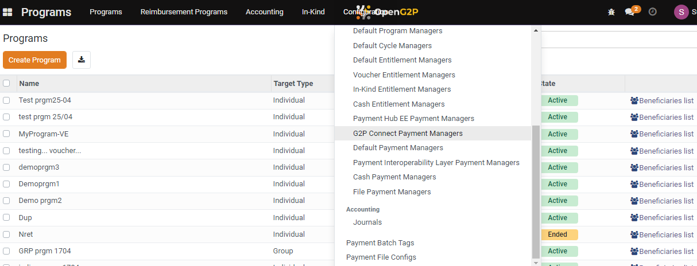
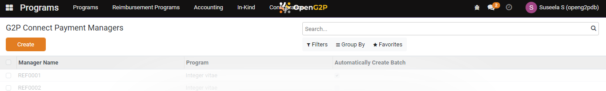
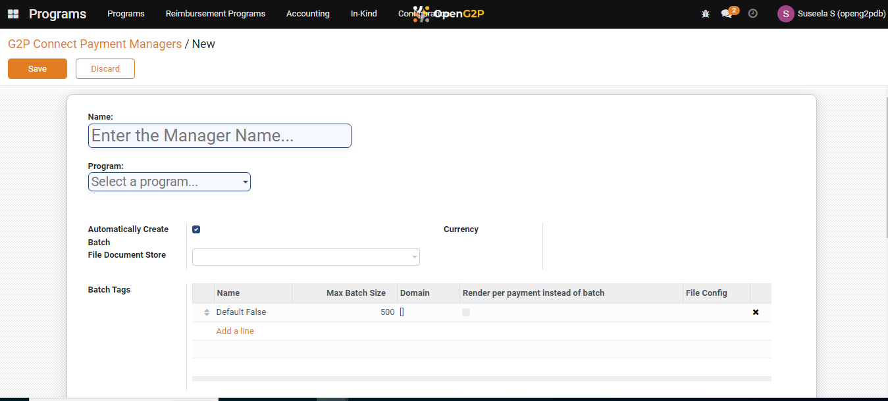
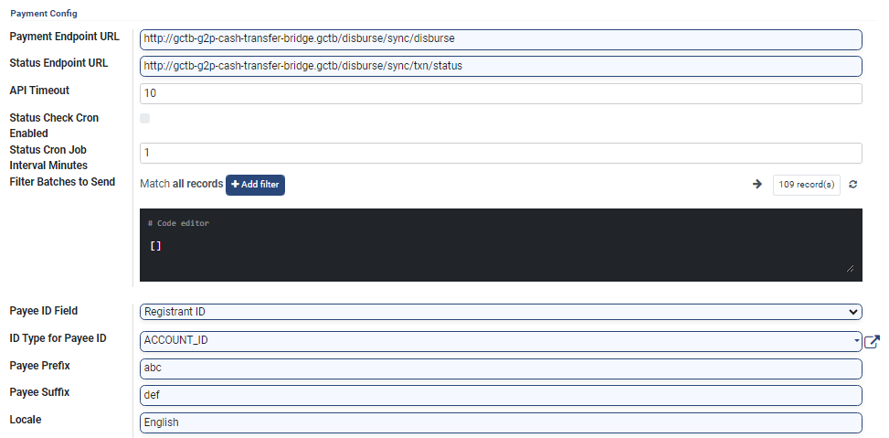

# 📔 Configure G2P Connect Payment Manager

This document provides instructions to configure G2P Connect Payment Manager in the Program module.

## Prerequisites

* The user must have a Registrar and Administrator role.
* The user must have access to the Program module in OpenG2P systems.

## Procedure

1. Click the main menu icon  and select _**Programs**_.

<figure><figcaption></figcaption></figure>

_**Programs**_ screen is displayed.

2. Click the _**Configuration**_ in the menu bar and then select _**G2P Connect Payments Managers**_.

<figure><figcaption></figcaption></figure>

_**G2P Connect Payment Managers**_ screen is displayed.

<figure><figcaption></figcaption></figure>

3. Click the _**Create**_ button.

_**G2P Connect Payment Managers/New**_ screen is displayed.

<figure><figcaption></figcaption></figure>

The fields and their descriptions are given below.

| Field                      | Description                                                                                                                                                                                                                                                                                                                                                                                                                |
| -------------------------- | -------------------------------------------------------------------------------------------------------------------------------------------------------------------------------------------------------------------------------------------------------------------------------------------------------------------------------------------------------------------------------------------------------------------------- |
| Name                       | Enter the G2P payment manager name.                                                                                                                                                                                                                                                                                                                                                                                        |
| Program                    | Select the appropriate program from the drop-down.                                                                                                                                                                                                                                                                                                                                                                         |
| Automatically Create Batch | Click the check box to create payment batches automatically while preparing payment for a cycle.                                                                                                                                                                                                                                                                                                                           |
| Currency                   | Displays the type of currency                                                                                                                                                                                                                                                                                                                                                                                              |
| File Document Store        | 
Select the appropriate storage space to store the beneficiary documents. The available storage space are: 
<ul><li>Default S3 Document Store</li><li>Payments File Store</li><li>Voucher S3 Document Store</li></ul>
For example, if the benefits are delivered via voucher to a beneficiary, then choose the option <em><strong>Voucher S3 Document Store</strong></em> to store the beneficiary's voucher.  
 |

### Batch Tags

| Field                               | Description                                                                                 |
| ----------------------------------- | ------------------------------------------------------------------------------------------- |
| Name                                | Displays the name of the batch tags                                                         |
| Max Batch Size                      | Displays the maximum count of batch size                                                    |
| Domain                              | Filters the batch based on the criteria                                                     |
| Render per payment instead of batch | Click the check box if each payment is to be rendered individually instead of batch payment |
| File Config                         | Select the file configuration from the drop-down                                            |

## Payment Config

<figure><figcaption></figcaption></figure>

|                                  |                                                                                                                                 |
| -------------------------------- | ------------------------------------------------------------------------------------------------------------------------------- |
| Payment Endpoint URL             | Specify the URL for payment disbursement.                                                                                       |
| Status Endpoint URL              | Specify the URL for payment status.                                                                                             |
| API Timeout                      | Set the maximum time (in seconds) for the API request to complete.                                                              |
| Status Check Cron Enabled        | Click the check box to enable cron job.                                                                                         |
| Status Cron Job Interval Minutes | Specify the time interval of the cron job.                                                                                      |
| Filter Batches to Send           | Filter the batches based on disbursement mode. The disbursement can be cash on hand, digital transaction and voucher payment.   |
| Payee ID Field                   | Select the appropriate value from the drop-down. It auto populates the ID Type for Payee ID, Payee Prefix, Payee Suffix fields. |
| ID Type for Payee ID             | Enter the type of ID used for payees                                                                                            |
| Payee Prefix                     | Add a prefix to payee information. It is mandatory only for all options                                                         |
| Payee Suffix                     | Add a suffix to payee information. It is mandatory only for REG\_ID.                                                            |
| Locale                           | Set the locale for language and formatting preferences.                                                                         |

4. Click the _**Save**_ button to configure the new G2P payment manager.
5. Click the _**Discard**_ button to exit the screen.
