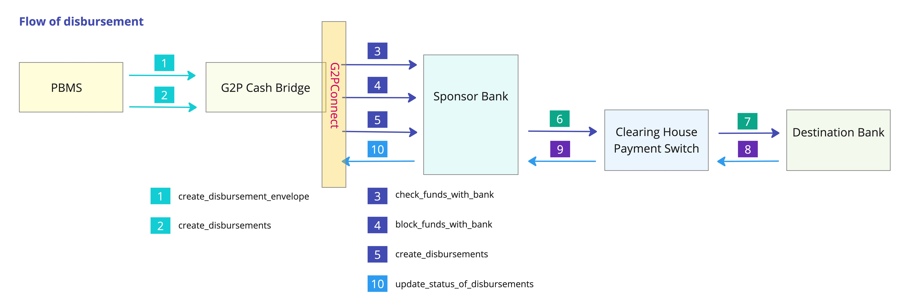

---
layout:
  title:
    visible: true
  description:
    visible: false
  tableOfContents:
    visible: true
  outline:
    visible: true
  pagination:
    visible: true
---

# Design Specifications

### Flow of information

<figure><figcaption>
Flow of information in the G2P Cash Bridge subsystem
</figcaption></figure>

### Inward APIs - from PBMS

<mark style="color:blue;">**create\_disbursement\_envelope**</mark> - creates a disbursement envelope object and persists this object in the table - 'disbursement\_envelope'. As an object, a disbursement\_envelope, represents an instance of a wrapper object, an envelope of sorts, that contains all the disbursements that need to be effected for a benefit program for a disbursement cycle. Depending on the nature of the benefit program, a disbursement\_envelope can potentially contain 100s of 1000s of disbursements. Each envelope is identified by a unique disbursement\_envelope\_id.

<mark style="color:blue;">**create\_disbursements**</mark> - creates a disbursement object and persists this object in the table - 'disbursement'. As an object, a disbursement represents a single disbursement transaction under a disbursement\_envelope. Each disbursement is identified by a unique disbursement\_id.

### Outward APIs - to Sponsor bank

<mark style="color:blue;">**checkFundsAvailability**</mark> - is the first step in the lifecycle processing of a disbursement\_envelope. Once the disbursement\_envelope is ready for processing, the system checks for available funds in the bank account with the Sponsor bank. Since we will need specific connectors for connecting to banks, these APIs have been abstracted to an interface and bank specific connectors that implement these interfaces. This API is triggered by a batch job - 'check\_funds\_with\_bank'

<mark style="color:blue;">**block\_funds\_wih\_bank**</mark> - is the second step in the disbursement\_envelope's lifecycle. Once the first step confirms availability of funds, the system invokes this API to block the funds in the funding account. If the block is successful, the sponsor bank will return a reference number for that block. All subsequent disbursements will result in release of funds under this block reference number.

<mark style="color:blue;">**create\_disbursements**</mark> - is the third step in the disbursement\_envelope's lifecycle. Multiple disbursements for a given envelope are batched together in a single API call. Given the nature of transaction&#x20;

1. the downstream clearing / payment switch will have to split the disbursements into multiple batches based on destination bank - depending on the arrangement with the switch
2. the sponsor bank might have a float period before it dispatches the disbursements into the payment switch
3. the actual success/failure of the disbursement transactions can be known only after the destination banks (destination banks are banks that service the ultimate beneficiary) process these disbursements
4. the destination banks might have a float period too

this API has been designed for an asynchronous mode. This API only expects an acknowledgement from the Sponsor bank. The actual feedback of success/failure is designed to be an inward API call from the sponsor bank.

### Inward APIs - from Sponsor bank

<mark style="color:blue;">**update\_status\_of\_disbursements**</mark> - As and when the sponsor bank receives status from the destination banks, the sponsor bank invokes this api and updates the status of the disbursement transactions.

Detailed notes on Objects and Tables - follows in the next few sections
